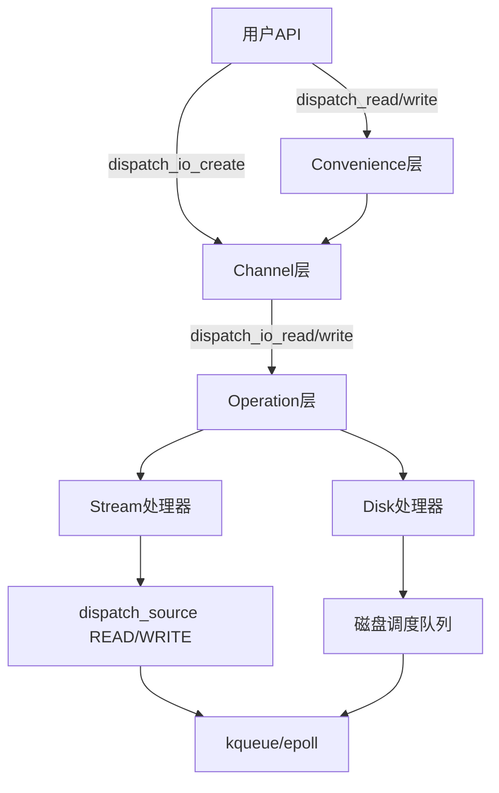
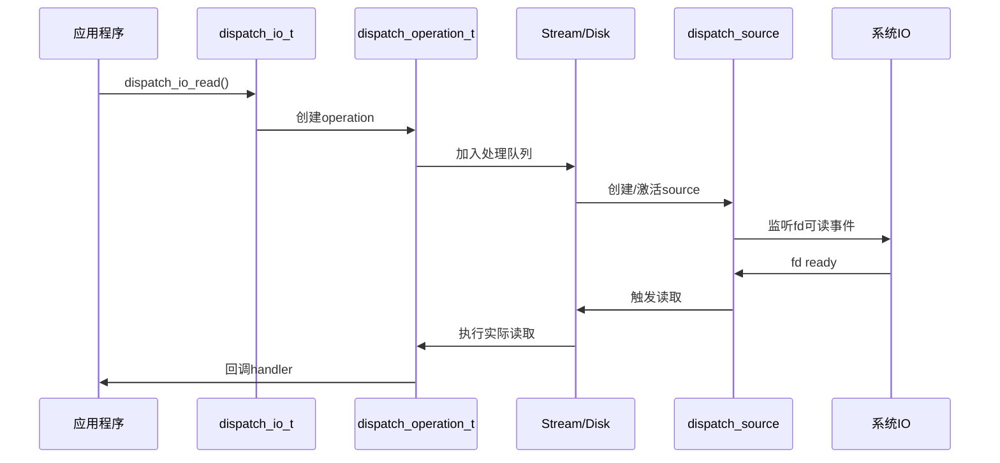

# GCD IO机制完整分析

## 1. 架构概述

### 1.1 核心概念

GCD IO提供了高级别的异步文件IO操作，基于以下核心概念：

- **dispatch_io_t**: IO通道，封装文件描述符和IO策略
- **dispatch_operation_t**: 具体的读写操作
- **dispatch_data_t**: 不可变数据对象，用于数据传输
- **Stream vs Random**: 两种IO模式，顺序访问 vs 随机访问

### 1.2 架构层次



### 1.3 数据流向



## 2. 核心数据结构

### 2.1 dispatch_io_t - IO通道

```c
struct dispatch_io_s {
    DISPATCH_OBJECT_HEADER(io);
    dispatch_queue_t queue, barrier_queue;     // 处理队列
    dispatch_group_t barrier_group;            // 同步屏障
    dispatch_io_param_s params;                // IO参数配置
    dispatch_fd_entry_t fd_entry;              // 文件描述符条目
    unsigned int atomic_flags;                  // 原子标志 (DIO_STOPPED/CLOSED)
    dispatch_fd_t fd, fd_actual;               // 文件描述符
    off_t f_ptr;                               // 文件指针位置
    int err;                                   // 创建错误码
};

// IO参数配置
typedef struct dispatch_io_param_s {
    dispatch_io_type_t type;    // STREAM(0) 或 RANDOM(1)
    size_t low;                 // 低水位线
    size_t high;                // 高水位线  
    uint64_t interval;          // 间隔时间
    unsigned long interval_flags; // 间隔标志
} dispatch_io_param_s;
```

### 2.2 dispatch_operation_t - IO操作

```c
struct dispatch_operation_s {
    DISPATCH_OBJECT_HEADER(operation);
    dispatch_queue_t op_q;                      // 操作队列
    dispatch_op_direction_t direction;          // READ(0) 或 WRITE(1)
    dispatch_io_param_s params;                 // 继承的IO参数
    off_t offset;                               // 操作偏移量
    size_t length;                              // 操作长度
    int err;                                    // 错误码
    dispatch_io_handler_t handler;              // 回调处理器
    dispatch_io_t channel;                      // 所属通道
    dispatch_fd_entry_t fd_entry;               // 文件描述符条目
    dispatch_source_t timer;                    // 定时器（超时控制）
    bool active;                                // 是否活跃
    
    // 缓冲区管理
    void* buf;                                  // 缓冲区指针
    dispatch_op_flags_t flags;                  // 操作标志
    size_t buf_siz, buf_len;                    // 缓冲区大小和已用长度
    size_t undelivered, total;                 // 未交付和总字节数
    dispatch_data_t buf_data, data;             // 数据对象
    
    // 链表管理
    TAILQ_ENTRY(dispatch_operation_s) operation_list;  // 操作队列链表
    TAILQ_ENTRY(dispatch_operation_s) stream_list;     // 流处理链表
};
```

### 2.3 dispatch_fd_entry_t - 文件描述符条目

```c
struct dispatch_fd_entry_s {
    dispatch_fd_t fd;                           // 文件描述符
    dispatch_io_path_data_t path_data;          // 路径数据（延迟打开）
    int orig_flags, orig_nosigpipe, err;        // 原始标志和错误
    struct dispatch_stat_s stat;                // 文件状态
    dispatch_stream_t streams[2];               // 读写流处理器 [READ, WRITE]
    dispatch_disk_t disk;                       // 磁盘处理器（随机访问）
    dispatch_queue_t close_queue, barrier_queue; // 关闭和屏障队列
    dispatch_group_t barrier_group;             // 屏障组
    dispatch_io_t convenience_channel;          // 便利通道
    TAILQ_HEAD(, dispatch_operation_s) stream_ops; // 流操作链表
    LIST_ENTRY(dispatch_fd_entry_s) fd_list;    // 全局FD哈希表链表
};
```

### 2.4 dispatch_stream_t - 流处理器

```c
struct dispatch_stream_s {
    dispatch_queue_t dq;                        // 流处理队列
    dispatch_source_t source;                   // dispatch_source (READ/WRITE)
    bool source_running;                        // source是否运行中
    
    // 操作队列：[RANDOM, STREAM] 两种类型
    TAILQ_HEAD(, dispatch_operation_s) operations[2];
};
```

### 2.5 dispatch_disk_t - 磁盘处理器

```c
struct dispatch_disk_s {
    DISPATCH_OBJECT_HEADER(disk);
    TAILQ_HEAD(dispatch_disk_operations_s, dispatch_operation_s) operations;
    dispatch_operation_t cur_rq;                // 当前请求
    dispatch_queue_t pick_queue;                // 选择队列
    
    size_t free_idx;                            // 空闲索引
    size_t req_idx;                             // 请求索引
    size_t advise_idx;                          // 建议索引
    dev_t dev;                                  // 设备号
    bool io_active;                             // IO是否活跃
    LIST_ENTRY(dispatch_disk_s) disk_list;      // 磁盘链表
    size_t advise_list_depth;                   // 建议列表深度
    dispatch_operation_t advise_list[];         // 建议列表
};
```

## 3. IO通道类型和特性

### 3.1 DISPATCH_IO_STREAM - 流式访问

**特点**：
- 顺序访问，维护文件指针位置
- 读写操作串行执行（按创建顺序）
- 不同类型操作（读 vs 写）可并发
- 忽略用户指定的offset参数

**使用场景**：
- 网络socket
- 管道 (pipe)
- 串行设备
- 日志文件追加

```c
// 创建流式IO通道
dispatch_io_t channel = dispatch_io_create(DISPATCH_IO_STREAM, 
                                          sockfd, queue, 
                                          ^(int error) {
    // cleanup handler
});
```

### 3.2 DISPATCH_IO_RANDOM - 随机访问

**特点**：
- 支持任意位置访问
- 读写操作可并发执行
- 使用用户指定的offset
- 针对磁盘文件优化

**使用场景**：
- 普通文件
- 数据库文件
- 随机访问的大文件

```c
// 创建随机访问IO通道
dispatch_io_t channel = dispatch_io_create(DISPATCH_IO_RANDOM, 
                                          filefd, queue, 
                                          ^(int error) {
    // cleanup handler
});
```

## 4. 便利API vs 通道API

### 4.1 便利API - dispatch_read/write

**简单、一次性操作**：

```c
// 读取操作
void dispatch_read(dispatch_fd_t fd, size_t length, 
                  dispatch_queue_t queue,
                  void (^handler)(dispatch_data_t data, int error));

// 写入操作  
void dispatch_write(dispatch_fd_t fd, dispatch_data_t data,
                   dispatch_queue_t queue,
                   void (^handler)(dispatch_data_t data, int error));
```

**内部实现流程**：
```c
// dispatch_read内部实现概要
void dispatch_read(dispatch_fd_t fd, size_t length, dispatch_queue_t queue,
                  void (^handler)(dispatch_data_t, int))
{
    // 1. 创建临时IO通道 (STREAM类型)
    dispatch_io_t channel = dispatch_io_create(DISPATCH_IO_STREAM, fd, queue, 
                                              ^(int error) { /* cleanup */ });
    
    // 2. 执行读取操作
    dispatch_io_read(channel, 0, length, queue, 
                    ^(bool done, dispatch_data_t data, int error) {
        if (done) {
            handler(data, error);
            dispatch_io_close(channel, 0);  // 3. 自动关闭通道
        }
    });
}
```

### 4.2 通道API - dispatch_io_read/write

**持久、可配置操作**：

```c
// 通道读取
void dispatch_io_read(dispatch_io_t channel, off_t offset, size_t length,
                     dispatch_queue_t queue, dispatch_io_handler_t handler);

// 通道写入
void dispatch_io_write(dispatch_io_t channel, off_t offset, dispatch_data_t data,
                      dispatch_queue_t queue, dispatch_io_handler_t handler);
```

**优势**：
- 可重用通道，避免重复创建开销
- 支持复杂的IO策略配置
- 更好的性能控制
- 支持屏障操作

## 5. 操作执行流程

### 5.1 Stream处理流程

```c
// 流操作入队和执行
static void _dispatch_stream_enqueue_operation(dispatch_stream_t stream, 
                                              dispatch_operation_t op, 
                                              dispatch_data_t data)
{
    // 1. 将操作加入对应队列
    TAILQ_INSERT_TAIL(&stream->operations[op->params.type], op, operation_list);
    
    // 2. 创建或激活dispatch_source
    if (!stream->source) {
        stream->source = _dispatch_stream_source(stream, op);
        dispatch_set_context(stream->source, stream);
        dispatch_source_set_event_handler(stream->source, ^{
            _dispatch_stream_handler(stream);  // 事件处理器
        });
    }
    
    // 3. 激活source开始监听
    if (!stream->source_running) {
        dispatch_resume(stream->source);
        stream->source_running = true;
    }
}
```

### 5.2 实际IO执行

```c
// Stream事件处理器
static void _dispatch_stream_handler(dispatch_stream_t stream)
{
    dispatch_operation_t op = _dispatch_stream_operation_avail(stream);
    if (!op) return;
    
    // 执行实际的read/write系统调用
    if (op->direction == DOP_DIR_READ) {
        ssize_t processed = read(op->fd_entry->fd, op->buf, op->buf_siz);
        // 处理读取结果...
    } else {
        ssize_t processed = write(op->fd_entry->fd, op->buf, op->buf_len);
        // 处理写入结果...
    }
    
    // 数据交付给用户回调
    _dispatch_operation_deliver_data(op, flags);
}
```

### 5.3 数据交付机制

```c
static void _dispatch_operation_deliver_data(dispatch_operation_t op, 
                                           dispatch_op_flags_t flags)
{
    dispatch_data_t data = NULL;
    bool deliver = (flags & DOP_DELIVER);
    
    if (op->direction == DOP_DIR_READ) {
        // 读操作：将读取的数据包装为dispatch_data_t
        if (deliver && op->buf_len) {
            data = dispatch_data_create(op->buf, op->buf_len, 
                                       op->op_q, DISPATCH_DATA_DESTRUCTOR_DEFAULT);
        }
    } else if (op->direction == DOP_DIR_WRITE) {
        // 写操作：交付未写入的数据（如果有错误）
        if (deliver) {
            data = dispatch_data_create_subrange(op->data, op->buf_len, op->length);
        }
    }
    
    // 异步交付到用户队列
    dispatch_async(op->op_q, ^{
        bool done = (flags & DOP_DONE);
        op->handler(done, data, op->err);
        // cleanup...
    });
}
```

## 6. 高级特性

### 6.1 低/高水位线控制

```c
// 设置IO策略
dispatch_io_set_low_water(channel, 1024);   // 最少读取1KB才回调
dispatch_io_set_high_water(channel, 64*1024); // 最多64KB一次回调
```

**作用**：
- **低水位线**：累积足够数据才触发回调，减少回调次数
- **高水位线**：限制单次回调的数据量，控制内存使用

### 6.2 间隔控制

```c
// 设置回调间隔
dispatch_io_set_interval(channel, 
                        NSEC_PER_SEC,           // 1秒间隔
                        DISPATCH_IO_STRICT_INTERVAL);
```

**用途**：
- 控制回调频率
- 实现流控
- 减少CPU占用

### 6.3 屏障操作

```c
// 屏障：等待之前所有操作完成后再执行
dispatch_io_barrier(channel, ^{
    // 所有之前的读写操作都已完成
    NSLog(@"All previous operations completed");
});
```

### 6.4 通道关闭

```c
// 关闭通道
dispatch_io_close(channel, DISPATCH_IO_STOP);  // 立即停止新操作
// 或
dispatch_io_close(channel, 0);  // 等待现有操作完成后关闭
```

## 7. 内存管理和性能优化

### 7.1 缓冲区管理

- **读操作**：动态分配缓冲区，自动释放
- **写操作**：引用用户数据，避免拷贝
- **分块处理**：大文件自动分块，避免内存压力

### 7.2 文件描述符共享

```c
// 全局FD哈希表，支持多通道共享同一FD
static struct dispatch_fd_entry_head_s _dispatch_io_fds[DIO_HASH_SIZE];
```

### 7.3 磁盘调度优化

- **按设备分组**：相同磁盘的操作统一调度
- **读写分离**：优化磁盘访问模式
- **预读建议**：使用`posix_fadvise`优化性能

## 8. 错误处理

### 8.1 错误传播

```c
// 操作级错误
op->err = errno;  // 保存系统调用错误

// 通道级错误
channel->err = error;  // 保存通道创建错误

// 错误交付
handler(true, NULL, error);  // done=true, data=NULL表示错误
```

### 8.2 资源清理

- **自动清理**：通道关闭时自动清理资源
- **异常处理**：fd错误时自动关闭并回调cleanup_handler
- **引用计数**：基于GCD对象模型的自动内存管理

## 9. 使用示例

### 9.1 文件复制

```c
void copy_file(const char* src, const char* dst) {
    dispatch_queue_t queue = dispatch_queue_create("io", NULL);
    
    dispatch_io_t src_channel = dispatch_io_create_with_path(
        DISPATCH_IO_RANDOM, src, O_RDONLY, 0, queue, ^(int error) {
            if (error) NSLog(@"Failed to open source: %s", strerror(error));
        });
    
    dispatch_io_t dst_channel = dispatch_io_create_with_path(
        DISPATCH_IO_RANDOM, dst, O_WRONLY|O_CREAT|O_TRUNC, 0644, queue, ^(int error) {
            if (error) NSLog(@"Failed to open destination: %s", strerror(error));
        });
    
    __block off_t offset = 0;
    __block void (^copy_chunk)(void) = ^{
        dispatch_io_read(src_channel, offset, SIZE_MAX, queue, 
                        ^(bool done, dispatch_data_t data, int error) {
            if (error) {
                NSLog(@"Read error: %s", strerror(error));
                return;
            }
            
            if (data) {
                dispatch_io_write(dst_channel, offset, data, queue,
                                 ^(bool done, dispatch_data_t remaining, int error) {
                    if (error) {
                        NSLog(@"Write error: %s", strerror(error));
                        return;
                    }
                    
                    if (!done && remaining) {
                        // 部分写入，继续写入剩余数据
                        return;
                    }
                    
                    offset += dispatch_data_get_size(data);
                    if (!done) {
                        copy_chunk();  // 继续复制下一块
                    } else {
                        NSLog(@"Copy completed");
                        dispatch_io_close(src_channel, 0);
                        dispatch_io_close(dst_channel, 0);
                    }
                });
            }
        });
    };
    
    copy_chunk();
}
```

### 9.2 网络服务器

```c
void handle_connection(int client_fd) {
    dispatch_queue_t queue = dispatch_queue_create("client", NULL);
    
    dispatch_io_t channel = dispatch_io_create(DISPATCH_IO_STREAM, 
                                              client_fd, queue, ^(int error) {
        close(client_fd);
        NSLog(@"Client disconnected");
    });
    
    // 设置低水位线，避免频繁回调
    dispatch_io_set_low_water(channel, 1);
    
    __block void (^read_request)(void) = ^{
        dispatch_io_read(channel, 0, SIZE_MAX, queue,
                        ^(bool done, dispatch_data_t data, int error) {
            if (error || !data) {
                dispatch_io_close(channel, 0);
                return;
            }
            
            // 处理HTTP请求数据
            process_http_request(data);
            
            // 发送响应
            dispatch_data_t response = create_http_response();
            dispatch_io_write(channel, 0, response, queue,
                             ^(bool done, dispatch_data_t remaining, int error) {
                if (done && !error) {
                    read_request();  // 继续处理下一个请求
                } else {
                    dispatch_io_close(channel, 0);
                }
            });
        });
    };
    
    read_request();
}
```

## 10. 总结

GCD IO机制的核心优势：

1. **异步非阻塞**：基于dispatch_source的事件驱动模型
2. **自动缓冲**：智能的缓冲区管理和数据分块
3. **流控支持**：低/高水位线和间隔控制
4. **资源共享**：多通道可共享文件描述符
5. **错误处理**：完善的错误传播和资源清理
6. **性能优化**：磁盘调度和预读优化

这使得GCD IO成为iOS/macOS平台上处理文件和网络IO的首选方案。