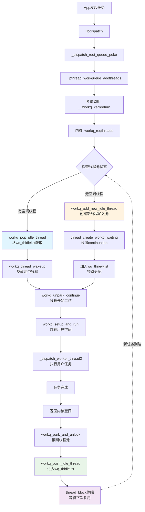
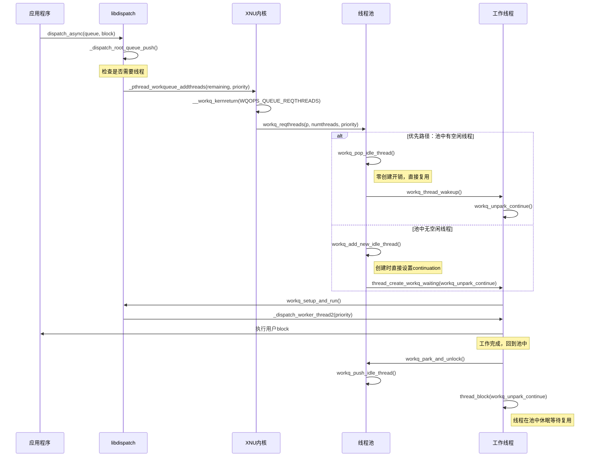
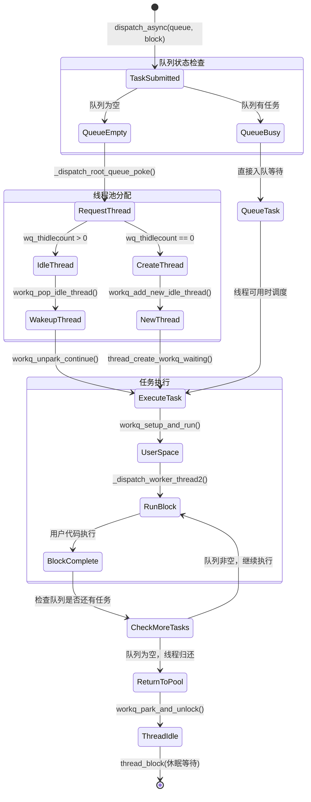
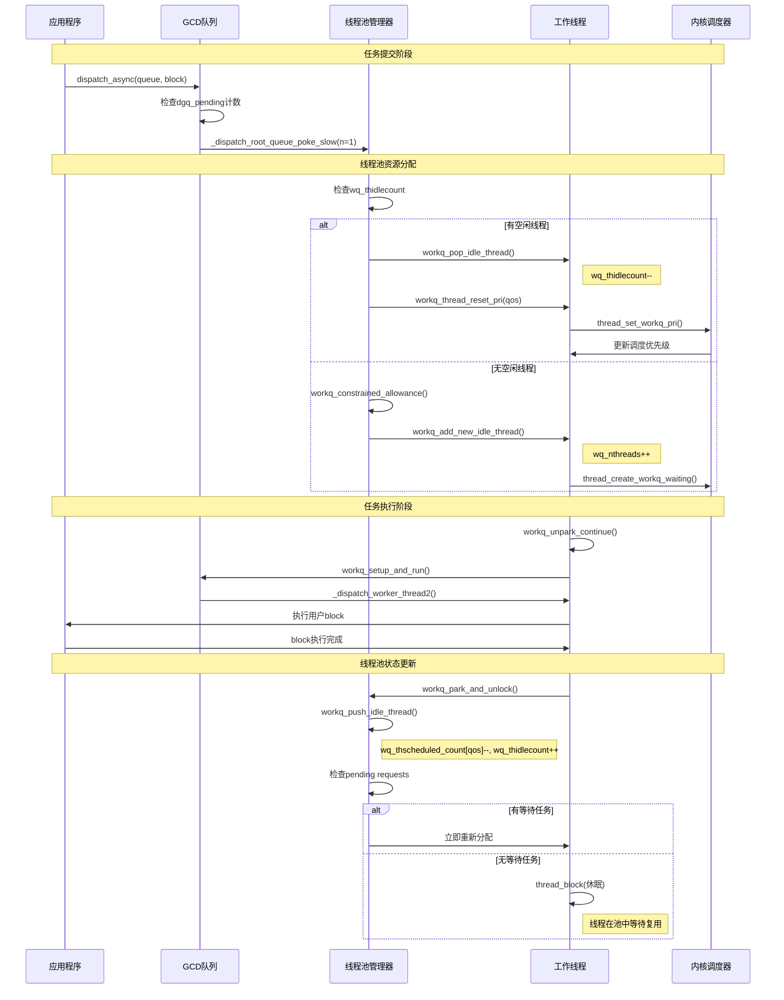

# Apple平台内核级workqueue机制：完整技术解析

## 1. 架构概览：内核级线程池的设计理念

**🚨 核心澄清：Apple的workqueue本质上就是一个高度优化的内核级线程池系统**

Apple的workqueue机制将传统的用户空间线程池管理完全下沉到内核层，形成了一个高度集成的线程管理子系统。关键在于：**这是一个线程池，不是每次都创建新线程**。设计的核心思想是让内核调度器直接参与线程池的创建、调度和生命周期管理。

### workqueue核心架构



### workqueue的核心结构

```c
// 内核工作队列核心结构 (bsd/pthread/pthread_workqueue.c)
struct workqueue {
    os_refcnt_t wq_refcnt;                    // 引用计数
    lck_spin_t wq_lock;                       // 自旋锁保护
    
    uint32_t wq_constrained_threads_scheduled; // 受限线程数
    uint32_t wq_nthreads;                     // 总线程数
    uint32_t wq_thidlecount;                  // 空闲线程数 ← 关键：线程池计数
    uint32_t wq_timer_interval;               // 定时器间隔
    
    // 不同优先级的线程计数
    uint16_t wq_thscheduled_count[WORKQ_NUM_QOS_BUCKETS];
    
    // 线程池的三层队列管理 ← 这就是线程池！
    TAILQ_HEAD(, uthread) wq_thrunlist;       // 运行中线程
    TAILQ_HEAD(, uthread) wq_thnewlist;       // 新创建线程  
    TAILQ_HEAD(, uthread) wq_thidlelist;      // 空闲线程池 ← 核心池
    
    // 请求队列
    struct priority_queue wq_overcommit_queue;   // 过度提交队列
    struct priority_queue wq_constrained_queue;  // 受限队列
};
```

## 2. 系统调用路径与线程池复用机制

### 2.1 完整调用链路



### 2.2 libdispatch → 内核的调用路径

```c
// libdispatch发起线程请求的完整路径
_dispatch_root_queue_poke_slow() 
  ↓
_pthread_workqueue_addthreads(remaining, priority)  // libpthread
  ↓
__workq_kernreturn(WQOPS_QUEUE_REQTHREADS, NULL, numthreads, priority)  // 系统调用
  ↓
workq_kernreturn()  // XNU内核入口 (bsd/pthread/pthread_workqueue.c)
  ↓
workq_reqthreads(p, numthreads, priority)  // 内核workqueue子系统
```

### 2.3 关键系统调用操作码

```c
// bsd/pthread/workqueue_syscalls.h - 内核workqueue操作命令
#define WQOPS_THREAD_RETURN              0x004  /* 线程回到内核池 */
#define WQOPS_QUEUE_REQTHREADS           0x020  /* 请求指定数量线程 */
#define WQOPS_THREAD_KEVENT_RETURN       0x040  /* kevent线程回池 */
#define WQOPS_THREAD_WORKLOOP_RETURN     0x100  /* workloop线程回池 */
#define WQOPS_SETUP_DISPATCH             0x400  /* 初始化workqueue */
```

### 2.4 线程池复用核心：优先复用，按需创建

**workq_reqthreads的实际处理逻辑**（简化版）：

```c
// 真实的线程请求处理 (bsd/pthread/pthread_workqueue.c)
static int
workq_reqthreads(struct proc *p, uint32_t reqcount, pthread_priority_t pp)
{
    struct workqueue *wq = proc_get_wqptr(p);
    thread_qos_t qos = _pthread_priority_thread_qos(pp);
    uint32_t unpaced = reqcount - 1;

    workq_lock_spin(wq);

    // 🎯 关键：优先从现有空闲线程池分配
    while (unpaced > 0 && wq->wq_thidlecount) {
        struct uthread *uth;
        bool needs_wakeup;
        
        // 从空闲线程池获取线程
        uth = workq_pop_idle_thread(wq, flags, &needs_wakeup);
        
        // 更新活跃线程计数和优先级
        _wq_thactive_inc(wq, qos);
        wq->wq_thscheduled_count[_wq_bucket(qos)]++;
        workq_thread_reset_pri(wq, uth, req, true);
        
        // 设置线程的upcall参数
        uth->uu_save.uus_workq_park_data.thread_request = req;
        
        if (needs_wakeup) {
            workq_thread_wakeup(uth); // 唤醒池中线程
        }
        unpaced--;
        reqcount--;
    }

    // 只有在池中无足够空闲线程时才创建新线程
    while (unpaced && wq->wq_nthreads < wq_max_threads) {
        if (workq_add_new_idle_thread(p, wq, workq_unpark_continue, 
                                     false, NULL) != KERN_SUCCESS) {
            break;
        }
        unpaced--;
    }

    // 剩余未满足的请求入队等待
    if (reqcount > 0) {
        req->tr_count = (uint16_t)reqcount;
        workq_threadreq_enqueue(wq, req);
        workq_schedule_creator(p, wq, WORKQ_THREADREQ_CAN_CREATE_THREADS);
    }
    
    workq_unlock(wq);
    return 0;
}
```

### 2.5 线程池管理：从池中获取线程

```c
// 从线程池获取空闲线程 (bsd/pthread/pthread_workqueue.c)
static struct uthread *
workq_pop_idle_thread(struct workqueue *wq, uint16_t uu_flags, bool *needs_wakeup)
{
    struct uthread *uth;

    // 优先从已有的空闲线程池获取
    if ((uth = TAILQ_FIRST(&wq->wq_thidlelist))) {
        TAILQ_REMOVE(&wq->wq_thidlelist, uth, uu_workq_entry);
    } else {
        // 次选：从新创建但未使用的线程获取
        uth = TAILQ_FIRST(&wq->wq_thnewlist);
        TAILQ_REMOVE(&wq->wq_thnewlist, uth, uu_workq_entry);
    }
    
    // 移入运行队列
    TAILQ_INSERT_TAIL(&wq->wq_thrunlist, uth, uu_workq_entry);
    
    uth->uu_workq_flags |= UT_WORKQ_RUNNING | uu_flags;
    wq->wq_threads_scheduled++;
    wq->wq_thidlecount--; // 减少空闲计数
    
    return uth; // 返回复用的线程
}
```

### 2.6 新线程创建：仅在必要时

```c
// 创建新的工作线程加入池中 (bsd/pthread/pthread_workqueue.c)
static kern_return_t
workq_add_new_idle_thread(proc_t p, struct workqueue *wq,
                         thread_continue_t continuation, bool bound, thread_t *new_thread)
{
    mach_vm_offset_t th_stackaddr;
    kern_return_t kret;
    thread_t th;

    wq->wq_nthreads++;
    workq_unlock(wq);

    // 1. 创建线程栈
    kret = pthread_functions->workq_create_threadstack(p, vmap, &th_stackaddr);
    if (kret != KERN_SUCCESS) goto out;

    // 2. 创建内核线程，直接设置continuation
    kret = thread_create_workq_waiting(proc_task(p),
        continuation,  // 关键：直接设置workq_unpark_continue
        &th, bound);
    
    if (kret != KERN_SUCCESS) {
        pthread_functions->workq_destroy_threadstack(p, vmap, th_stackaddr);
        goto out;
    }

    // 3. 初始化uthread结构并加入线程池
    struct uthread *uth = get_bsdthread_info(th);
    uth->uu_workq_stackaddr = (user_addr_t)th_stackaddr;
    uth->uu_workq_flags = UT_WORKQ_NEW;
    
    // 4. 重要：新线程直接加入线程池，等待复用
    wq->wq_thidlecount++;
    TAILQ_INSERT_TAIL(&wq->wq_thnewlist, uth, uu_workq_entry);
    
    return KERN_SUCCESS;
}
```

### 2.7 线程完成工作后回到线程池

```c
// libpthread用户空间线程完成工作后 (src/pthread.c)
void _pthread_wqthread(pthread_t self, mach_port_t kport, void *stackaddr, 
                       void *keventlist, int flags, int nkevents) {
    // 调用libdispatch工作函数
    if (flags & WQ_FLAG_THREAD_WORKLOOP) {
        (*__libdispatch_workloopfunction)(kqidptr, &self->arg, &self->wq_nevents);
        __workq_kernreturn(WQOPS_THREAD_WORKLOOP_RETURN, self->arg, self->wq_nevents, 0);
    } else if (flags & WQ_FLAG_THREAD_KEVENT) {
        (*__libdispatch_keventfunction)(&self->arg, &self->wq_nevents);
        __workq_kernreturn(WQOPS_THREAD_KEVENT_RETURN, self->arg, self->wq_nevents, 0);
    } else {
        // 普通工作线程路径
        (*__libdispatch_workerfunction)(workq_function2_arg);
        // 关键：工作完成后直接系统调用回到内核池
        __workq_kernreturn(WQOPS_THREAD_RETURN, NULL, 0, 0);
    }
}
```

## 3. 核心机制：park/unpark线程池休眠唤醒

### 3.1 线程park：回到线程池休眠

```c
// 线程完成工作后回到池中休眠 (bsd/pthread/pthread_workqueue.c)
static void
workq_park_and_unlock(proc_t p, struct workqueue *wq, struct uthread *uth,
    uint32_t setup_flags)
{
    // 1. 关键：推入空闲线程池而非销毁
    workq_push_idle_thread(p, wq, uth, setup_flags);
    
    // 2. 重置CPU占用统计
    workq_thread_reset_cpupercent(NULL, uth);
    
    // 3. 清理线程状态但保持内核结构
    if (uth->uu_workq_flags & UT_WORKQ_IDLE_CLEANUP) {
        workq_unlock(wq);
        // 清理栈内存（如果需要）、voucher等
        workq_lock_spin(wq);
    }
    
    // 4. 检查是否被重新调度（在清理过程中被唤醒）
    if (uth->uu_workq_flags & UT_WORKQ_RUNNING) {
        workq_unpark_select_threadreq_or_park_and_unlock(p, wq, uth, setup_flags);
        __builtin_unreachable();
    }
    
    // 5. 设置等待事件并休眠 - 线程保持在内核中等待复用
    assert_wait(workq_parked_wait_event(uth), THREAD_INTERRUPTIBLE);
    workq_unlock(wq);
    
    // 6. 进入休眠，设置唤醒continuation
    thread_block(workq_unpark_continue);
    __builtin_unreachable();
}
```

### 3.2 线程unpark：从线程池智能唤醒

```c
// 线程池中线程被唤醒处理 (bsd/pthread/pthread_workqueue.c)
static void
workq_unpark_continue(void *parameter __unused, wait_result_t wr __unused)
{
    thread_t th = current_thread();
    struct uthread *uth = get_bsdthread_info(th);
    proc_t p = current_proc();
    struct workqueue *wq = proc_get_wqptr_fast(p);

    workq_lock_spin(wq);

    // 1. 创建者线程的负载控制
    if (wq->wq_creator == uth && workq_creator_should_yield(wq, uth)) {
        // 如果当前线程数已足够处理负载，让创建者线程让步
        workq_unlock(wq);
        thread_yield_with_continuation(workq_unpark_continue, NULL);
        __builtin_unreachable();
    }

    // 2. 检查线程运行状态
    if (uth->uu_workq_flags & UT_WORKQ_RUNNING) {
        workq_unpark_select_threadreq_or_park_and_unlock(p, wq, uth, WQ_SETUP_NONE);
        __builtin_unreachable();
    }

    // 3. 处理线程终止
    if (uth->uu_workq_flags & UT_WORKQ_DYING) {
        workq_unpark_for_death_and_unlock(p, wq, uth,
            WORKQ_UNPARK_FOR_DEATH_WAS_IDLE, setup_flags);
        __builtin_unreachable();
    }

    // 4. 重新进入休眠等待
    assert_wait(workq_parked_wait_event(uth), THREAD_INTERRUPTIBLE);
    workq_unlock(wq);
    thread_block(workq_unpark_continue);
    __builtin_unreachable();
}
```

## 4. libdispatch集成与智能调度

### 4.1 workqueue初始化

```c
// libdispatch初始化workqueue (src/queue.c)
static void _dispatch_root_queues_init_once(void *context)
{
    // 获取内核支持的workqueue特性
    int r = _pthread_workqueue_supported();
    if (r < 0) {
        DISPATCH_INTERNAL_CRASH(-r, "Could not initialize workqueue");
    }
    
    int wq_supported = r;
    
    // 注册libdispatch的工作函数到内核
    if (wq_supported & WORKQ_FEATURE_WORKLOOP) {
        // 完整模式：支持workloop
        r = _pthread_workqueue_init_with_workloop(_dispatch_worker_thread2,
                _dispatch_kevent_worker_thread,
                _dispatch_workloop_worker_thread,
                offsetof(struct dispatch_queue_s, dq_serialnum), 0);
    } else if (wq_supported & WORKQ_FEATURE_KEVENT) {
        // 支持kevent
        r = _pthread_workqueue_init_with_kevent(_dispatch_worker_thread2,
                _dispatch_kevent_worker_thread,
                offsetof(struct dispatch_queue_s, dq_serialnum), 0);
    } else {
        // 基础模式：仅普通工作线程
        r = _pthread_workqueue_init(_dispatch_worker_thread2,
                offsetof(struct dispatch_queue_s, dq_serialnum), 0);
    }
}
```

### 4.2 智能线程池大小控制

```c
// 线程池的智能清理策略 (bsd/pthread/pthread_workqueue.c)
static void
workq_death_policy_evaluate(struct workqueue *wq, uint16_t decrement)
{
    struct uthread *uth;

    if (wq->wq_thidlecount <= 1) {
        return; // 保持最少一个空闲线程
    }

    if ((uth = workq_oldest_killable_idle_thread(wq)) == NULL) {
        return;
    }

    uint64_t now = mach_absolute_time();
    uint64_t delay = workq_kill_delay_for_idle_thread(wq);

    if (now - uth->uu_save.uus_workq_park_data.idle_stamp > delay) {
        // 空闲时间过长，回收线程
        wq->wq_thdying_count++;
        uth->uu_workq_flags |= UT_WORKQ_DYING;
        if ((uth->uu_workq_flags & UT_WORKQ_IDLE_CLEANUP) == 0) {
            workq_thread_wakeup(uth);
        }
        return;
    }

    // 设置定时器，稍后再检查
    workq_death_call_schedule(wq,
        uth->uu_save.uus_workq_park_data.idle_stamp + delay);
}
```

### 4.3 Apple内核workqueue vs pthread pool对比

**Apple内核workqueue路径**：
```c
// 内核线程池线程直接运行，无复杂初始化 (src/queue.c)
static void _dispatch_worker_thread2(pthread_priority_t pp) {
    // 内核已设置优先级，直接获取对应队列
    dispatch_queue_global_t dq = _dispatch_get_root_queue(_dispatch_qos_from_pp(pp), overcommit);
    
    // 简单递减pending计数
    int pending = os_atomic_dec2o(dq, dgq_pending, relaxed);
    
    // 直接开始工作，无需休眠/唤醒循环
    _dispatch_root_queue_drain(dq, dq->dq_priority,
            DISPATCH_INVOKE_WORKER_DRAIN | DISPATCH_INVOKE_REDIRECTING_DRAIN);
    
    // 工作完成后直接退出，由内核回收到线程池
    // 函数结束，线程返回内核休眠状态等待下次复用
}
```

**传统pthread pool路径**：
```c
// 复杂的pthread生命周期管理 (src/queue.c)
static void *_dispatch_worker_thread(void *context) {
    dispatch_queue_global_t dq = context;
    
    // 关键：休眠/唤醒循环，使用信号量同步
    uint64_t timeout = 5 * NSEC_PER_SEC; // 5秒超时
    do {
        // 执行工作
        _dispatch_root_queue_drain(dq, pri, DISPATCH_INVOKE_REDIRECTING_DRAIN);
        
        // 等待新工作或超时（线程休眠）
    } while (dispatch_semaphore_wait(&pqc->dpq_thread_mediator,
            dispatch_time(0, timeout)) == 0);
    
    // 线程退出时的复杂清理
    _dispatch_release(dq); // 释放线程创建时的引用
    
    return NULL; // pthread正常退出，线程被销毁
}
```

**核心区别**：
- **内核workqueue**：线程复用，在内核中休眠，无超时退出
- **pthread pool**：线程超时销毁，用户空间休眠/唤醒，需要信号量同步

## 5. 系统调用映射表

| 操作类型 | libdispatch调用 | libpthread系统调用 | 内核处理函数 |
|---------|-----------------|-------------------|-------------|
| 请求线程 | `_dispatch_root_queue_poke()` | `_pthread_workqueue_addthreads()` | `workq_reqthreads()` |
| 线程回池 | 工作函数返回 | `__workq_kernreturn(WQOPS_THREAD_RETURN)` | `workq_park_and_unlock()` |
| kevent回池 | kevent处理完成 | `__workq_kernreturn(WQOPS_THREAD_KEVENT_RETURN)` | `workq_handle_stack_events()` |
| 初始化 | `_dispatch_root_queues_init()` | `pthread_workqueue_setup()` | `workq_setup_dispatch()` |

## 6. 任务提交、执行与线程池管理的协同机制

### 6.1 任务生命周期与线程池状态变化

Apple平台的任务执行本质上是一个**任务队列驱动的线程池调度系统**。每个任务的提交和执行都会引发线程池状态的精确变化：



### 6.2 GCD队列层次与线程池映射关系

每种GCD队列类型都对应特定的线程池管理策略：

```c
// GCD全局队列到workqueue线程池的映射 (src/queue.c)
static const struct dispatch_queue_global_s _dispatch_root_queues[] = {
    // 高优先级队列 -> 内核QoS_CLASS_USER_INTERACTIVE线程池
    [DISPATCH_ROOT_QUEUE_IDX_HIGH_QOS] = {
        .dq_priority = DISPATCH_PRIORITY_HIGH | DISPATCH_PRIORITY_REQUESTED,
        // 映射到内核wq_thscheduled_count[QOS_CLASS_USER_INTERACTIVE]
    },
    
    // 默认优先级队列 -> 内核QoS_CLASS_DEFAULT线程池  
    [DISPATCH_ROOT_QUEUE_IDX_DEFAULT_QOS] = {
        .dq_priority = DISPATCH_PRIORITY_DEFAULT | DISPATCH_PRIORITY_REQUESTED,
        // 映射到内核wq_thscheduled_count[QOS_CLASS_DEFAULT]
    },
    
    // 后台队列 -> 内核QoS_CLASS_BACKGROUND线程池
    [DISPATCH_ROOT_QUEUE_IDX_BACKGROUND_QOS] = {
        .dq_priority = DISPATCH_PRIORITY_BACKGROUND | DISPATCH_PRIORITY_REQUESTED,
        // 映射到内核wq_thscheduled_count[QOS_CLASS_BACKGROUND]
    }
};
```

### 6.3 任务调度的三层决策机制

Apple的任务调度系统在三个层次做出调度决策，每层都与线程池状态紧密耦合：

#### Layer 1: libdispatch队列调度

```c
// 队列层面的调度决策 (src/queue.c)
static void _dispatch_root_queue_poke_slow(dispatch_queue_global_t dq, int n, int floor)
{
    // 1. 检查队列pending任务数
    int32_t remaining = n;
    int32_t pending = os_atomic_load2o(dq, dgq_pending, relaxed);
    
    // 2. 计算实际需要的线程数
    if (pending < floor) {
        remaining = floor - pending;
    }
    
    // 3. 关键决策点：是否需要向内核请求更多线程
    if (remaining > 0) {
        // 直接请求内核分配线程池资源
        int r = _pthread_workqueue_addthreads(remaining, 
                    _dispatch_priority_to_pp(dq->dq_priority));
        
        // 如果内核无法提供足够线程，libdispatch会调整策略
        if (r == EAGAIN) {
            // 线程池达到系统限制，任务继续排队等待
            return;
        }
    }
}
```

#### Layer 2: 内核workqueue资源分配

```c
// 内核层面的线程池资源决策 (bsd/pthread/pthread_workqueue.c)
static uint32_t
workq_constrained_allowance(struct workqueue *wq, thread_qos_t at_qos,
    struct uthread *uth, bool may_start_timer, bool record_failed_allowance)
{
    // 1. 全局并发限制检查
    uint32_t max_count = wq->wq_constrained_threads_scheduled;
    if (max_count >= wq_max_constrained_threads) {
        return 0; // 拒绝分配，任务必须等待线程回池
    }
    
    // 2. QoS bucket级别的负载均衡
    thread_qos_t highest_pending_qos = _workq_highest_pending_qos(wq);
    if (at_qos < highest_pending_qos) {
        // 优先满足更高优先级的任务
        return 0;
    }
    
    // 3. 计算该QoS可用的线程池容量
    uint32_t active_count = 0;
    for (thread_qos_t qos = at_qos; qos <= WORKQ_THREAD_QOS_MAX; qos++) {
        active_count += wq->wq_thscheduled_count[_wq_bucket(qos)];
    }
    
    return wq_max_parallelism[_wq_bucket(at_qos)] - active_count;
}
```

#### Layer 3: 线程调度器优先级映射

```c
// 线程调度器层面的优先级决策 (bsd/pthread/pthread_workqueue.c)
static void
workq_thread_reset_pri(struct workqueue *wq, struct uthread *uth, 
                      workq_threadreq_t req, bool unpark)
{
    thread_t th = get_machthread(uth);
    thread_qos_t qos = req->tr_qos;
    
    // 1. 设置线程的QoS优先级，直接影响内核调度
    thread_set_workq_pri(th, qos, 0);
    
    // 2. 更新workqueue的QoS bucket计数
    wq->wq_thscheduled_count[_wq_bucket(qos)]++;
    
    // 3. 设置线程的CPU时间片和调度参数
    if (qos >= THREAD_QOS_USER_INTERACTIVE) {
        // 交互式任务获得更高的调度优先级和更大的时间片
        thread_set_base_priority(th, BASEPRI_USER_INITIATED);
    }
    
    if (unpark) {
        // 4. 立即将线程标记为可调度
        thread_unstop(th);
    }
}
```

### 6.4 负载感知的动态线程池调整

内核workqueue子系统实时监控任务负载，动态调整线程池大小：

```c
// 基于负载的线程池自适应调整 (bsd/pthread/pthread_workqueue.c)
static void
workq_schedule_creator(proc_t p, struct workqueue *wq, uint32_t flags)
{
    struct uthread *uth = wq->wq_creator;
    
    // 1. 负载评估：检查pending任务vs可用线程
    uint32_t pending_requests = workq_pending_request_count(wq);
    uint32_t available_threads = wq->wq_thidlecount;
    
    // 2. 动态决策：是否需要扩展线程池
    if (pending_requests > available_threads && 
        wq->wq_nthreads < wq_max_threads) {
        
        // 启动creator线程扩展池大小
        if (uth == NULL) {
            // 创建专门的creator线程来管理线程池扩展
            (void)workq_add_new_idle_thread(p, wq, workq_creator_continue, 
                                          /*bound*/ true, NULL);
        } else if (uth->uu_workq_flags & UT_WORKQ_IDLE) {
            // 唤醒已有的creator线程
            workq_thread_wakeup(uth);
        }
    }
    
    // 3. 收缩决策：检查是否有过多空闲线程
    if (wq->wq_thidlecount > WQ_IDLE_THREAD_LIMIT) {
        workq_death_call_schedule(wq, mach_absolute_time() + WQ_DEATH_CALL_DELAY);
    }
}
```

### 6.5 任务执行完成后的线程池状态更新

每个任务执行完成都会触发线程池状态的精确更新：

```c
// 任务完成后的线程池状态同步 (bsd/pthread/pthread_workqueue.c)
static void
workq_push_idle_thread(proc_t p, struct workqueue *wq, struct uthread *uth, 
                      uint32_t setup_flags)
{
    uint64_t now = mach_absolute_time();
    bool is_creator = (uth == wq->wq_creator);

    // 处理cooperative线程的特殊计数
    if (workq_thread_is_cooperative(uth)) {
        thread_qos_t thread_qos = uth->uu_workq_pri.qos_req;
        _wq_cooperative_queue_scheduled_count_dec(wq, thread_qos);
    } else if (workq_thread_is_nonovercommit(uth)) {
        wq->wq_constrained_threads_scheduled--;
    }

    // 1. 线程状态转换：运行中 -> 空闲
    uth->uu_workq_flags &= ~(UT_WORKQ_RUNNING | UT_WORKQ_OVERCOMMIT | UT_WORKQ_COOPERATIVE);
    TAILQ_REMOVE(&wq->wq_thrunlist, uth, uu_workq_entry);
    wq->wq_threads_scheduled--;

    // 2. 处理creator线程状态
    if (is_creator) {
        wq->wq_creator = NULL;
    }

    // 3. 更新turnstile继承者（用于优先级继承）
    if (wq->wq_inheritor == get_machthread(uth)) {
        if (wq->wq_reqcount) {
            workq_turnstile_update_inheritor(wq, wq, TURNSTILE_INHERITOR_WORKQ);
        } else {
            workq_turnstile_update_inheritor(wq, TURNSTILE_INHERITOR_NULL, 0);
        }
    }

    // 4. 新线程直接加入等待分配队列
    if (uth->uu_workq_flags & UT_WORKQ_NEW) {
        TAILQ_INSERT_TAIL(&wq->wq_thnewlist, uth, uu_workq_entry);
        wq->wq_thidlecount++;
        return;
    }

    // 5. 常规线程：更新QoS bucket计数并加入空闲池
    if (!is_creator) {
        _wq_thactive_dec(wq, uth->uu_workq_pri.qos_bucket);
        wq->wq_thscheduled_count[_wq_bucket(uth->uu_workq_pri.qos_bucket)]--;
        uth->uu_workq_flags |= UT_WORKQ_IDLE_CLEANUP;
    }

    // 6. 记录进入空闲状态的时间戳（用于后续回收决策）
    uth->uu_save.uus_workq_park_data.idle_stamp = now;

    // 7. 智能插入位置：检查是否需要立即回收
    struct uthread *oldest = workq_oldest_killable_idle_thread(wq);
    uint16_t cur_idle = wq->wq_thidlecount;

    if (cur_idle >= wq_max_constrained_threads ||
        (wq->wq_thdying_count == 0 && oldest &&
         workq_should_kill_idle_thread(wq, oldest, now))) {
        // 如果空闲线程过多，标记当前线程为即将死亡
        uth->uu_workq_flags |= UT_WORKQ_DYING;
        wq->wq_thdying_count++;
    } else {
        // 正常情况：加入空闲线程池头部（最近使用优先复用）
        TAILQ_INSERT_HEAD(&wq->wq_thidlelist, uth, uu_workq_entry);
        wq->wq_thidlecount++;
    }
}
```

### 6.6 完整的任务-线程池协同时序



### 6.7 关键性能优化点

Apple的任务-线程池协同机制包含多个性能优化点：

1. **预测性线程创建**：在任务提交高峰期，提前创建线程避免延迟
2. **QoS感知调度**：高优先级任务优先获得线程池资源
3. **负载均衡**：在不同QoS bucket间动态平衡线程分配
4. **延迟回收**：空闲线程延迟销毁，提高复用率
5. **批量处理**：单个线程连续处理多个任务，减少上下文切换

这种深度集成的设计使得Apple平台能够在任务密集型应用中保持高效的资源利用和响应性能。

## 总结：内核级线程池的技术优势

Apple的workqueue机制通过将线程池管理完全下沉到内核层，实现了质的飞跃：

### 核心创新点
- **内核感知**：调度器直接了解每个线程池中线程的真实状态
- **零拷贝切换**：线程在内核中直接从工作状态切换到池中休眠状态  
- **智能复用**：优先从池中分配(`workq_pop_idle_thread`)，最大化线程复用效率
- **动态调节**：根据系统负载自动调整线程池大小

### 关键源码验证点
- **线程池复用**：`workq_pop_idle_thread()`优先从`wq_thidlelist`获取空闲线程
- **系统调用优化**：`__workq_kernreturn()`直接与内核交互，无中间层
- **continuation机制**：`thread_create_workq_waiting()`创建时就设置continuation  
- **智能回收**：`workq_park_and_unlock()`将线程推回池中而非销毁

这种设计让Apple平台上的多线程应用能够以更低的开销、更高的效率运行，**关键在于理解：这不是简单的线程创建机制，而是一个高度优化的内核级线程池系统**。