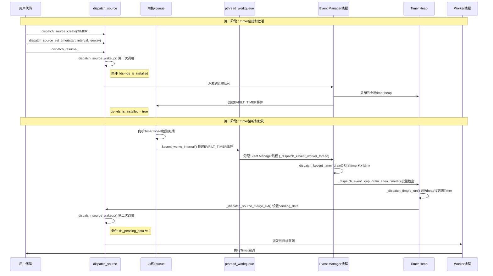

# GCD Timer完整机制解析

## 时序图概览



## 架构概览

GCD Timer采用三层分工架构：

```
┌─────────────────────┐
│   Timer回调执行     │ ← Worker线程（普通workqueue线程）
├─────────────────────┤
│   Timer检测派发     │ ← Event Manager线程（临时分配）
├─────────────────────┤
│   Timer事件监听     │ ← 内核kqueue（系统级常驻）
└─────────────────────┘
```

## 详细实现机制

### 1. Timer创建和注册

#### 用户API调用
```c
dispatch_source_t timer = dispatch_source_create(DISPATCH_SOURCE_TYPE_TIMER, 0, 0, queue);
dispatch_source_set_event_handler(timer, ^{ /* 回调逻辑 */ });
dispatch_source_set_timer(timer, start, interval, leeway);
dispatch_resume(timer);  // 关键：立即激活并注册
```

#### 内部注册流程
```c
// dispatch_resume() 触发的内部流程
void _dispatch_source_activate(dispatch_source_t ds, bool *allow_resume)
{
    if (!ds->ds_is_installed) {
        _dispatch_source_install(ds, wlh, pri);  // 立即注册到系统
    }
}

static void _dispatch_source_install(dispatch_source_t ds, dispatch_wlh_t wlh,
                                    dispatch_priority_t pri)
{
    ds->ds_is_installed = true;
    _dispatch_unote_register(dr, wlh, pri);  // 注册到全局timer heap
}
```

#### Timer数据结构
```c
typedef struct dispatch_timer_source_refs_s {
    struct dispatch_timer_source_s dt_timer;    // Timer配置（target, interval, deadline）
    uint32_t dt_heap_entry[DTH_ID_COUNT];      // 在Timer heap中的位置索引
    dispatch_timer_config_t dt_pending_config;  // 待应用的配置更新
    uint32_t du_ident;                         // Timer在kqueue中的标识符
    uint8_t du_timer_flags;                    // Timer标志（时钟类型、QoS等）
} *dispatch_timer_source_refs_t;
```

#### 全局Timer Heap管理

```c
// 全局timer heap数组 - 所有Timer的统一存储
DISPATCH_GLOBAL(struct dispatch_timer_heap_s _dispatch_timers_heap[DISPATCH_TIMER_COUNT]);

// 每个heap的结构
typedef struct dispatch_timer_heap_s {
    uint32_t dth_count;                              // heap中Timer数量
    uint8_t dth_segments;                            // 分段数量（动态扩容）
    uint8_t dth_max_qos;                            // heap中最高QoS级别
    uint8_t dth_dirty_bits;                         // 脏位标记（仅第一个heap使用）
    uint8_t dth_armed : 1;                         // 是否已注册到kqueue
    uint8_t dth_needs_program : 1;                 // 是否需要重新编程kqueue
    dispatch_timer_source_refs_t dth_min[DTH_ID_COUNT];  // 最小堆顶元素（target和deadline）
    void **dth_heap;                               // 分段存储的heap数据
} *dispatch_timer_heap_t;
```

**Timer分类和索引计算**：

```c
// Timer根据时钟类型和QoS级别分配到不同heap
static inline unsigned int _dispatch_timer_unote_idx(dispatch_timer_source_refs_t dt)
{
    dispatch_clock_t clock = _dispatch_timer_flags_to_clock(dt->du_timer_flags);
    uint32_t qos = 0;

#if DISPATCH_HAVE_TIMER_QOS
    // 提取QoS相关标志
    qos = dt->du_timer_flags & (DISPATCH_TIMER_STRICT|DISPATCH_TIMER_BACKGROUND);
#endif

    // 计算在全局数组中的索引：DISPATCH_TIMER_INDEX(clock, qos)
    // 例如：UPTIME时钟 + NORMAL QoS = 索引0，WALL时钟 + BACKGROUND QoS = 索引N
    return DISPATCH_TIMER_INDEX(clock, qos);
}
```

**双重最小堆结构**：

每个heap实际上包含两个交错存储的最小堆：
- **偶数索引**：按target时间排序的最小堆
- **奇数索引**：按deadline时间排序的最小堆

```c
#define DTH_TARGET_ID   0u    // target时间堆ID
#define DTH_DEADLINE_ID 1u    // deadline时间堆ID
#define DTH_ID_COUNT    2u    // 两个堆

// 堆顶元素直接存储在heap结构中
dth->dth_min[DTH_TARGET_ID]   // target最小堆的根
dth->dth_min[DTH_DEADLINE_ID] // deadline最小堆的根
```

**分段动态存储**：

为了支持动态扩容，heap使用分段存储：

```c
// 分段容量计算
#define DISPATCH_HEAP_INIT_SEGMENT_CAPACITY 8u

static inline uint32_t _dispatch_timer_heap_capacity(uint32_t segments)
{
    if (segments == 0) return 2;  // 只有堆顶的两个元素
    uint32_t seg_no = segments - 1;
    // 总容量 = 2 + 8 + 8 + 16 + 32 + ... - seg_no
    return 2 + (DISPATCH_HEAP_INIT_SEGMENT_CAPACITY << seg_no) - seg_no;
}

// 存储布局示例：
// segment 0: [8个Timer指针]
// segment 1: [8个Timer指针]  
// segment 2: [16个Timer指针]
// segment n: [常规Timer指针... | seg_n-1_ptr | seg_k_ptr | seg_0_ptr]
```

**Timer插入操作**：

```c
static void _dispatch_timer_heap_insert(dispatch_timer_heap_t dth,
        dispatch_timer_source_refs_t dt)
{
    uint32_t idx = (dth->dth_count += DTH_ID_COUNT) - DTH_ID_COUNT;

    // 更新heap的最高QoS
    dispatch_qos_t qos = MAX(_dispatch_priority_qos(dt->du_priority),
            _dispatch_priority_fallback_qos(dt->du_priority));
    if (dth->dth_max_qos < qos) {
        dth->dth_max_qos = (uint8_t)qos;
        dth->dth_needs_program = true;  // 需要重新编程kqueue
    }

    if (idx == 0) {
        // 第一个Timer，直接设为堆顶
        dth->dth_needs_program = true;
        dt->dt_heap_entry[DTH_TARGET_ID] = DTH_TARGET_ID;
        dt->dt_heap_entry[DTH_DEADLINE_ID] = DTH_DEADLINE_ID;
        dth->dth_min[DTH_TARGET_ID] = dth->dth_min[DTH_DEADLINE_ID] = dt;
        return;
    }

    // 检查是否需要扩容
    if (unlikely(idx + DTH_ID_COUNT > _dispatch_timer_heap_capacity(dth->dth_segments))) {
        _dispatch_timer_heap_grow(dth);
    }
    
    // 分别在两个堆中进行堆化操作
    _dispatch_timer_heap_resift(dth, dt, idx + DTH_TARGET_ID);    // target堆
    _dispatch_timer_heap_resift(dth, dt, idx + DTH_DEADLINE_ID);  // deadline堆
}
```

**Timer查找和访问**：

```c
// 获取heap中指定位置的Timer
static inline dispatch_timer_source_refs_t *
_dispatch_timer_heap_get_slot(dispatch_timer_heap_t dth, uint32_t idx)
{
    if (idx < DTH_ID_COUNT) {
        return &dth->dth_min[idx];  // 堆顶元素
    }
    
    idx -= DTH_ID_COUNT;
    // 计算在哪个segment中
    uint32_t seg_no = 0;
    uint32_t capacity = DISPATCH_HEAP_INIT_SEGMENT_CAPACITY;
    
    while (idx >= capacity) {
        idx -= capacity;
        seg_no++;
        capacity <<= 1;  // 下一个segment容量翻倍
    }
    
    // 通过segment链找到实际存储位置
    void **segment = dth->dth_heap;
    for (uint32_t i = dth->dth_segments - 1; i > seg_no; i--) {
        segment = segment[_dispatch_timer_heap_capacity(i) - i];
    }
    
    return (dispatch_timer_source_refs_t *)&segment[idx];
}
```

**批量处理和dirty标记**：

```c
// 使用dirty位来批量处理heap更新
static inline void _dispatch_timers_heap_dirty(dispatch_timer_heap_t dth, uint32_t tidx)
{
    // 注意：dirty位只在第一个heap中维护，用于全局协调
    dth[0].dth_dirty_bits |= (1 << DISPATCH_TIMER_QOS(tidx)) | DTH_DIRTY_GLOBAL;
}

// 批量处理所有dirty的heap
static inline void _dispatch_event_loop_drain_anon_timers(void)
{
    if (_dispatch_timers_heap[0].dth_dirty_bits) {
        _dispatch_event_loop_drain_timers(_dispatch_timers_heap, DISPATCH_TIMER_COUNT);
    }
}
```

**关键特点**：
- 所有Timer统一管理在全局heap中，与目标队列类型无关
- 每个QoS级别维护独立的Timer heap
- Timer注册立即生效，无需等待

### 2. 内核事件监听层

#### kqueue初始化
```c
static void _dispatch_kq_init(void *context)
{
    // 初始化kevent workqueue集成
    _dispatch_kevent_workqueue_init();
    
    // 创建管理用的EVFILT_USER事件
    const dispatch_kevent_s ke = {
        .ident = 1,
        .filter = EVFILT_USER,
        .flags = EV_ADD|EV_CLEAR,
        .qos = _PTHREAD_PRIORITY_EVENT_MANAGER_FLAG,  // Event Manager标识
        .udata = (dispatch_kevent_udata_t)DISPATCH_WLH_MANAGER,
    };
    
    // 注册到内核kqueue，启用workqueue模式
    kevent_qos(kqfd, &ke, 1, NULL, 0, NULL, NULL,
               KEVENT_FLAG_WORKQ|KEVENT_FLAG_IMMEDIATE);
}
```

#### Timer注册到kqueue
```c
static void _dispatch_event_loop_timer_program(dispatch_timer_heap_t dth, uint32_t tidx,
        uint64_t target, uint64_t leeway, uint16_t action)
{
    dispatch_kevent_s ke = {
        .ident = DISPATCH_KEVENT_TIMEOUT_IDENT_MASK | tidx,  // Timer标识
        .filter = EVFILT_TIMER,
        .flags = action | EV_ONESHOT,
        .fflags = _dispatch_timer_index_to_fflags[tidx],     // 时钟类型
        .data = (int64_t)target,                             // 触发时间
        .ext[1] = leeway,                                    // 允许的延迟
        .qos = _PTHREAD_PRIORITY_EVENT_MANAGER_FLAG,
    };
    
    _dispatch_kq_deferred_update(wlh, &ke);  // 批量更新kqueue
}
```

**监听机制特点**：
- 基于内核EVFILT_TIMER，零轮询
- 支持纳秒级精度
- 支持leeway（延迟容忍）优化功耗

### 3. Event Manager线程检测层

#### 线程分配和类型判断
```c
// pthread workqueue分配线程入口
static void _dispatch_kevent_worker_thread(void **buf, int *count)
{
    dispatch_kevent_t events = (dispatch_kevent_t)*buf;
    int nevents = *count;
    
    // 关键：线程类型判断
    bool is_manager = _dispatch_wlh_worker_thread_init(&ddi);
    
    // 处理接收到的kevent事件
    _dispatch_event_loop_merge(events, nevents);
    
    if (is_manager) {
        // Event Manager线程执行路径
        _dispatch_mgr_queue_drain();                // 处理管理队列任务
        _dispatch_event_loop_drain_anon_timers();   // 处理timer事件
        _dispatch_wlh_worker_thread_reset();        // 重置状态，归还线程
    }
}

// 线程类型判断实现
static inline bool _dispatch_wlh_worker_thread_init(dispatch_deferred_items_t ddi)
{
    pthread_priority_t pp = _dispatch_get_priority();
    
    // 检查Event Manager标志
    if (!(pp & _PTHREAD_PRIORITY_EVENT_MANAGER_FLAG)) {
        return false;  // 普通Worker线程
    }
    
    // 设置Event Manager上下文
    _dispatch_queue_set_current(&_dispatch_mgr_q);
    _dispatch_queue_mgr_lock(&_dispatch_mgr_q);
    return true;
}
```

#### Timer到期检测和派发
```c
// Timer事件处理主循环
void _dispatch_event_loop_drain_anon_timers(void)
{
    dispatch_timer_heap_t dth = &_dispatch_timers[DISPATCH_TIMER_QOS_COUNT];
    uint32_t count = DISPATCH_TIMER_COUNT;
    dispatch_clock_now_cache_t nows = { };

    do {
        // 第一轮：检查到期Timer
        for (uint32_t tidx = 0; tidx < count; tidx++) {
            _dispatch_timers_run(dth, tidx, &nows);
        }
        
        // 第二轮：重新编程需要更新的Timer
        for (uint32_t tidx = 0; tidx < count; tidx++) {
            if (dth[tidx].dth_needs_program) {
                _dispatch_timers_program(dth, tidx, &nows);
            }
        }
    } while (unlikely(dth[0].dth_dirty_bits));  // 处理批处理期间的新变更
}

// Timer到期检测实现
static void _dispatch_timers_run(dispatch_timer_heap_t dth, uint32_t tidx,
                                dispatch_clock_now_cache_t nows)
{
    dispatch_timer_source_refs_t dr;
    uint64_t now;
    
    // 遍历Timer heap最小堆，检查到期的Timer
    while ((dr = dth[tidx].dth_min[DTH_TARGET_ID])) {
        now = _dispatch_time_now_cached(DISPATCH_TIMER_CLOCK(tidx), nows);
        if (dr->dt_timer.target > now) {
            break;  // 未到期，结束检查
        }
        
        // 处理到期Timer
        if (dr->du_timer_flags & DISPATCH_TIMER_AFTER) {
            // 一次性Timer：解除武装并派发
            _dispatch_timer_unote_disarm(dr, dth);
            os_atomic_store2o(dr, ds_pending_data, 2, relaxed);
            dux_merge_evt(dr, EV_ONESHOT, 0, 0);
        } else {
            // 重复Timer：重新计算下次触发时间
            uint64_t interval = dr->dt_timer.interval;
            if (interval > 0) {
                dr->dt_timer.target += interval;
                _dispatch_timer_heap_update(&dth[tidx], dr);
                os_atomic_store2o(dr, ds_pending_data, 1, relaxed);
                dux_merge_evt(dr, 0, 0, 0);
            }
        }
    }
}
```

#### 异步事件派发
```c
// Timer事件派发到目标队列
static void _dispatch_source_merge_evt(dispatch_unote_t du, uint32_t flags,
                                      uintptr_t data, uintptr_t status, 
                                      pthread_priority_t pp)
{
    dispatch_source_t ds = _dispatch_source_from_refs(du._ds);
    
    // 设置pending数据，用于用户回调获取触发次数
    os_atomic_store2o(du._ds, ds_pending_data, data, relaxed);
    
    // 关键：异步唤醒目标队列，请求Worker线程执行Timer回调
    dx_wakeup(ds, _dispatch_qos_from_pp(pp), 
              DISPATCH_WAKEUP_EVENT | DISPATCH_WAKEUP_CONSUME_2 | DISPATCH_WAKEUP_MAKE_DIRTY);
}
```

**Event Manager特点**：
- 临时分配，用完即还
- 批量处理timer heap更新，提高效率
- 异步派发，不阻塞检测流程

### 4. Worker线程执行层

#### Timer回调执行
- 普通workqueue线程执行用户Timer回调
- 运行在Timer source指定的目标队列QoS上下文
- 支持优先级继承和QoS传播
- 执行完毕后归还线程到线程池

#### Timer数据获取
```c
// 用户回调中获取Timer触发信息
DISPATCH_ALWAYS_INLINE
static inline unsigned long
_dispatch_source_timer_data(dispatch_timer_source_refs_t dr, uint64_t prev)
{
    unsigned long data = (unsigned long)prev >> 1;
    
    // 与_dispatch_timers_run()的release barrier配对
    uint64_t now = os_atomic_load2o(dr, ds_pending_data, acquire);
    if ((now & DISPATCH_TIMER_DISARMED_MARKER) && data) {
        data = (unsigned long)now >> 1;
    }
    
    return data;  // 返回Timer触发次数
}
```

## _dispatch_source_wakeup的两次关键调用

GCD Timer在生命周期中会经过 `_dispatch_source_wakeup` 两次关键调用，每次有不同的判断条件和执行路径。

### 核心判断逻辑

```c
void _dispatch_source_wakeup(dispatch_source_t ds, dispatch_qos_t qos,
        dispatch_wakeup_flags_t flags)
{
    dispatch_source_refs_t dr = ds->ds_refs;
    dispatch_queue_wakeup_target_t dkq = DISPATCH_QUEUE_WAKEUP_MGR;    // 默认管理队列
    dispatch_queue_wakeup_target_t tq = DISPATCH_QUEUE_WAKEUP_NONE;

    // 关键判断序列 - 按优先级顺序
    if (!ds->ds_is_installed) {
        // 第一次：Timer需要安装到kevent队列
        tq = dkq;
    } else if (!(dqf & (DSF_CANCELED | DQF_RELEASED)) &&
            os_atomic_load2o(dr, ds_pending_data, relaxed)) {
        // 第二次：Timer有pending数据需要派发到目标队列
        tq = DISPATCH_QUEUE_WAKEUP_TARGET;
    }
    // ... 其他条件判断

    return _dispatch_queue_wakeup(ds, qos, flags, tq);
}
```

### 第一次调用：Timer激活安装

**何时触发**：`dispatch_resume()` → `_dispatch_source_activate()` → `dx_wakeup()`

**判断条件**：`!ds->ds_is_installed`

**执行目标**：管理队列 (`DISPATCH_QUEUE_WAKEUP_MGR`)

**主要任务**：
- 注册Timer到全局timer heap
- 创建kqueue事件 (`EVFILT_TIMER`)
- 设置 `ds->ds_is_installed = true`

**执行路径**：
```c
管理队列处理 → _dispatch_source_install() 
              → _dispatch_unote_register() 
              → _dispatch_timer_unote_register()
              → _dispatch_timer_unote_arm() 
              → 注册到全局heap和kqueue
```

### 第二次调用：Timer到期派发

**何时触发**：Event Manager线程检测到Timer到期 → `_dispatch_source_merge_evt()` → `dx_wakeup()`

**判断条件**：`os_atomic_load2o(dr, ds_pending_data, relaxed)`

**执行目标**：Timer的目标队列 (`DISPATCH_QUEUE_WAKEUP_TARGET`)

**主要任务**：
- 唤醒目标队列
- 请求Worker线程
- 执行用户Timer回调

**Event Manager线程生命周期**：
```c
// 1. 内核分配临时线程
kevent_workq_internal() → workq_kevent_callback() 
→ _pthread_wqthread() // 带WQ_FLAG_THREAD_KEVENT标志

// 2. 线程类型判断和任务执行
_dispatch_kevent_worker_thread() {
    bool is_manager = _dispatch_wlh_worker_thread_init(&ddi);
    if (is_manager) {
        _dispatch_event_loop_drain_anon_timers();   // 检查timer heap
        _dispatch_wlh_worker_thread_reset();        // 归还线程
    }
}

// 3. Timer检测和派发
_dispatch_timers_run() {
    while ((dr = dth[tidx].dth_min[DTH_TARGET_ID])) {
        if (dr->dt_timer.target > now) break;  // 未到期
        
        // 找到到期Timer，触发第二次wakeup
        dux_merge_evt(dr, flags, data, 0);
    }
}
```

**完整执行路径**：
```c
_dispatch_queue_wakeup(ds, qos, flags, DISPATCH_QUEUE_WAKEUP_TARGET);
  ↓
_dispatch_lane_wakeup() // 普通队列处理
  ↓
// 更新队列状态，增加pending工作项
os_atomic_rmw_loop2o(dq, dq_state, old_state, new_state, relaxed, {
    new_state = old_state + DISPATCH_QUEUE_WIDTH_INTERVAL | DISPATCH_QUEUE_DIRTY;
});
  ↓
// 请求pthread workqueue分配Worker线程
_dispatch_root_queue_poke() → _pthread_workqueue_addthreads()
  ↓
// 内核分配线程并调用注册回调
_dispatch_worker_thread2(pthread_priority_t pp)
  ↓
// 获取对应root queue并开始处理
_dispatch_root_queue_drain() → _dispatch_source_invoke()
  ↓
// 执行用户Timer回调
handler(); // 用户的Timer回调代码
```

### 两次调用对比

| 维度 | 第一次 (激活) | 第二次 (回调) |
|------|--------------|--------------|
| **判断条件** | `!ds->ds_is_installed` | `ds_pending_data != 0` |
| **目标队列** | 管理队列 | Timer的目标队列 |
| **线程类型** | Event Manager线程 | 普通Worker线程 |
| **主要任务** | 系统注册和配置 | 用户回调执行 |
| **生命周期** | 立即处理后归还 | 临时分配执行后归还 |

## 完整触发链路

```
1. 用户代码调用dispatch_resume()
   └── Timer立即注册到全局heap和内核kqueue

2. 内核kqueue检测EVFILT_TIMER到期
   └── kevent_workq_internal()投递事件到pthread workqueue

3. pthread workqueue分配Event Manager线程
   └── _pthread_wqthread()带_PTHREAD_PRIORITY_EVENT_MANAGER_FLAG

4. Event Manager线程处理kevent事件
   ├── _dispatch_kevent_worker_thread()线程入口
   ├── _dispatch_event_loop_drain_anon_timers()检查timer heap
   └── _dispatch_timers_run()找到实际到期的timer

5. 异步派发timer回调到目标队列
   ├── _dispatch_source_merge_evt()设置pending数据
   └── dx_wakeup()唤醒目标队列

6. pthread workqueue分配Worker线程执行回调
   └── 在目标队列QoS上下文中执行用户Timer回调

7. Event Manager线程归还
   └── _dispatch_wlh_worker_thread_reset()清理状态并返回线程池
```