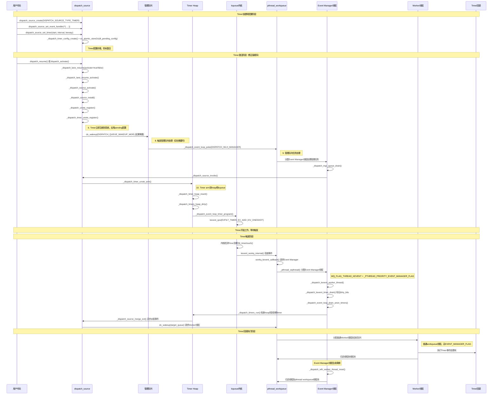

# GCD Timer完整实现机制深度解析（Apple平台）

基于Apple平台libdispatch源码分析，深入解析GCD Timer在DISPATCH_USE_KEVENT_WORKQUEUE和DISPATCH_USE_KEVENT_WORKLOOP都开启情况下，从注册到回调执行的完整实现机制。

## 核心架构

Apple平台GCD Timer采用pthread workqueue + kevent的事件驱动架构：

```c
// src/internal.h - Apple平台配置
#if HAVE_PTHREAD_WORKQUEUE_KEVENT
#define DISPATCH_USE_KEVENT_WORKQUEUE 1    // pthread workqueue集成
#else
#define DISPATCH_USE_KEVENT_WORKQUEUE 0
#endif

#if HAVE_PTHREAD_WORKQUEUE_WORKLOOP && DISPATCH_MIN_REQUIRED_OSX_AT_LEAST(101300)
#define DISPATCH_USE_KEVENT_WORKLOOP 1     // workloop支持
#else
#define DISPATCH_USE_KEVENT_WORKLOOP 0
#endif

// 关键：Apple平台不使用传统Manager线程
#ifndef DISPATCH_USE_MGR_THREAD
#if !DISPATCH_USE_KEVENT_WORKQUEUE || DISPATCH_DEBUG || DISPATCH_PROFILE
#define DISPATCH_USE_MGR_THREAD 1          // 仅调试模式
#else
#define DISPATCH_USE_MGR_THREAD 0          // 正常模式
#endif
#endif
```

**架构特点**：
- **临时Event Manager线程**：从pthread workqueue按需分配，处理完任务后立即归还
- **无常驻Manager线程**：避免了传统模式的线程常驻开销
- **内核级事件驱动**：基于kqueue的零轮询事件通知

## 关键组件

### 1. Timer数据结构

```c
// swift-corelibs-libdispatch - src/event/event_internal.h
typedef struct dispatch_timer_source_refs_s {
    struct dispatch_timer_source_s dt_timer;    // Timer配置（target, interval, deadline）
    uint32_t dt_heap_entry[DTH_ID_COUNT];      // 在Timer heap中的位置索引
    dispatch_timer_config_t dt_pending_config;  // 待应用的配置更新
    uint32_t du_ident;                         // Timer在kqueue中的标识符
    uint8_t du_timer_flags;                    // Timer标志（时钟类型、QoS等）
} *dispatch_timer_source_refs_t;
```

### 2. Timer Heap管理

```c
// swift-corelibs-libdispatch - src/event/event_internal.h
typedef struct dispatch_timer_heap_s {
    dispatch_timer_source_refs_t *dth_min[DTH_ID_COUNT];  // 最小堆顶元素数组
    uint32_t dth_dirty_bits;     // 标记需要重新编程的heap位掩码
    bool dth_needs_program;      // 是否需要重新设置kqueue
    bool dth_armed;             // 是否已注册到kqueue
} dispatch_timer_heap_s[DISPATCH_TIMER_COUNT];
```

**特点**：
- 每个QoS级别维护独立的Timer heap
- 支持按target时间和deadline的双重排序
- 通过dirty_bits实现批量kqueue更新优化

## libdispatch初始化流程

### 1. pthread workqueue集成

```c
// swift-corelibs-libdispatch - src/queue.c
void _dispatch_kevent_workqueue_init(void)
{
    _dispatch_root_queues_init();
    if (!_dispatch_kevent_workqueue_enabled) return;
    
    // 设置Event Manager线程优先级
    dispatch_once_f(&_dispatch_mgr_sched_pred, NULL, _dispatch_mgr_sched_init);
    qos_class_t qos = _dispatch_mgr_sched.qos;
    int prio = _dispatch_mgr_sched.prio;
    pthread_priority_t pp = 0;
    
    if (qos) {
        pp = _pthread_qos_class_encode(qos, 0, 0);
    }
    if (prio > _dispatch_mgr_sched.default_prio) {
        pp = (pthread_priority_t)prio | _PTHREAD_PRIORITY_SCHED_PRI_FLAG;
    }
    
    // 关键：向pthread workqueue注册Event Manager优先级
    if (pp) {
        int r = _pthread_workqueue_set_event_manager_priority(pp);
        (void)dispatch_assume_zero(r);
    }
}
```

### 2. workqueue回调注册

```c
// swift-corelibs-libdispatch - src/queue.c
static void _dispatch_root_queues_init_once(void *context)
{
#if DISPATCH_USE_KEVENT_WORKLOOP
    if (wq_supported & WORKQ_FEATURE_WORKLOOP) {
        r = _pthread_workqueue_init_with_workloop(_dispatch_worker_thread2,
                (pthread_workqueue_function_kevent_t)_dispatch_kevent_worker_thread,
                (pthread_workqueue_function_workloop_t)_dispatch_workloop_worker_thread,
                offsetof(struct dispatch_queue_s, dq_serialnum), 0);
#endif
    }
}
```

**关键点**：
- `_dispatch_kevent_worker_thread`就是Event Manager的实际入口函数
- 支持workloop和kevent两种模式

## 完整流程时序图



## Timer注册和激活完整流程

### 1. 用户API调用序列

```c
// 1. 创建Timer source
dispatch_source_t timer = dispatch_source_create(DISPATCH_SOURCE_TYPE_TIMER, 0, 0, queue);

// 2. 设置事件处理器
dispatch_source_set_event_handler(timer, ^{
    // Timer回调逻辑
});

// 3. 配置Timer参数
dispatch_source_set_timer(timer, start, interval, leeway);

// 4. 关键步骤：激活Timer（开始监听）
dispatch_resume(timer);  // 或者 dispatch_activate(timer)
```

**重要**：`dispatch_resume()`或`dispatch_activate()`是必需的最后步骤，没有这个调用Timer不会真正开始工作！

### 2. Timer配置阶段

```c
// swift-corelibs-libdispatch - src/source.c
void dispatch_source_set_timer(dispatch_source_t ds, dispatch_time_t start,
                               uint64_t interval, uint64_t leeway)
{
    dispatch_timer_source_refs_t dr = ds->ds_timer_refs;
    
    // 创建新的Timer配置
    dispatch_timer_config_t dtc = _dispatch_timer_config_create(start, interval, leeway, dr);

    // 原子更新pending配置（注意：此时Timer还未激活）
    os_atomic_store2o(dr, dt_pending_config, dtc, release);

    // 如果Timer已经激活，则需要重新配置
    if (ds->ds_is_installed) {
        dx_wakeup(ds, qos, DISPATCH_WAKEUP_CONSUME_2 | DISPATCH_WAKEUP_MAKE_DIRTY);
    }
    // 如果Timer未激活，配置会在dispatch_resume()时应用
}
```

### 3. 关键的激活步骤：dispatch_resume()

```c
// swift-corelibs-libdispatch - src/object.c
void dispatch_resume(dispatch_object_t dou)
{
    if (dx_cluster(dou._do) == _DISPATCH_QUEUE_CLUSTER) {
        // Timer source属于队列集群
        _dispatch_lane_resume(dou._dl, false);  // activate=false，表示正常resume
    }
}

// 或者用户也可以调用
void dispatch_activate(dispatch_object_t dou)
{
    if (dx_cluster(dou._do) == _DISPATCH_QUEUE_CLUSTER) {
        _dispatch_lane_resume(dou._dl, true);   // activate=true，表示首次激活
    }
}
```

### 4. 激活状态转换和Source安装

```c
// swift-corelibs-libdispatch - src/queue.c
void _dispatch_lane_resume(dispatch_lane_t dq, bool activate)
{
    uint64_t old_state, new_state;
    bool is_source = (dx_metatype(dq) == _DISPATCH_SOURCE_TYPE);

    os_atomic_rmw_loop2o(dq, dq_state, old_state, new_state, release, {
        if (is_source && (old_state & suspend_bits) ==
                DISPATCH_QUEUE_NEEDS_ACTIVATION + DISPATCH_QUEUE_INACTIVE) {
            // Timer source从未激活状态转换到活跃状态
            // { sc:0 i:1 na:1 } -> { sc:1 i:0 na:0 }
            new_state = old_state - DISPATCH_QUEUE_INACTIVE
                    - DISPATCH_QUEUE_NEEDS_ACTIVATION
                    + DISPATCH_QUEUE_SUSPEND_INTERVAL;
        } 
        // ... 其他状态转换逻辑
    });

    if ((old_state ^ new_state) & DISPATCH_QUEUE_NEEDS_ACTIVATION) {
        // 清除了NEEDS_ACTIVATION位，需要执行激活流程
        return _dispatch_lane_resume_activate(dq);
    }
    // ... 正常resume逻辑
}

static void _dispatch_lane_resume_activate(dispatch_lane_t dq)
{
    bool allow_resume = true;
    
    // 关键：调用source的激活回调
    if (dx_vtable(dq)->dq_activate) {
        dx_vtable(dq)->dq_activate(dq, &allow_resume);  // 对Timer source调用_dispatch_source_activate
    }
    
    // 完成resume
    if (allow_resume) {
        return _dispatch_lane_resume(dq, false);
    }
}
```

### 5. Timer Source激活实现

```c
// swift-corelibs-libdispatch - src/source.c
void _dispatch_source_activate(dispatch_source_t ds, bool *allow_resume)
{
    dispatch_source_refs_t dr = ds->ds_refs;
    dispatch_priority_t pri;
    dispatch_wlh_t wlh;

    // 检查是否已被取消
    if (unlikely(_dispatch_queue_atomic_flags(ds) & DSF_CANCELED)) {
        ds->ds_is_installed = true;
        return _dispatch_source_refs_finalize_unregistration(ds);
    }

    // 检查事件处理器
    dispatch_continuation_t dc = _dispatch_source_get_event_handler(dr);
    if (dc) {
        // 设置队列优先级等属性
        if ((dc->dc_priority & _PTHREAD_PRIORITY_ENFORCE_FLAG) ||
                !_dispatch_queue_priority_manually_selected(ds->dq_priority)) {
            ds->dq_priority = _dispatch_priority_from_pp_strip_flags(dc->dc_priority);
        }
        if (dc->dc_flags & DC_FLAG_FETCH_CONTEXT) {
            dc->dc_ctxt = ds->do_ctxt;
        }
    } else {
        _dispatch_bug_deprecated("dispatch source activated "
                "with no event handler set");
    }

    // 调用"super"的激活逻辑
    _dispatch_lane_activate(ds, allow_resume);

    // 关键：Timer source的特殊处理
    if ((dr->du_is_direct || dr->du_is_timer) && !ds->ds_is_installed) {
        pri = _dispatch_queue_compute_priority_and_wlh(ds, &wlh);
        if (pri) {
#if DISPATCH_USE_KEVENT_WORKLOOP
            // workloop Timer的特殊处理
            dispatch_workloop_t dwl = _dispatch_wlh_to_workloop(wlh);
            if (dwl && dr->du_filter == DISPATCH_EVFILT_TIMER_WITH_CLOCK &&
                    dr->du_ident < DISPATCH_TIMER_WLH_COUNT) {
                if (!dwl->dwl_timer_heap) {
                    uint32_t count = DISPATCH_TIMER_WLH_COUNT;
                    dwl->dwl_timer_heap = _dispatch_calloc(count,
                            sizeof(struct dispatch_timer_heap_s));
                }
                dr->du_is_direct = true;
                _dispatch_wlh_retain(wlh);
                _dispatch_unote_state_set(dr, wlh, 0);
            }
#endif
            // 关键：安装Timer source到系统
            _dispatch_source_install(ds, wlh, pri);
        }
    }
}
```

### 6. Timer安装到系统（立即注册）

```c
// swift-corelibs-libdispatch - src/source.c
static void _dispatch_source_install(dispatch_source_t ds, dispatch_wlh_t wlh,
                                    dispatch_priority_t pri)
{
    dispatch_source_refs_t dr = ds->ds_refs;

    dispatch_assert(!ds->ds_is_installed);
    ds->ds_is_installed = true;

    _dispatch_object_debug(ds, "%s", __func__);
    
    // 关键：立即注册Timer到系统
    if (unlikely(!_dispatch_unote_register(dr, wlh, pri))) {
        return _dispatch_source_refs_finalize_unregistration(ds);
    }
}
```

### 7. Timer注册到系统核心实现

```c
// swift-corelibs-libdispatch - src/event/event.c
bool _dispatch_unote_register(dispatch_unote_t du, dispatch_wlh_t wlh,
                              dispatch_priority_t pri)
{
    dispatch_assert(du._du->du_is_timer || !_dispatch_unote_registered(du));
    dispatch_priority_t masked_pri;

    masked_pri = pri & (DISPATCH_PRIORITY_FLAG_MANAGER |
            DISPATCH_PRIORITY_FLAG_FALLBACK |
            DISPATCH_PRIORITY_FLAG_FLOOR |
            DISPATCH_PRIORITY_FALLBACK_QOS_MASK |
            DISPATCH_PRIORITY_REQUESTED_MASK);

    dispatch_assert(wlh == DISPATCH_WLH_ANON || masked_pri);
    du._du->du_priority = pri;

    if (du._du->du_is_timer) {
        _dispatch_timer_unote_register(du._dt, wlh, pri);
        return true;
    }
    // 其他类型source处理...
}

DISPATCH_NOINLINE
static void _dispatch_timer_unote_register(dispatch_timer_source_refs_t dt,
                                          dispatch_wlh_t wlh, 
                                          dispatch_priority_t pri)
{
    // 处理background/maintenance QoS Timer的积极合并优化
    // <rdar://problem/12200216&27342536>
    if (_dispatch_qos_is_background(_dispatch_priority_qos(pri))) {
        if (dt->du_timer_flags & DISPATCH_TIMER_STRICT) {
            _dispatch_ktrace1(DISPATCH_PERF_strict_bg_timer,
                    _dispatch_source_from_refs(dt));
        } else {
            dt->du_timer_flags |= DISPATCH_TIMER_BACKGROUND;
            dt->du_ident = _dispatch_timer_unote_idx(dt);
        }
    }
    
    // _dispatch_source_activate()可以为直接附加到workloop的Timer预设wlh
    if (_dispatch_unote_wlh(dt) != wlh) {
        dispatch_assert(_dispatch_unote_wlh(dt) == NULL);
        _dispatch_unote_state_set(dt, DISPATCH_WLH_ANON, 0);
    }
    
    // 立即应用pending配置
    if (os_atomic_load2o(dt, dt_pending_config, relaxed)) {
        _dispatch_timer_unote_configure(dt);
    }
}
```

**重要理解**：
- 如果Timer还未激活（`!ds->ds_is_installed`），`dispatch_source_set_timer()`只是存储配置
- 只有在`dispatch_resume()`调用`_dispatch_source_activate()`时，Timer才真正注册到系统
- 如果Timer已激活，后续的`dispatch_source_set_timer()`会触发配置更新流程

### 8. 触发管理队列处理（如果需要）

```c
// swift-corelibs-libdispatch - src/source.c
void _dispatch_source_wakeup(dispatch_source_t ds, dispatch_qos_t qos,
                             dispatch_wakeup_flags_t flags)
{
    dispatch_timer_source_refs_t dr = ds->ds_timer_refs;
    dispatch_queue_wakeup_target_t tq = DISPATCH_QUEUE_WAKEUP_NONE;

    if (!ds->ds_is_installed) {
        // Timer source首次注册需要在管理队列中处理
        tq = DISPATCH_QUEUE_WAKEUP_MGR;
    } else if (_dispatch_source_refs_needs_configuration(dr)) {
        // Timer配置变更也需要在管理队列中处理
        tq = DISPATCH_QUEUE_WAKEUP_MGR;
    }

    if (tq) {
        // 将注册/配置任务推送到管理队列
        return _dispatch_queue_wakeup(ds, qos, flags, tq);
    }
}
```

### 9. 管理队列任务处理

```c
// swift-corelibs-libdispatch - src/queue.c
void _dispatch_mgr_queue_push(dispatch_lane_t dq, dispatch_object_t dou,
                              dispatch_qos_t qos)
{
    if (unlikely(_dispatch_queue_push_item(dq, dou))) {
        dq_state = os_atomic_or2o(dq, dq_state, DISPATCH_QUEUE_DIRTY, release);
        
        if (!_dq_state_drain_locked_by_self(dq_state)) {
            // 关键：触发Event Manager线程处理管理任务
            _dispatch_event_loop_poke(DISPATCH_WLH_MANAGER, 0, 0);
        }
    }
}

static void _dispatch_mgr_queue_drain(void)
{
    if (dq->dq_items_tail) {
        // 串行处理所有pending的管理任务
        _dispatch_lane_serial_drain(dq, &dic, flags, &owned);
    }
}
```

### 10. Timer arm到heap和kqueue

```c
// swift-corelibs-libdispatch - src/source.c
void _dispatch_source_invoke(dispatch_source_t ds, dispatch_invoke_context_t dic,
                             dispatch_invoke_flags_t flags)
{
    // 最终在管理队列中执行，处理Timer的arm操作
    if (!ds->ds_is_installed) {
        _dispatch_source_install(ds, _dispatch_get_event_wlh(), pri);
    }
    
    if (_dispatch_source_refs_needs_configuration(dr)) {
        _dispatch_timer_unote_configure(ds->ds_timer_refs);
    }
}

// swift-corelibs-libdispatch - src/event/event.c
static void _dispatch_timer_unote_resume(dispatch_timer_source_refs_t dt)
{
    bool will_arm = _dispatch_timer_unote_needs_rearm(dt, 0);
    uint32_t tidx = _dispatch_timer_unote_idx(dt);
    dispatch_timer_heap_t dth = _dispatch_timer_unote_heap(dt);

    if (will_arm) {
        _dispatch_timer_unote_arm(dt, dth, tidx);
    }
}

static void _dispatch_timer_unote_arm(dispatch_timer_source_refs_t dt,
                                     dispatch_timer_heap_t dth, uint32_t tidx)
{
    if (_dispatch_unote_armed(dt)) {
        _dispatch_timer_heap_update(&dth[tidx], dt);
    } else {
        dt->du_ident = tidx;
        _dispatch_timer_heap_insert(&dth[tidx], dt);
        _dispatch_unote_state_set_bit(dt, DU_STATE_ARMED);
    }
    _dispatch_timers_heap_dirty(dth, tidx);
}
```

## Timer触发的完整内核到用户空间链路

### 1. 内核kqueue层面

```c
// XNU内核 - bsd/kern/kern_event.c 
// Timer到期时，内核检测到EVFILT_TIMER事件
static int filt_timertouch(struct knote *kn, struct kevent_qos_s *kev)
{
    // Timer到期处理，激活knote
    KNOTE_ACTIVATE(kn, kev->data);
    return 0;
}

// 内核将事件投递到kevent workqueue
int kevent_workq_internal(struct proc *p,
                         user_addr_t changelist, int nchanges,
                         user_addr_t eventlist, int nevents,
                         user_addr_t data_out, user_size_t *data_available,
                         unsigned int flags, int32_t *retval)
{
    // 从kqueue中获取ready事件
    error = kqueue_scan(kq, kevent_callback_workq, &kev_data, 
                       &workq_data, p);
                       
    // 关键：调用pthread workqueue投递事件到用户空间线程
    if (workq_data.wd_has_events) {
        workq_kevent_callback(p, &workq_data);
    }
    
    return error;
}
```

### 2. pthread workqueue层面

```c
// XNU内核 - bsd/pthread/pthread_workqueue.c
static int workq_kevent_callback(struct proc *p, struct workq_kevent_data *kev_data)
{
    struct workqueue *wq = proc_get_wqptr_fast(p);
    
    // 关键：请求Event Manager线程处理kevent事件
    workq_threadreq_t req = workq_threadreq_alloc();
    req->tr_qos = WORKQ_THREAD_QOS_MANAGER;  // 指定Event Manager线程类型
    req->tr_flags = WORKQ_TR_FLAG_KEVENT;
    
    // 从线程池分派线程处理事件
    if (workq_threadreq_initiate(wq, req)) {
        workq_schedule_creator(p, wq);
    }
    
    return 0;
}
```

### 3. 用户空间线程启动

```c
// libpthread - pthread_workqueue.c
void _pthread_wqthread(pthread_t self, mach_port_t kport, void *stackaddr,
                      void *keventlist, int upcall_flags, int nkevents)
{
    if (flags & WQ_FLAG_THREAD_KEVENT) {
        // 这是kevent事件处理线程
        self->fun = (void *(*)(void*))__libdispatch_keventfunction;
        self->arg = keventlist;  // 包含kevent事件数组
        self->wq_nevents = nkevents;
        
        // 关键：调用libdispatch注册的kevent处理函数
        (*__libdispatch_keventfunction)(&self->arg, &self->wq_nevents);
        
        // 处理完成，返回内核
        __workq_kernreturn(WQOPS_THREAD_KEVENT_RETURN, self->arg, 
                          self->wq_nevents, 0);
    }
}
```

## Event Manager线程运作机制

### 1. 临时线程分配

```c
// swift-corelibs-libdispatch - src/queue.c
// __libdispatch_keventfunction指向这个函数
static void _dispatch_kevent_worker_thread(void **buf, int *count)
{
    if (!events || !nevents) {
        // 普通worker线程请求，无kevent事件
        return;
    }
    
    dispatch_kevent_t events = (dispatch_kevent_t)*buf;
    int nevents = *count;
    dispatch_deferred_items_s ddi = { .ddi_wlh = DISPATCH_WLH_ANON };
    
    // 关键：线程类型判断
    bool is_manager = _dispatch_wlh_worker_thread_init(&ddi);
    
    // 处理接收到的kevent事件
    _dispatch_event_loop_merge(events, nevents);
    
    if (is_manager) {
        // Event Manager线程执行路径
        _dispatch_trace_runtime_event(worker_unpark, &_dispatch_mgr_q, 0);
        _dispatch_mgr_queue_drain();                // 处理管理队列任务
        _dispatch_event_loop_drain_anon_timers();   // 处理timer事件
        _dispatch_wlh_worker_thread_reset();        // 重置线程状态，准备返回
    } else {
        // 普通Worker线程执行路径
        if (ddi.ddi_stashed_dou._do) {
            _dispatch_root_queue_drain_deferred_item(&ddi);
        }
    }
}
```

### 2. 关键的线程类型判断

```c
// swift-corelibs-libdispatch - src/queue.c
static inline bool _dispatch_wlh_worker_thread_init(dispatch_deferred_items_t ddi)
{
    dispatch_assert(ddi->ddi_wlh);
    pthread_priority_t pp = _dispatch_get_priority();

    // 关键判断：检查Event Manager标志
    if (!(pp & _PTHREAD_PRIORITY_EVENT_MANAGER_FLAG)) {
        // 普通workqueue线程：只处理投递的事件，执行Timer回调
        pp &= _PTHREAD_PRIORITY_OVERCOMMIT_FLAG | ~_PTHREAD_PRIORITY_FLAGS_MASK;
        if (ddi->ddi_wlh == DISPATCH_WLH_ANON) {
            pp |= _PTHREAD_PRIORITY_NEEDS_UNBIND_FLAG;
        } else {
            pp &= ~(pthread_priority_t)_PTHREAD_PRIORITY_NEEDS_UNBIND_FLAG;
        }
        _dispatch_thread_setspecific(dispatch_priority_key, (void *)(uintptr_t)pp);
        
        if (ddi->ddi_wlh != DISPATCH_WLH_ANON) {
            _dispatch_debug("wlh[%p]: handling events", ddi->ddi_wlh);
        } else {
            ddi->ddi_can_stash = true;
        }
        return false;  // 不是Event Manager
    }

    // 是Event Manager线程：设置管理队列上下文
    _dispatch_queue_set_current(&_dispatch_mgr_q);
    _dispatch_queue_mgr_lock(&_dispatch_mgr_q);
    return true;
}
```

### 3. 管理队列任务处理

```c
// swift-corelibs-libdispatch - src/queue.c
static void _dispatch_mgr_queue_drain(void)
{
    const dispatch_invoke_flags_t flags = DISPATCH_INVOKE_MANAGER_DRAIN;
    dispatch_invoke_context_s dic = { };
    struct dispatch_queue_static_s *dq = &_dispatch_mgr_q;
    uint64_t owned = DISPATCH_QUEUE_SERIAL_DRAIN_OWNED;

    // 只有在确实有管理任务时才处理
    if (dq->dq_items_tail) {
        _dispatch_perfmon_start();
        _dispatch_set_basepri_override_qos(DISPATCH_QOS_SATURATED);
        
        // 串行处理所有pending的管理任务
        if (unlikely(_dispatch_lane_serial_drain(dq, &dic, flags, &owned))) {
            DISPATCH_INTERNAL_CRASH(0, "Interrupted drain on manager queue");
        }
        
        _dispatch_voucher_debug("mgr queue clear", NULL);
        _voucher_clear();
        _dispatch_reset_basepri_override();
        _dispatch_perfmon_end(perfmon_thread_manager);
    }

    // 缓存清理（仅在kevent workqueue未启用时）
#if DISPATCH_USE_KEVENT_WORKQUEUE
    if (!_dispatch_kevent_workqueue_enabled)
#endif
    {
        _dispatch_force_cache_cleanup();
    }
}
```

## Timer事件检测与回调派发

### 1. Timer kevent处理

```c
// swift-corelibs-libdispatch - src/event/event_kevent.c
static inline void _dispatch_kevent_timer_drain(dispatch_kevent_t ke)
{
    uint32_t tidx = (uint32_t)ke->ident & ~DISPATCH_KEVENT_TIMEOUT_IDENT_MASK;
    dispatch_timer_heap_t dth = (dispatch_timer_heap_t)ke->udata;
    
    // 关键理解：kevent只是通知有timer到期，具体哪个需要检查heap
    // 标记该timer索引需要检查和重新编程
    dth[tidx].dth_needs_program = true;
    dth[tidx].dth_dirty_bits |= (1u << tidx);
}
```

### 2. Timer heap检查

```c
// swift-corelibs-libdispatch - src/event/event.c
void _dispatch_event_loop_drain_anon_timers(void)
{
    dispatch_timer_heap_t dth = &_dispatch_timers[DISPATCH_TIMER_QOS_COUNT];
    uint32_t count = DISPATCH_TIMER_COUNT;
    dispatch_clock_now_cache_t nows = { };

    do {
        // 第一轮：检查到期Timer
        for (uint32_t tidx = 0; tidx < count; tidx++) {
            _dispatch_timers_run(dth, tidx, &nows);
        }

        // 第二轮：重新编程需要更新的Timer
        for (uint32_t tidx = 0; tidx < count; tidx++) {
            if (dth[tidx].dth_needs_program) {
                _dispatch_timers_program(dth, tidx, &nows);
            }
        }
    } while (unlikely(dth[0].dth_dirty_bits));  // 处理批处理期间的新变更
}
```

### 3. Timer到期检测

```c
// swift-corelibs-libdispatch - src/event/event.c
static void _dispatch_timers_run(dispatch_timer_heap_t dth, uint32_t tidx,
                                dispatch_clock_now_cache_t nows)
{
    dispatch_timer_source_refs_t dr;
    uint64_t now;

    // 遍历Timer heap最小堆，检查到期的Timer
    while ((dr = dth[tidx].dth_min[DTH_TARGET_ID])) {
        now = _dispatch_time_now_cached(DISPATCH_TIMER_CLOCK(tidx), nows);
        if (dr->dt_timer.target > now) {
            break;  // 未到期，结束检查
        }

        // 找到到期的timer
        if (dr->du_timer_flags & DISPATCH_TIMER_AFTER) {
            // 一次性Timer处理
            _dispatch_timer_unote_disarm(dr, dth);
            os_atomic_store2o(dr, ds_pending_data, 2, relaxed);
            _dispatch_trace_timer_fire(dr, 1, 1);

            // 关键：异步派发Timer事件到目标队列
            dux_merge_evt(dr, EV_ONESHOT, 0, 0);
            continue;
        }

        // 重复Timer处理：重新计算下次触发时间并更新heap
        uint64_t interval = dr->dt_timer.interval;
        if (interval > 0) {
            dr->dt_timer.target += interval;
            _dispatch_timer_heap_update(&dth[tidx], dr);
            os_atomic_store2o(dr, ds_pending_data, 1, relaxed);
            _dispatch_trace_timer_fire(dr, 1, 0);
            dux_merge_evt(dr, 0, 0, 0);
        }
    }
}
```

### 4. 异步回调派发

```c
// swift-corelibs-libdispatch - src/source.c
static void _dispatch_source_merge_evt(dispatch_unote_t du, uint32_t flags,
                                      uintptr_t data, uintptr_t status, 
                                      pthread_priority_t pp)
{
    dispatch_source_t ds = _dispatch_source_from_refs(du._ds);

    // 设置pending数据，用于用户回调获取触发次数
    os_atomic_store2o(du._ds, ds_pending_data, data, relaxed);

    // 关键：异步唤醒目标队列，请求Worker线程执行Timer回调
    dx_wakeup(ds, _dispatch_qos_from_pp(pp), 
              DISPATCH_WAKEUP_EVENT | DISPATCH_WAKEUP_CONSUME_2 | DISPATCH_WAKEUP_MAKE_DIRTY);
}
```

## 关键设计特点与优势

### 1. 临时Event Manager机制

**特点**：
- Event Manager线程从pthread workqueue按需分配
- 处理完管理任务和timer检查后立即归还线程池
- 避免了常驻线程的资源开销

**代码证据**：
```c
// Event Manager完成任务后的清理
static void _dispatch_wlh_worker_thread_reset(void)
{
    _dispatch_queue_set_current(NULL);
    _dispatch_queue_mgr_unlock(&_dispatch_mgr_q);
    // 线程即将返回pthread workqueue线程池
}
```

### 2. 批量kqueue操作优化

**特点**：
- 使用dirty_bits机制延迟批量提交kqueue更新
- 减少系统调用频率，提高性能
- 通过`_dispatch_kq_deferred_update()`实现

**代码证据**：
```c
// 批量处理timer heap更新
void _dispatch_event_loop_drain_anon_timers(void)
{
    do {
        // 处理到期timer
        for (uint32_t tidx = 0; tidx < count; tidx++) {
            _dispatch_timers_run(dth, tidx, &nows);
        }
        // 批量kqueue编程
        for (uint32_t tidx = 0; tidx < count; tidx++) {
            if (dth[tidx].dth_needs_program) {
                _dispatch_timers_program(dth, tidx, &nows);
            }
        }
    } while (unlikely(dth[0].dth_dirty_bits));  // 处理批处理期间的变更
}
```

### 3. 两阶段事件处理

**Event Manager阶段**：
- 监听kqueue事件
- 维护timer heap
- 检测到期timer
- 异步派发事件到目标队列

**Worker线程阶段**：
- 执行实际的timer回调
- 运行在目标队列的QoS上下文
- 处理用户业务逻辑

### 4. QoS感知的优先级处理

```c
// Event Manager线程优先级设置
static void _dispatch_kevent_workqueue_init(void)
{
    qos_class_t qos = _dispatch_mgr_sched.qos;
    if (qos == QOS_CLASS_DEFAULT) {
        qos = QOS_CLASS_USER_INITIATED;  // 默认提升到USER_INITIATED
    }
    
    pthread_priority_t pp = _pthread_qos_class_encode(qos, 0, 0);
    _pthread_workqueue_set_event_manager_priority(pp);
}

// Timer kqueue事件携带QoS信息
dispatch_kevent_s ke = {
    .qos = _PTHREAD_PRIORITY_EVENT_MANAGER_FLAG,  // Event Manager标识
    // ... 其他字段
};
```

## 完整触发链路总结

```
1. 内核kqueue检测EVFILT_TIMER到期
   └── filt_timertouch() 激活knote事件

2. kevent_workq_internal() 投递事件到pthread workqueue
   └── workq_kevent_callback() 请求Event Manager线程

3. pthread workqueue分配临时Event Manager线程
   └── _pthread_wqthread() 带WQ_FLAG_THREAD_KEVENT标志

4. libdispatch接收并处理kevent事件
   ├── _dispatch_kevent_worker_thread() 线程入口
   ├── _dispatch_wlh_worker_thread_init() 线程类型判断
   └── _dispatch_kevent_timer_drain() 标记timer索引dirty

5. Event Manager线程执行核心处理循环
   ├── _dispatch_mgr_queue_drain() 处理管理队列任务
   ├── _dispatch_event_loop_drain_anon_timers() 检查timer heap
   └── _dispatch_timers_run() 找到实际到期的timer source

6. 异步派发timer回调到目标队列
   ├── _dispatch_source_merge_evt() 设置pending数据
   ├── dx_wakeup() 唤醒目标队列
   └── pthread workqueue分配Worker线程执行用户回调

7. Event Manager线程归还到线程池
   └── _dispatch_wlh_worker_thread_reset() 清理状态并返回
```

## 线程职责对比

| 线程类型 | 生命周期 | 主要职责 | 线程标识 | 执行内容 |
|---------|----------|----------|----------|----------|
| **Event Manager** | 临时按需分配 | Timer监听和管理 | `_PTHREAD_PRIORITY_EVENT_MANAGER_FLAG` | - 处理管理队列任务<br>- Timer heap维护<br>- kqueue事件处理<br>- 异步事件派发 |
| **Worker Thread** | 临时按需分配 | 执行用户回调 | 普通workqueue线程 | - 执行Timer事件处理块<br>- 运行在目标队列QoS<br>- 处理用户业务逻辑 |

## 环境控制与调试

### 1. 运行时环境变量

```c
// 可以禁用kevent workqueue，回退到传统Manager线程
#if DISPATCH_DEBUG || DISPATCH_PROFILE
#if DISPATCH_USE_KEVENT_WORKQUEUE
    if (getenv("LIBDISPATCH_DISABLE_KEVENT_WQ")) {
        _dispatch_kevent_workqueue_enabled = false;
    }
#endif
#endif
```

### 2. 编译时配置

```c
// 调试或性能分析模式下可能启用传统Manager线程
#ifndef DISPATCH_USE_MGR_THREAD
#if !DISPATCH_USE_KEVENT_WORKQUEUE || DISPATCH_DEBUG || DISPATCH_PROFILE
#define DISPATCH_USE_MGR_THREAD 1    // 启用传统模式
#else
#define DISPATCH_USE_MGR_THREAD 0    // 正常模式
#endif
#endif
```

## 关键优势

1. **高效的资源利用**：
   - 临时Event Manager线程避免常驻开销
   - pthread workqueue统一管理线程池
   - 按需分配，用完即还

2. **精确的事件驱动**：
   - 基于kqueue的内核级事件通知
   - 零轮询，响应延迟最小化
   - 支持纳秒级定时精度

3. **智能的批处理优化**：
   - dirty_bits机制减少系统调用
   - 批量timer检查和kqueue更新
   - 处理突发timer事件的效率最大化

4. **清晰的职责分离**：
   - Event Manager专注管理和调度
   - Worker线程专注执行用户代码
   - 避免阻塞和优先级倒置

5. **QoS感知的调度**：
   - Event Manager使用合适的优先级
   - Timer回调在目标队列QoS上执行
   - 系统级QoS传播和继承

这种设计使得Apple平台的GCD Timer既保证了高精度和低延迟，又实现了卓越的系统资源利用效率和现代化的异步编程模型。通过pthread workqueue集成，Timer系统完全融入了系统级的线程调度和QoS管理框架。