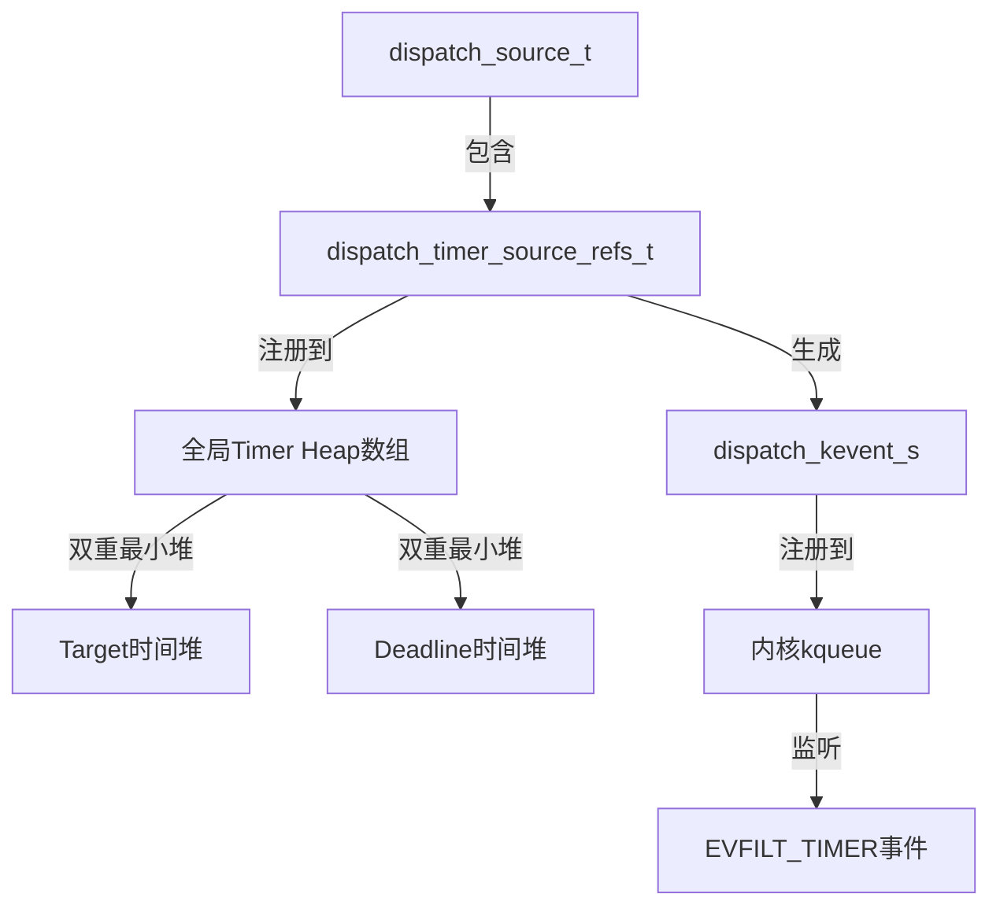
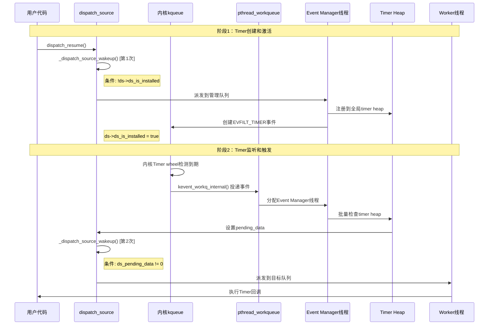

# GCD Timer内核监听机制与执行流程

## 1. 架构概述

### 1.1 三层分工模式

| 层次 | 组件 | 职责 | 线程类型 |
|------|------|------|----------|
| **监听层** | 内核kqueue + EVFILT_TIMER | 高精度时间监控，零轮询 | 内核级 |
| **检测层** | Event Manager线程 + Timer Heap | 批量检测到期Timer，异步派发 | 临时分配 |
| **执行层** | Worker线程 + 目标队列 | 执行用户Timer回调 | 按需分配 |

### 1.2 核心数据结构关系



### 1.3 时序图



## 2. Timer注册到内核流程

### 2.1 用户API调用链

```c
// 用户代码
dispatch_source_t timer = dispatch_source_create(DISPATCH_SOURCE_TYPE_TIMER, 0, 0, queue);
dispatch_source_set_timer(timer, start, interval, leeway);
dispatch_resume(timer);  // 关键：立即触发注册
```

### 2.2 内部注册流程

#### 第一次 _dispatch_source_wakeup 调用

**触发条件**: `!ds->ds_is_installed`

```c
void _dispatch_source_wakeup(dispatch_source_t ds, dispatch_qos_t qos, dispatch_wakeup_flags_t flags)
{
    // 判断序列 - 按优先级
    if (!ds->ds_is_installed) {
        // 第一次：Timer需要安装到kevent队列
        tq = DISPATCH_QUEUE_WAKEUP_MGR;  // 派发到管理队列
    }
    
    return _dispatch_queue_wakeup(ds, qos, flags, tq);
}
```

**执行路径**:
```
dispatch_resume() 
  → _dispatch_source_activate() 
  → dx_wakeup() 
  → 管理队列处理
  → _dispatch_source_install()
  → _dispatch_unote_register()
  → _dispatch_timer_unote_register()
```

### 2.3 Timer数据结构初始化

```c
typedef struct dispatch_timer_source_refs_s {
    struct dispatch_timer_source_s dt_timer;    // Timer配置：target, interval, deadline
    uint32_t dt_heap_entry[DTH_ID_COUNT];      // 在Timer heap中的双重索引位置
    dispatch_timer_config_t dt_pending_config;  // 待应用的配置更新
    uint32_t du_ident;                         // Timer在kqueue中的唯一标识符
    uint8_t du_timer_flags;                    // Timer标志：时钟类型、QoS等
} *dispatch_timer_source_refs_t;
```

### 2.4 全局Timer Heap注册

#### 索引计算和分类存储

```c
// Timer根据时钟类型和QoS级别分配到不同heap
static inline unsigned int _dispatch_timer_unote_idx(dispatch_timer_source_refs_t dt)
{
    dispatch_clock_t clock = _dispatch_timer_flags_to_clock(dt->du_timer_flags);
    uint32_t qos = dt->du_timer_flags & (DISPATCH_TIMER_STRICT|DISPATCH_TIMER_BACKGROUND);
    
    // 计算在全局数组中的索引
    // 例如：UPTIME时钟 + NORMAL QoS = 索引0，WALL时钟 + BACKGROUND QoS = 索引N
    return DISPATCH_TIMER_INDEX(clock, qos);
}
```

#### 双重最小堆插入

```c
static void _dispatch_timer_heap_insert(dispatch_timer_heap_t dth, dispatch_timer_source_refs_t dt)
{
    uint32_t idx = (dth->dth_count += DTH_ID_COUNT) - DTH_ID_COUNT;

    if (idx == 0) {
        // 第一个Timer，直接设为堆顶
        dth->dth_needs_program = true;  // 标记需要编程kqueue
        dt->dt_heap_entry[DTH_TARGET_ID] = DTH_TARGET_ID;
        dt->dt_heap_entry[DTH_DEADLINE_ID] = DTH_DEADLINE_ID;
        dth->dth_min[DTH_TARGET_ID] = dth->dth_min[DTH_DEADLINE_ID] = dt;
        return;
    }

    // 扩容检查
    if (unlikely(idx + DTH_ID_COUNT > _dispatch_timer_heap_capacity(dth->dth_segments))) {
        _dispatch_timer_heap_grow(dth);
    }
    
    // 分别在两个堆中进行堆化操作
    _dispatch_timer_heap_resift(dth, dt, idx + DTH_TARGET_ID);    // target堆
    _dispatch_timer_heap_resift(dth, dt, idx + DTH_DEADLINE_ID);  // deadline堆
}
```

### 2.5 kqueue事件注册

```c
static void _dispatch_event_loop_timer_program(dispatch_timer_heap_t dth, uint32_t tidx,
        uint64_t target, uint64_t leeway, uint16_t action)
{
    dispatch_kevent_s ke = {
        .ident = DISPATCH_KEVENT_TIMEOUT_IDENT_MASK | tidx,  // Timer唯一标识
        .filter = EVFILT_TIMER,                              // 内核Timer过滤器
        .flags = action | EV_ONESHOT,                        // 一次性触发
        .fflags = _dispatch_timer_index_to_fflags[tidx],     // 时钟类型标志
        .data = (int64_t)target,                             // 触发时间（绝对时间）
        .ext[1] = leeway,                                    // 允许的延迟时间
        .qos = _PTHREAD_PRIORITY_EVENT_MANAGER_FLAG,         // Event Manager优先级
    };
    
    _dispatch_kq_deferred_update(wlh, &ke);  // 批量更新kqueue，减少系统调用
}
```

**关键特点**:
- **立即生效**: `dispatch_resume()`调用后立即注册，不需等待
- **批量操作**: 使用deferred update减少系统调用开销
- **高精度**: 支持纳秒级时间精度和leeway优化

## 3. 内核监听机制

### 3.1 kqueue工作队列集成

```c
static void _dispatch_kq_init(void *context)
{
    // 初始化kevent workqueue集成
    _dispatch_kevent_workqueue_init();
    
    // 创建管理用的EVFILT_USER事件
    const dispatch_kevent_s ke = {
        .ident = 1,
        .filter = EVFILT_USER,
        .flags = EV_ADD|EV_CLEAR,
        .qos = _PTHREAD_PRIORITY_EVENT_MANAGER_FLAG,  // Event Manager标识
        .udata = (dispatch_kevent_udata_t)DISPATCH_WLH_MANAGER,
    };
    
    // 启用workqueue模式，委托线程管理给pthread工作队列
    kevent_qos(kqfd, &ke, 1, NULL, 0, NULL, NULL,
               KEVENT_FLAG_WORKQ|KEVENT_FLAG_IMMEDIATE);
}
```

### 3.2 内核Timer机制（基于项目源码）

#### timer_call 底层实现

```c
// osfmk/kern/timer_call.c
bool running_timers_expire(processor_t processor, uint64_t now)
{
    bool expired = false;
    
    if (!processor->running_timers_active) {
        return expired;
    }
    
    // 遍历处理器上的所有运行中Timer
    for (int i = 0; i < RUNNING_TIMER_MAX; i++) {
        struct timer_call *call = &processor->running_timers[i];
        
        uint64_t deadline = call->tc_pqlink.deadline;
        if (deadline > now) {
            continue;  // 未到期
        }
        
        expired = true;
        timer_call_trace_expire_entry(call);
        call->tc_func(call->tc_param0, call->tc_param1);  // 执行回调
        timer_call_trace_expire_return(call);
    }
    
    return expired;
}
```

#### EVFILT_TIMER处理器

```c
// 内核检测到Timer到期时的处理流程
static int filt_timerexpire(struct knote *kn, struct kevent_qos_s *kev)
{
    // 标记事件已触发
    kn->kn_hookid = 0;
    kn->kn_data = 1;
    
    // 投递到workqueue进行异步处理
    return kevent_workq_internal(kn->kn_kq, kev, 1, NULL, 0, 
                                KEVENT_FLAG_WORKQ | KEVENT_FLAG_IMMEDIATE);
}
```

**监听机制特性**:
- **零轮询**: 基于内核事件机制，不消耗CPU
- **高精度**: 内核timer wheel提供纳秒级精度
- **多时钟支持**: 支持UPTIME、MONOTONIC、WALL时钟
- **节能优化**: leeway参数允许系统合并Timer触发

## 4. Event处理线程启动流程

### 4.1 pthread workqueue线程分配

```c
// 内核投递EVFILT_TIMER事件到pthread workqueue
kevent_workq_internal() 
  → workq_kevent_callback()     // 内核workqueue回调
  → _pthread_wqthread()         // 带WQ_FLAG_THREAD_KEVENT标志
  → _dispatch_kevent_worker_thread()  // GCD事件处理入口
```

### 4.2 线程类型判断和角色分配

```c
static void _dispatch_kevent_worker_thread(void **buf, int *count)
{
    dispatch_kevent_t events = (dispatch_kevent_t)*buf;
    int nevents = *count;
    
    // 关键：判断线程类型
    bool is_manager = _dispatch_wlh_worker_thread_init(&ddi);
    
    // 处理接收到的kevent事件
    _dispatch_event_loop_merge(events, nevents);
    
    if (is_manager) {
        // Event Manager线程执行路径
        _dispatch_mgr_queue_drain();                // 处理管理队列任务
        _dispatch_event_loop_drain_anon_timers();   // 批量处理timer事件
        _dispatch_wlh_worker_thread_reset();        // 重置状态，归还线程
    }
    // 普通Worker线程直接返回，继续处理其他任务
}
```

#### 线程角色判断机制

```c
static inline bool _dispatch_wlh_worker_thread_init(dispatch_deferred_items_t ddi)
{
    pthread_priority_t pp = _dispatch_get_priority();
    
    // 检查Event Manager标志
    if (!(pp & _PTHREAD_PRIORITY_EVENT_MANAGER_FLAG)) {
        return false;  // 普通Worker线程
    }
    
    // 设置Event Manager上下文
    _dispatch_queue_set_current(&_dispatch_mgr_q);
    _dispatch_queue_mgr_lock(&_dispatch_mgr_q);
    return true;
}
```

### 4.3 Timer事件批量检测

```c
void _dispatch_event_loop_drain_anon_timers(void)
{
    dispatch_timer_heap_t dth = &_dispatch_timers[DISPATCH_TIMER_QOS_COUNT];
    uint32_t count = DISPATCH_TIMER_COUNT;
    dispatch_clock_now_cache_t nows = { };  // 时间缓存，避免重复系统调用

    do {
        // 第一轮：检查所有Timer heap中的到期Timer
        for (uint32_t tidx = 0; tidx < count; tidx++) {
            _dispatch_timers_run(dth, tidx, &nows);
        }
        
        // 第二轮：重新编程需要更新的Timer到kqueue
        for (uint32_t tidx = 0; tidx < count; tidx++) {
            if (dth[tidx].dth_needs_program) {
                _dispatch_timers_program(dth, tidx, &nows);
            }
        }
    } while (unlikely(dth[0].dth_dirty_bits));  // 处理批处理期间的新变更
}
```

#### 具体Timer到期检测逻辑

```c
static void _dispatch_timers_run(dispatch_timer_heap_t dth, uint32_t tidx,
                                dispatch_clock_now_cache_t nows)
{
    dispatch_timer_source_refs_t dr;
    uint64_t now;
    
    // 遍历Timer heap最小堆，检查到期的Timer
    while ((dr = dth[tidx].dth_min[DTH_TARGET_ID])) {
        now = _dispatch_time_now_cached(DISPATCH_TIMER_CLOCK(tidx), nows);
        if (dr->dt_timer.target > now) {
            break;  // 未到期，结束检查（最小堆特性）
        }
        
        // 处理到期Timer
        if (dr->du_timer_flags & DISPATCH_TIMER_AFTER) {
            // 一次性Timer：解除武装并派发
            _dispatch_timer_unote_disarm(dr, dth);
            os_atomic_store2o(dr, ds_pending_data, 2, relaxed);
            dux_merge_evt(dr, EV_ONESHOT, 0, 0);  // 触发第二次wakeup
        } else {
            // 重复Timer：重新计算下次触发时间
            uint64_t interval = dr->dt_timer.interval;
            if (interval > 0) {
                dr->dt_timer.target += interval;
                _dispatch_timer_heap_update(&dth[tidx], dr);  // 重新堆化
                os_atomic_store2o(dr, ds_pending_data, 1, relaxed);
                dux_merge_evt(dr, 0, 0, 0);  // 触发第二次wakeup
            }
        }
    }
}
```

**Event Manager线程特点**:
- **临时分配**: 从pthread workqueue临时获取，用完即还
- **批量处理**: 一次性检查所有Timer heap，提高效率
- **优先级管理**: 使用Event Manager专用优先级标志
- **状态同步**: 处理完毕后重置线程状态

## 5. Callback提交到目标队列流程

### 5.1 第二次 _dispatch_source_wakeup 调用

**触发条件**: Timer到期，Event Manager设置了 `ds_pending_data`

```c
// _dispatch_timers_run() 中找到到期Timer后调用
static void _dispatch_source_merge_evt(dispatch_unote_t du, uint32_t flags,
                                      uintptr_t data, uintptr_t status, 
                                      pthread_priority_t pp)
{
    dispatch_source_t ds = _dispatch_source_from_refs(du._ds);
    
    // 设置pending数据，供用户回调获取触发次数
    os_atomic_store2o(du._ds, ds_pending_data, data, relaxed);
    
    // 关键：异步唤醒目标队列，请求Worker线程执行Timer回调
    dx_wakeup(ds, _dispatch_qos_from_pp(pp), 
              DISPATCH_WAKEUP_EVENT | DISPATCH_WAKEUP_CONSUME_2 | DISPATCH_WAKEUP_MAKE_DIRTY);
}
```

### 5.2 目标队列唤醒机制

```c
void _dispatch_source_wakeup(dispatch_source_t ds, dispatch_qos_t qos, dispatch_wakeup_flags_t flags)
{
    dispatch_source_refs_t dr = ds->ds_refs;
    dispatch_queue_wakeup_target_t tq = DISPATCH_QUEUE_WAKEUP_NONE;

    // 第二次调用的判断条件
    if (!(dqf & (DSF_CANCELED | DQF_RELEASED)) &&
            os_atomic_load2o(dr, ds_pending_data, relaxed)) {
        // Timer有pending数据需要派发到目标队列
        tq = DISPATCH_QUEUE_WAKEUP_TARGET;
    }

    return _dispatch_queue_wakeup(ds, qos, flags, tq);
}
```

### 5.3 Worker线程分配和回调执行

#### 队列状态更新和线程请求

```c
_dispatch_queue_wakeup(ds, qos, flags, DISPATCH_QUEUE_WAKEUP_TARGET)
  ↓
_dispatch_lane_wakeup()  // 普通队列处理
  ↓
// 原子更新队列状态，增加pending工作项
os_atomic_rmw_loop2o(dq, dq_state, old_state, new_state, relaxed, {
    new_state = old_state + DISPATCH_QUEUE_WIDTH_INTERVAL | DISPATCH_QUEUE_DIRTY;
});
  ↓
// 请求pthread workqueue分配Worker线程
_dispatch_root_queue_poke() → _pthread_workqueue_addthreads()
```

#### Worker线程执行用户回调

```c
// 内核分配线程并调用注册回调
_dispatch_worker_thread2(pthread_priority_t pp)
  ↓
// 获取对应root queue并开始处理
_dispatch_root_queue_drain() → _dispatch_source_invoke()
  ↓
// 最终执行用户Timer回调
dispatch_source_get_handle(source);  // 获取Timer句柄
unsigned long data = dispatch_source_get_data(source);  // 获取触发次数
handler();  // 执行用户的Timer回调代码
```

#### Timer数据获取机制

```c
// 用户回调中获取Timer触发信息
DISPATCH_ALWAYS_INLINE
static inline unsigned long _dispatch_source_timer_data(dispatch_timer_source_refs_t dr, uint64_t prev)
{
    unsigned long data = (unsigned long)prev >> 1;
    
    // 与_dispatch_timers_run()的release barrier配对，确保内存可见性
    uint64_t now = os_atomic_load2o(dr, ds_pending_data, acquire);
    if ((now & DISPATCH_TIMER_DISARMED_MARKER) && data) {
        data = (unsigned long)now >> 1;
    }
    
    return data;  // 返回Timer触发次数（1=正常触发，2=取消触发）
}
```