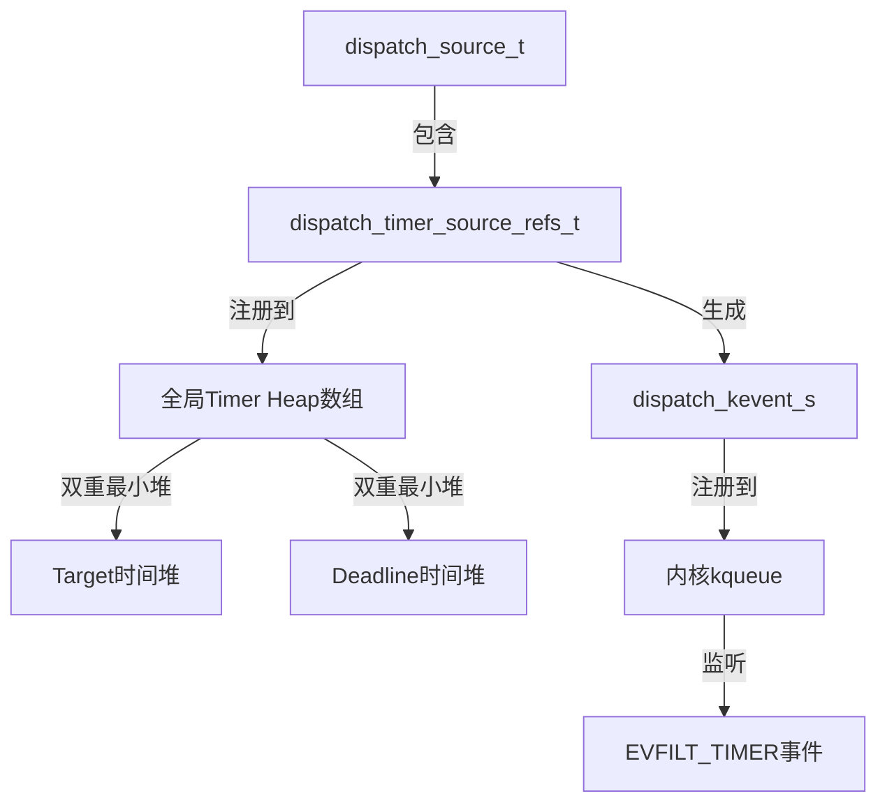
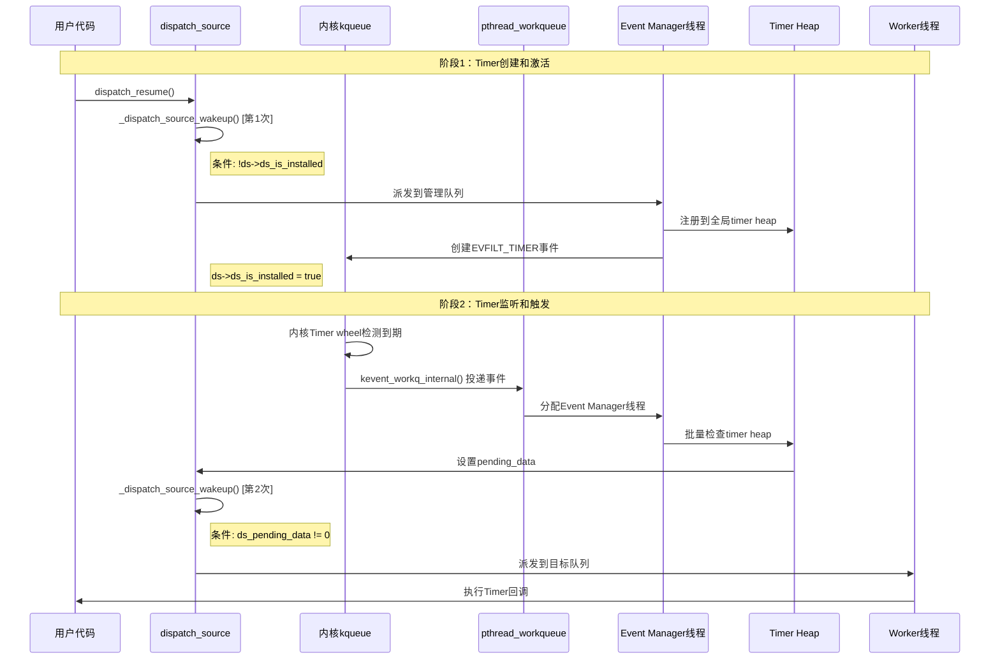

## 1. 架构概述

### 1.1 GCD Timer 核心特性

| 特性维度 | 核心优势 | 实现机制 |
|----------|----------|----------|
| **时间精确性** | 零时间漂移，长期运行不累积误差 | 绝对时间基准：`target += interval` |
| | 高精度调度，支持纳秒级精度 | 内核 timer wheel + 纳秒级时间戳 |
| | 智能错过处理，延迟不影响后续周期 | 批量跳跃：`(now - target) / interval` |
| **性能优化** | 零轮询开销，完全事件驱动 | 基于内核 kqueue 事件机制 |
| | 批量处理，减少上下文切换 | Event Manager 一次检查所有 heap |
| | 内存效率，O(log n) 复杂度 | 双重最小堆结构 |
| **可靠性** | 多时钟支持，适应不同使用场景 | UPTIME/MONOTONIC/WALLTIME |
| | 世代管理，避免过期触发 | 世代计数器防止竞态 |
| | 原子操作，并发安全 | CAS 状态转换 |
| | 容错设计，系统鲁棒性 | 延迟触发自动忽略 |

### 1.2 三层分工模式

| 层次 | 组件 | 职责 | 线程类型 |
|------|------|------|----------|
| **监听层** | 内核kqueue + EVFILT_TIMER | 高精度时间监控，零轮询 | 内核级 |
| **检测层** | Event Manager线程 + Timer Heap | 批量检测到期Timer，异步派发 | 临时分配 |
| **执行层** | Worker线程 + 目标队列 | 执行用户Timer回调 | 按需分配 |

### 1.2 时钟类型特点对比

#### 不同时钟类型的调用方式

**UPTIME 时钟（默认）**:
```c
// 方式1：使用 dispatch_time，基于 mach_absolute_time()
dispatch_source_t timer = dispatch_source_create(DISPATCH_SOURCE_TYPE_TIMER, 0, 0, queue);
dispatch_time_t start = dispatch_time(DISPATCH_TIME_NOW, 2 * NSEC_PER_SEC);
dispatch_source_set_timer(timer, start, 5 * NSEC_PER_SEC, 0);

// 方式2：明确指定 UPTIME 时钟
dispatch_source_t timer = dispatch_source_create_with_clock(DISPATCH_SOURCE_TYPE_TIMER, 
    DISPATCH_CLOCKID_UPTIME, 0, 0, queue);
```

**MONOTONIC 时钟**:
```c
// 单调递增时间，休眠时继续计时
dispatch_source_t timer = dispatch_source_create_with_clock(DISPATCH_SOURCE_TYPE_TIMER,
    DISPATCH_CLOCKID_MONOTONIC, 0, 0, queue);
dispatch_time_t start = dispatch_time(DISPATCH_TIME_NOW, 2 * NSEC_PER_SEC);
dispatch_source_set_timer(timer, start, 5 * NSEC_PER_SEC, 0);
```

**WALLTIME 时钟**:
```c
// 方式1：使用 dispatch_walltime，基于 gettimeofday()
dispatch_source_t timer = dispatch_source_create(DISPATCH_SOURCE_TYPE_TIMER, 0, 0, queue);
struct timespec ts = {.tv_sec = time(NULL) + 10, .tv_nsec = 0};  // 10秒后触发
dispatch_time_t start = dispatch_walltime(&ts, 0);
dispatch_source_set_timer(timer, start, 5 * NSEC_PER_SEC, 0);

// 方式2：明确指定 WALLTIME 时钟
dispatch_source_t timer = dispatch_source_create_with_clock(DISPATCH_SOURCE_TYPE_TIMER,
    DISPATCH_CLOCKID_WALLTIME, 0, 0, queue);
```

#### 特点对比表格

| 时钟类型 | API 调用 | 时间基准 | 系统休眠行为 | 时间调整影响 | 适用场景 |
|----------|----------|----------|--------------|--------------|----------|
| **UPTIME** | `dispatch_time(DISPATCH_TIME_NOW, ...)` | `mach_absolute_time()` | 暂停计时 | 不受影响 | 定时任务、周期性操作 |
| **MONOTONIC** | `dispatch_source_create_with_clock(DISPATCH_CLOCKID_MONOTONIC, ...)` | 单调递增时间 | 继续计时 | 不受影响 | 持续监控、超时检测 |
| **WALLTIME** | `dispatch_walltime(...)` | `gettimeofday()` | 继续计时 | 受影响 | 特定时刻触发、日程安排 |

### 1.3 核心数据结构关系



### 1.4 时序图



## 2. Timer注册到内核流程

### 2.1 用户API调用链

```c
// 用户代码
dispatch_source_t timer = dispatch_source_create(DISPATCH_SOURCE_TYPE_TIMER, 0, 0, queue);
dispatch_source_set_timer(timer, start, interval, leeway);
dispatch_resume(timer);  // 关键：立即触发注册
```

### 2.2 内部注册流程

#### 第一次 _dispatch_source_wakeup 调用

**触发条件**: `!ds->ds_is_installed`

```c
void _dispatch_source_wakeup(dispatch_source_t ds, dispatch_qos_t qos, dispatch_wakeup_flags_t flags)
{
    // 判断序列 - 按优先级
    if (!ds->ds_is_installed) {
        // 第一次：Timer需要安装到kevent队列
        tq = DISPATCH_QUEUE_WAKEUP_MGR;  // 派发到管理队列
    }

    return _dispatch_queue_wakeup(ds, qos, flags, tq);
}
```

**执行路径**:

```
dispatch_resume() 
  → _dispatch_source_activate() 
  → dx_wakeup() 
  → 管理队列处理
  → _dispatch_source_install()
  → _dispatch_unote_register()
  → _dispatch_timer_unote_register()
```

### 2.3 Timer数据结构初始化

```c
typedef struct dispatch_timer_source_refs_s {
    struct dispatch_timer_source_s dt_timer;    // Timer配置：target, interval, deadline
    uint32_t dt_heap_entry[DTH_ID_COUNT];      // 在Timer heap中的双重索引位置
    dispatch_timer_config_t dt_pending_config;  // 待应用的配置更新
    uint32_t du_ident;                         // Timer在kqueue中的唯一标识符
    uint8_t du_timer_flags;                    // Timer标志：时钟类型、QoS等
} *dispatch_timer_source_refs_t;
```

### 2.4 全局Timer Heap注册

#### 索引计算和分类存储

```c
// Timer根据时钟类型和QoS级别分配到不同heap
static inline unsigned int _dispatch_timer_unote_idx(dispatch_timer_source_refs_t dt)
{
    dispatch_clock_t clock = _dispatch_timer_flags_to_clock(dt->du_timer_flags);
    uint32_t qos = 0;

#if DISPATCH_HAVE_TIMER_QOS
    qos = dt->du_timer_flags & (DISPATCH_TIMER_STRICT|DISPATCH_TIMER_BACKGROUND);
#endif

    // 计算在全局数组中的索引
    // 例如：UPTIME时钟 + NORMAL QoS = 索引0，WALL时钟 + BACKGROUND QoS = 索引N
    return DISPATCH_TIMER_INDEX(clock, qos);
}
```

#### QoS与目标队列的关系

Timer heap 的 QoS 分类**从目标队列的 QoS 自动推导**：

```c
static void _dispatch_timer_unote_register(dispatch_timer_source_refs_t dt,
        dispatch_wlh_t wlh, dispatch_priority_t pri)
{
    // 检查目标队列的QoS优先级
    if (_dispatch_qos_is_background(_dispatch_priority_qos(pri))) {
        if (dt->du_timer_flags & DISPATCH_TIMER_STRICT) {
            // STRICT 标志可以覆盖QoS降级
        } else {
            // 自动将Timer标记为BACKGROUND QoS
            dt->du_timer_flags |= DISPATCH_TIMER_BACKGROUND;
            dt->du_ident = _dispatch_timer_unote_idx(dt);
        }
    }
}
```

**QoS 映射规则**：
- **BACKGROUND/MAINTENANCE 队列**: Timer 使用 `DISPATCH_TIMER_QOS_BACKGROUND` heap（延迟更大，合并更积极）
- **DEFAULT/UTILITY 队列**: Timer 使用 `DISPATCH_TIMER_QOS_NORMAL` heap（标准处理）
- **USER_INTERACTIVE/USER_INITIATED 队列**: Timer 可使用 `DISPATCH_TIMER_QOS_CRITICAL` heap（需要 STRICT 标志，延迟最小）

这确保了 Timer 的调度优先级与其回调执行队列的优先级保持一致。
```

#### 双重最小堆插入

```c
static void _dispatch_timer_heap_insert(dispatch_timer_heap_t dth, dispatch_timer_source_refs_t dt)
{
    uint32_t idx = (dth->dth_count += DTH_ID_COUNT) - DTH_ID_COUNT;

    if (idx == 0) {
        // 第一个Timer，直接设为堆顶
        dth->dth_needs_program = true;  // 标记需要编程kqueue
        dt->dt_heap_entry[DTH_TARGET_ID] = DTH_TARGET_ID;
        dt->dt_heap_entry[DTH_DEADLINE_ID] = DTH_DEADLINE_ID;
        dth->dth_min[DTH_TARGET_ID] = dth->dth_min[DTH_DEADLINE_ID] = dt;
        return;
    }

    // 扩容检查
    if (unlikely(idx + DTH_ID_COUNT > _dispatch_timer_heap_capacity(dth->dth_segments))) {
        _dispatch_timer_heap_grow(dth);
    }

    // 分别在两个堆中进行堆化操作
    _dispatch_timer_heap_resift(dth, dt, idx + DTH_TARGET_ID);    // target堆
    _dispatch_timer_heap_resift(dth, dt, idx + DTH_DEADLINE_ID);  // deadline堆
}
```

### 2.5 kqueue事件注册

```c
static void _dispatch_event_loop_timer_program(dispatch_timer_heap_t dth, uint32_t tidx,
        uint64_t target, uint64_t leeway, uint16_t action)
{
    dispatch_kevent_s ke = {
        .ident = DISPATCH_KEVENT_TIMEOUT_IDENT_MASK | tidx,  // Timer唯一标识
        .filter = EVFILT_TIMER,                              // 内核Timer过滤器
        .flags = action | EV_ONESHOT,                        // 一次性触发
        .fflags = _dispatch_timer_index_to_fflags[tidx],     // 时钟类型标志
        .data = (int64_t)target,                             // 触发时间（绝对时间）
        .ext[1] = leeway,                                    // 允许的延迟时间
        .qos = _PTHREAD_PRIORITY_EVENT_MANAGER_FLAG,         // Event Manager优先级
    };

    _dispatch_kq_deferred_update(wlh, &ke);  // 批量更新kqueue，减少系统调用
}
```

**关键特点**:

- **立即生效**: `dispatch_resume()`调用后立即注册，不需等待
- **批量操作**: 使用deferred update减少系统调用开销
- **高精度**: 支持纳秒级时间精度和leeway优化

## 3. 内核监听机制

### 3.1 kqueue工作队列集成

```c
static void _dispatch_kq_init(void *context)
{
    // 初始化kevent workqueue集成
    _dispatch_kevent_workqueue_init();

    // 创建管理用的EVFILT_USER事件
    const dispatch_kevent_s ke = {
        .ident = 1,
        .filter = EVFILT_USER,
        .flags = EV_ADD|EV_CLEAR,
        .qos = _PTHREAD_PRIORITY_EVENT_MANAGER_FLAG,  // Event Manager标识
        .udata = (dispatch_kevent_udata_t)DISPATCH_WLH_MANAGER,
    };

    // 启用workqueue模式，委托线程管理给pthread工作队列
    kevent_qos(kqfd, &ke, 1, NULL, 0, NULL, NULL,
               KEVENT_FLAG_WORKQ|KEVENT_FLAG_IMMEDIATE);
}
```

### 3.2 内核Timer机制（基于项目源码）

#### EVFILT_TIMER完整调用链路

**1. Timer注册阶段**：

```c
// bsd/kern/kern_event.c - Timer创建和回调注册
static int filt_timerattach(struct knote *kn, struct kevent_qos_s *kev)
{
    thread_call_t callout;
    struct filt_timer_params params;

    // 验证Timer参数
    if ((error = filt_timervalidate(kev, &params)) != 0) {
        knote_set_error(kn, error);
        return 0;
    }

    // 关键：分配thread_call并注册filt_timerexpire为回调函数
    callout = thread_call_allocate_with_options(filt_timerexpire,
        (thread_call_param_t)kn,           // 参数1：knote指针
        THREAD_CALL_PRIORITY_HIGH,         // 高优先级
        THREAD_CALL_OPTIONS_ONCE);         // 一次性回调

    if (NULL == callout) {
        knote_set_error(kn, ENOMEM);
        return 0;
    }

    // 初始化Timer参数和状态
    filt_timer_set_params(kn, &params);
    kn->kn_thcall = callout;              // 保存thread_call到knote
    kn->kn_flags |= EV_CLEAR;
    os_atomic_store(&kn->kn_hook32, TIMER_IDLE, relaxed);

    // 检查是否立即到期，否则启动定时器
    if (filt_timer_is_ready(kn)) {
        os_atomic_store(&kn->kn_hook32, TIMER_IMMEDIATE, relaxed);
        return FILTER_ACTIVE;             // 立即激活
    } else {
        filt_timerarm(kn);                // 启动定时器
        return 0;
    }
}
```

**2. Timer启动和内核注册**：

```c
// Timer启动：注册到内核thread_call系统
static void filt_timerarm(struct knote *kn)
{
    uint64_t deadline = kn->kn_ext[0];    // 目标时间
    uint64_t leeway   = kn->kn_ext[1];    // 允许延迟
    uint32_t state;

    // 设置Timer标志（优先级、时钟类型等）
    int filter_flags = kn->kn_sfflags;
    unsigned int timer_flags = 0;

    if (filter_flags & NOTE_CRITICAL) {
        timer_flags |= THREAD_CALL_DELAY_USER_CRITICAL;
    } else if (filter_flags & NOTE_BACKGROUND) {
        timer_flags |= THREAD_CALL_DELAY_USER_BACKGROUND;
    } else {
        timer_flags |= THREAD_CALL_DELAY_USER_NORMAL;
    }

    if (filter_flags & NOTE_LEEWAY) {
        timer_flags |= THREAD_CALL_DELAY_LEEWAY;
    }

    if (filter_flags & NOTE_MACH_CONTINUOUS_TIME) {
        timer_flags |= THREAD_CALL_CONTINUOUS;
    }

    // 原子更新Timer状态：IDLE -> ARMED，并增加世代计数
    state = os_atomic_load(&kn->kn_hook32, relaxed);
    state &= ~TIMER_STATE_MASK;
    state += TIMER_GEN_INC + TIMER_ARMED;
    os_atomic_store(&kn->kn_hook32, state, relaxed);

    // 关键：将Timer注册到内核thread_call调度系统
    // 当deadline到期时，内核会自动调用之前注册的filt_timerexpire回调
    thread_call_enter_delayed_with_leeway(kn->kn_thcall,
        (void *)(uintptr_t)state,         // 传递状态作为第二个参数
        deadline,                         // 到期时间（绝对时间）
        leeway,                          // 允许的延迟时间
        timer_flags);                    // Timer标志和优先级
}
```

**3. 内核调度系统核心机制**：

```c
// osfmk/kern/timer_call.c - 内核Timer调度核心
static boolean_t timer_call_enter_internal(timer_call_t call, timer_call_param_t param1,
                                          uint64_t deadline, uint64_t leeway, 
                                          uint32_t flags, boolean_t ratelimited)
{
    mpqueue_head_t *queue = NULL;
    uint64_t slop, sdeadline, ttd;
    uint64_t ctime = mach_absolute_time();

    // 计算Timer的"松弛度"（允许延迟），用于节能优化
    uint32_t urgency = (flags & TIMER_CALL_URGENCY_MASK);
    boolean_t slop_ratelimited = FALSE;
    slop = timer_call_slop(deadline, ctime, urgency, current_thread(), &slop_ratelimited);

    // 应用用户指定的leeway
    if ((flags & TIMER_CALL_LEEWAY) != 0 && leeway > slop) {
        slop = leeway;
    }

    // 更新实际deadline
    if (UINT64_MAX - deadline <= slop) {
        deadline = UINT64_MAX;
    } else {
        deadline += slop;
    }

    // 处理过期Timer
    if (__improbable(deadline < ctime)) {
        deadline = timer_call_past_deadline_timer_handle(deadline, ctime);
        sdeadline = deadline;
    }

    // 将Timer加入到适当的优先级队列中
    // 内核会定期扫描这些队列，执行到期的Timer回调
    queue = timer_call_enqueue_deadline_unlocked(call, queue, deadline, 
                                                sdeadline, ttd, param1, flags);
    return true;
}
```

**4. 内核Timer到期检测和回调执行**：

```c
// 内核定期调用此函数检查到期Timer
uint64_t timer_queue_expire_with_options(mpqueue_head_t *queue, uint64_t deadline, boolean_t rescan)
{
    timer_call_t call = NULL;
    uint32_t tc_iterations = 0;
    uint64_t cur_deadline = deadline;

    timer_queue_lock_spin(queue);

    // 遍历Timer队列，找到所有到期的Timer
    while (!queue_empty(&queue->head)) {
        call = 队列中的下一个Timer;

        if (call->tc_pqlink.deadline <= deadline) {
            // Timer到期，从队列中移除
            timer_call_entry_dequeue(call);

            // 执行Timer回调 - 这里会调用到filt_timerexpire
            call->tc_func(call->tc_param0, call->tc_param1);

            tc_iterations++;
        } else {
            break;  // 队列已排序，后续Timer都未到期
        }
    }

    timer_queue_unlock(queue);
    return cur_deadline;
}
```

**5. Timer到期回调处理**：

```c
// bsd/kern/kern_event.c - Timer到期时的回调函数
static void filt_timerexpire(void *knx, void *state_on_arm)
{
    struct knote *kn = knx;                           // 参数1：knote指针
    uint32_t state = (uint32_t)(uintptr_t)state_on_arm;   // 参数2：启动时的状态

    // 原子状态转换：TIMER_ARMED -> TIMER_FIRED
    uint32_t fired_state = state ^ TIMER_ARMED ^ TIMER_FIRED;

    // 使用CAS确保状态转换的原子性和世代检查
    if (os_atomic_cmpxchg(&kn->kn_hook32, state, fired_state, relaxed)) {
        // 状态更新成功，说明这是有效的Timer触发
        struct kqueue *kq = knote_get_kq(kn);
        kqlock(kq);
        knote_activate(kq, kn, FILTER_ACTIVE);  // 激活kqueue事件
        kqunlock(kq);
    } else {
        /*
         * 状态更新失败，说明Timer已被重新编程或取消
         * 这是一个延迟到达的Timer触发，应该忽略
         * 这种情况在Timer被快速重设或取消时会发生
         */
    }
}
```

#### Timer状态机和世代管理

```c
// Timer状态定义
#define TIMER_IDLE       0x0    // Timer从未调度或已取消
#define TIMER_ARMED      0x1    // Timer已调度等待触发
#define TIMER_FIRED      0x2    // Timer已触发等待处理
#define TIMER_IMMEDIATE  0x3    // Timer在注册时立即触发
#define TIMER_STATE_MASK 0x3    // 状态掩码
#define TIMER_GEN_INC    0x4    // 世代计数器增量

// 世代管理机制防止过期Timer的延迟触发
// 每次重新启动Timer时，世代计数器递增
// filt_timerexpire检查世代计数确保只处理当前有效的Timer触发
```

#### running_timers 处理器级Timer

```c
// osfmk/kern/timer_call.c - 处理器级别的Timer处理
bool running_timers_expire(processor_t processor, uint64_t now)
{
    bool expired = false;

    if (!processor->running_timers_active) {
        return expired;
    }

    // 检查处理器上的所有运行中Timer（量子Timer、抢占Timer等）
    for (int i = 0; i < RUNNING_TIMER_MAX; i++) {
        struct timer_call *call = &processor->running_timers[i];

        uint64_t deadline = call->tc_pqlink.deadline;
        if (deadline > now) {
            continue;  // 未到期
        }

        expired = true;
        timer_call_trace_expire_entry(call);
        call->tc_func(call->tc_param0, call->tc_param1);  // 执行回调
        timer_call_trace_expire_return(call);
    }

    return expired;
}
```

**监听机制特性**:

- **零轮询**: 基于内核事件机制，不消耗CPU
- **高精度**: 内核timer wheel提供纳秒级精度
- **多时钟支持**: 支持UPTIME、MONOTONIC、WALL时钟
- **节能优化**: leeway参数允许系统合并Timer触发

## 4. Event处理线程启动流程

### 4.1 pthread workqueue线程分配

```c
// 内核投递EVFILT_TIMER事件到pthread workqueue
kevent_workq_internal() 
  → workq_kevent_callback()     // 内核workqueue回调
  → _pthread_wqthread()         // 带WQ_FLAG_THREAD_KEVENT标志
  → _dispatch_kevent_worker_thread()  // GCD事件处理入口
```

### 4.2 线程类型判断和角色分配

```c
static void _dispatch_kevent_worker_thread(void **buf, int *count)
{
    dispatch_kevent_t events = (dispatch_kevent_t)*buf;
    int nevents = *count;

    // 关键：判断线程类型
    bool is_manager = _dispatch_wlh_worker_thread_init(&ddi);

    // 处理接收到的kevent事件
    _dispatch_event_loop_merge(events, nevents);

    if (is_manager) {
        // Event Manager线程执行路径
        _dispatch_mgr_queue_drain();                // 处理管理队列任务
        _dispatch_event_loop_drain_anon_timers();   // 批量处理timer事件
        _dispatch_wlh_worker_thread_reset();        // 重置状态，归还线程
    }
    // 普通Worker线程直接返回，继续处理其他任务
}
```

#### 线程角色判断机制

```c
static inline bool _dispatch_wlh_worker_thread_init(dispatch_deferred_items_t ddi)
{
    pthread_priority_t pp = _dispatch_get_priority();

    // 检查Event Manager标志
    if (!(pp & _PTHREAD_PRIORITY_EVENT_MANAGER_FLAG)) {
        return false;  // 普通Worker线程
    }

    // 设置Event Manager上下文
    _dispatch_queue_set_current(&_dispatch_mgr_q);
    _dispatch_queue_mgr_lock(&_dispatch_mgr_q);
    return true;
}
```

### 4.3 Timer事件批量检测

```c
void _dispatch_event_loop_drain_anon_timers(void)
{
    dispatch_timer_heap_t dth = &_dispatch_timers[DISPATCH_TIMER_QOS_COUNT];
    uint32_t count = DISPATCH_TIMER_COUNT;
    dispatch_clock_now_cache_t nows = { };  // 时间缓存，避免重复系统调用

    do {
        // 第一轮：检查所有Timer heap中的到期Timer
        for (uint32_t tidx = 0; tidx < count; tidx++) {
            _dispatch_timers_run(dth, tidx, &nows);
        }

        // 第二轮：重新编程需要更新的Timer到kqueue
        for (uint32_t tidx = 0; tidx < count; tidx++) {
            if (dth[tidx].dth_needs_program) {
                _dispatch_timers_program(dth, tidx, &nows);
            }
        }
    } while (unlikely(dth[0].dth_dirty_bits));  // 处理批处理期间的新变更
}
```

#### 具体Timer到期检测逻辑

```c
static void _dispatch_timers_run(dispatch_timer_heap_t dth, uint32_t tidx,
                                dispatch_clock_now_cache_t nows)
{
    dispatch_timer_source_refs_t dr;
    uint64_t now;

    // 遍历Timer heap最小堆，检查到期的Timer
    while ((dr = dth[tidx].dth_min[DTH_TARGET_ID])) {
        now = _dispatch_time_now_cached(DISPATCH_TIMER_CLOCK(tidx), nows);
        if (dr->dt_timer.target > now) {
            break;  // 未到期，结束检查（最小堆特性）
        }

        // 处理到期Timer
        if (dr->du_timer_flags & DISPATCH_TIMER_AFTER) {
            // 一次性Timer：解除武装并派发
            _dispatch_timer_unote_disarm(dr, dth);
            os_atomic_store2o(dr, ds_pending_data, 2, relaxed);
            dux_merge_evt(dr, EV_ONESHOT, 0, 0);  // 触发第二次wakeup
        } else {
            // 重复Timer：重新计算下次触发时间
            uint64_t interval = dr->dt_timer.interval;
            if (interval > 0) {
                dr->dt_timer.target += interval;
                _dispatch_timer_heap_update(&dth[tidx], dr);  // 重新堆化
                os_atomic_store2o(dr, ds_pending_data, 1, relaxed);
                dux_merge_evt(dr, 0, 0, 0);  // 触发第二次wakeup
            }
        }
    }
}
```

**Event Manager线程特点**:

- **临时分配**: 从pthread workqueue临时获取，用完即还
- **批量处理**: 一次性检查所有Timer heap，提高效率
- **优先级管理**: 使用Event Manager专用优先级标志
- **状态同步**: 处理完毕后重置线程状态

## 5. Callback提交到目标队列流程

### 5.1 第二次 _dispatch_source_wakeup 调用

**触发条件**: Timer到期，Event Manager设置了 `ds_pending_data`

```c
// _dispatch_timers_run() 中找到到期Timer后调用
static void _dispatch_source_merge_evt(dispatch_unote_t du, uint32_t flags,
                                      uintptr_t data, uintptr_t status, 
                                      pthread_priority_t pp)
{
    dispatch_source_t ds = _dispatch_source_from_refs(du._ds);

    // 设置pending数据，供用户回调获取触发次数
    os_atomic_store2o(du._ds, ds_pending_data, data, relaxed);

    // 关键：异步唤醒目标队列，请求Worker线程执行Timer回调
    dx_wakeup(ds, _dispatch_qos_from_pp(pp), 
              DISPATCH_WAKEUP_EVENT | DISPATCH_WAKEUP_CONSUME_2 | DISPATCH_WAKEUP_MAKE_DIRTY);
}
```

### 5.2 目标队列唤醒机制

```c
void _dispatch_source_wakeup(dispatch_source_t ds, dispatch_qos_t qos, dispatch_wakeup_flags_t flags)
{
    dispatch_source_refs_t dr = ds->ds_refs;
    dispatch_queue_wakeup_target_t tq = DISPATCH_QUEUE_WAKEUP_NONE;

    // 第二次调用的判断条件
    if (!(dqf & (DSF_CANCELED | DQF_RELEASED)) &&
            os_atomic_load2o(dr, ds_pending_data, relaxed)) {
        // Timer有pending数据需要派发到目标队列
        tq = DISPATCH_QUEUE_WAKEUP_TARGET;
    }

    return _dispatch_queue_wakeup(ds, qos, flags, tq);
}
```

### 5.3 Worker线程分配和回调执行

#### 队列状态更新和线程请求

```c
_dispatch_queue_wakeup(ds, qos, flags, DISPATCH_QUEUE_WAKEUP_TARGET)
  ↓
_dispatch_lane_wakeup()  // 普通队列处理
  ↓
// 原子更新队列状态，增加pending工作项
os_atomic_rmw_loop2o(dq, dq_state, old_state, new_state, relaxed, {
    new_state = old_state + DISPATCH_QUEUE_WIDTH_INTERVAL | DISPATCH_QUEUE_DIRTY;
});
  ↓
// 请求pthread workqueue分配Worker线程
_dispatch_root_queue_poke() → _pthread_workqueue_addthreads()
```

#### Worker线程执行用户回调

```c
// 内核分配线程并调用注册回调
_dispatch_worker_thread2(pthread_priority_t pp)
  ↓
// 获取对应root queue并开始处理
_dispatch_root_queue_drain() → _dispatch_source_invoke()
  ↓
// 最终执行用户Timer回调
dispatch_source_get_handle(source);  // 获取Timer句柄
unsigned long data = dispatch_source_get_data(source);  // 获取触发次数
handler();  // 执行用户的Timer回调代码
```

#### Timer数据获取机制

```c
// 用户回调中获取Timer触发信息
DISPATCH_ALWAYS_INLINE
static inline unsigned long _dispatch_source_timer_data(dispatch_timer_source_refs_t dr, uint64_t prev)
{
    unsigned long data = (unsigned long)prev >> 1;

    // 与_dispatch_timers_run()的release barrier配对，确保内存可见性
    uint64_t now = os_atomic_load2o(dr, ds_pending_data, acquire);
    if ((now & DISPATCH_TIMER_DISARMED_MARKER) && data) {
        data = (unsigned long)now >> 1;
    }

    return data;  // 返回Timer触发次数（1=正常触发，2=取消触发）
}
```

## 6. 深度解析常见问题

**Q: Timer 是每次触发后再向内核注册一次吗？**

A: 不是。Timer 的内核注册是**一次性的**，发生在 `dispatch_resume()` 时。之后的重复触发通过以下机制处理：

- **一次性 Timer**: 触发后自动从内核移除，不需要再次注册
- **重复 Timer**: 内核根据 `interval` 自动计算下次触发时间，Timer 在全局 heap 中的位置会被重新调整，但不需要重新向内核注册

重复 Timer 的处理逻辑：
```c
// _dispatch_timers_run() 中的重复 Timer 处理
if (interval > 0) {
    dr->dt_timer.target += interval;  // 计算下次触发时间
    _dispatch_timer_heap_update(&dth[tidx], dr);  // 重新堆化，不重新注册内核
}
```

**Q: Timer 取消时会到内核去取消吗？**

A: 会的。调用 `dispatch_source_cancel()` 时会触发内核级别的取消操作：

```c
// bsd/kern/kern_event.c
static void filt_timerdetach(struct knote *kn)
{
    thread_call_cancel_wait(kn->kn_thcall);  // 等待内核取消完成
    freed = thread_call_free(kn->kn_thcall);  // 释放内核资源
}
```

**Q: dispatch_source_get_data 的返回值详解**

A: 对于 Timer 类型，返回值表示**自上次回调以来的触发次数**：

- `1`: 正常单次触发
- `>1`: 系统负载高时合并的多次触发（如返回 3 表示合并了 3 次触发）  
- 特殊值 `2`: Timer 被取消时的最后一次触发（这是特殊标记 `DISPATCH_TIMER_DISARMED_MARKER`）

**什么时候会发生合并？**

Timer 合并发生在以下情况：

1. **系统负载过高**: 当 Event Manager 线程或目标队列的 Worker 线程无法及时处理时
2. **Timer 回调执行耗时**: 用户回调函数执行时间过长，导致后续触发积压
3. **队列挂起**: 目标队列被挂起（suspended）时，触发会累积
4. **多个 Timer 到期**: 在 Event Manager 的批量检测中发现多个 Timer 同时到期

**合并处理逻辑**:

Event Manager 在检查到期 Timer 时会进行两种情况的处理：

1. **有积压触发**: 如果发现上次触发还未被用户回调消费（`ds_pending_data` 不为 0），会将 Timer 标记为 DISARMED 状态，等待用户回调处理完毕
2. **计算错过次数**: 如果没有积压，会计算从上次应该触发到现在错过了多少个 interval，然后决定是继续保持 Timer 在 heap 中还是暂时移除

**"错过"的定义和计算逻辑**:

"错过"是基于 **Timer 的 interval 间隔**计算的，不是基于 timeout 的倍数：

```c
// 错过次数 = (当前时间 - 应该触发时间) / Timer间隔
uint64_t missed = (now - dt->dt_timer.target) / dt->dt_timer.interval;
```

**举例说明**：
- Timer 设置为每 100ms 触发一次
- 应该在 t+100ms 触发，但系统忙碌直到 t+350ms 才检查
- 错过次数 = (350ms - 100ms) / 100ms = 2.5，取整为 2
- 即错过了 t+200ms 和 t+300ms 两次触发

**计算错过触发次数的核心函数**:

```c
static inline unsigned long
_dispatch_timer_unote_compute_missed(dispatch_timer_source_refs_t dt, uint64_t now, unsigned long prev)
{
    uint64_t missed = (now - dt->dt_timer.target) / dt->dt_timer.interval;
    
    // 更新下次触发时间，跳过错过的触发点
    uint64_t push_by = missed * dt->dt_timer.interval;
    dt->dt_timer.target += push_by;
    dt->dt_timer.deadline += push_by;
    
    return prev + missed;  // 返回总的错过次数
}
```

**用户回调中的数据获取机制**:

```c
// _dispatch_source_timer_data() - 用户回调中获取合并的触发次数
static inline unsigned long _dispatch_source_timer_data(dispatch_timer_source_refs_t dr, uint64_t prev)
{
    unsigned long data = (unsigned long)prev >> 1;  // 移除内部标志位

    // 检查是否有 DISARMED 标记
    uint64_t now = os_atomic_load2o(dr, ds_pending_data, acquire);
    if ((now & DISPATCH_TIMER_DISARMED_MARKER) && data) {
        // 如果被 disarm，重新计算错过的触发次数
        data = (unsigned long)now >> 1;
    }

    return data;  // 返回最终的触发次数给用户
}
```

**合并示例场景**:

```c
// 假设一个每100ms触发的Timer
dispatch_source_set_timer(timer, start, 100*NSEC_PER_MSEC, 0);

// 如果用户回调执行了350ms，那么：
// - 第一次触发：正常执行，但耗时350ms
// - 期间错过了：t+100ms, t+200ms, t+300ms 三次触发
// - 下次回调时 dispatch_source_get_data() 返回 4（1个正在处理 + 3个错过）
```

这种合并机制确保了即使在高负载情况下，Timer 也不会无限积压，而是通过计数的方式告知用户错过的触发次数。

**Q: leeway 参数对用户的实际作用？**

A: leeway 参数允许系统**延迟 Timer 触发**以实现节能优化：

**不加 leeway（默认行为）**:
- 系统使用默认 leeway：`MIN(interval/2, 默认最大值)`
- Timer 尽量准时触发，但仍可能被系统延迟

**明确设置 leeway**:
- 告诉系统可以接受的最大延迟时间
- 系统可以将多个 Timer 对齐到同一时刻触发，减少 CPU 唤醒次数
- 延迟范围：`[系统最小延迟, leeway]`

**实际效果**:
```c
// 设置较大 leeway 的例子
dispatch_source_set_timer(timer, start, 5*NSEC_PER_SEC, 2*NSEC_PER_SEC);
// Timer 每 5 秒触发，但允许延迟最多 2 秒，即可能在 5-7 秒之间的任意时刻触发
```

**Q: Timer 可以被修改吗？修改时会到内核修改吗？**

A: 可以修改，调用 `dispatch_source_set_timer()` 即可。修改过程是**异步的**：

1. **用户层**: 新配置保存在 `dt_pending_config` 中
2. **内核更新**: Event Manager 线程处理时才应用到内核

```c
// dispatch_source_set_timer() 的修改逻辑
dtc = os_atomic_xchg2o(dt, dt_pending_config, dtc, release);  // 异步更新配置
dx_wakeup(ds, 0, DISPATCH_WAKEUP_MAKE_DIRTY);  // 触发异步处理
```

**时钟类型限制**: 一旦创建，不能修改 Timer 的时钟类型（UPTIME vs WALLTIME），否则会 crash。

**Q: 系统进程使用 GCD Timer 在系统休眠时能正常工作吗？**

A: 取决于**时钟类型**和**进程权限**：

**UPTIME 时钟**:
- 系统休眠时**停止计时**
- 唤醒后从休眠前的时间继续，不会触发休眠期间"错过"的 Timer

**MONOTONIC/WALLTIME 时钟**:
- **继续计时**，但能否在休眠期间唤醒系统取决于进程权限
- 系统进程通常有权限设置可以唤醒系统的 Timer

**实际行为**:
```c
// 不同时钟类型的休眠行为
dispatch_source_create_with_clock(DISPATCH_CLOCKID_UPTIME, ...);     // 休眠时暂停
dispatch_source_create_with_clock(DISPATCH_CLOCKID_MONOTONIC, ...);  // 休眠时继续
```

**影响因素**:
- 进程是否有 `com.apple.private.kernel.override-iokit-sleep` 等权限
- Timer 是否设置了 `DISPATCH_TIMER_STRICT` 标志
- 系统的整体电源管理策略

**Q: Timer heap 的 QoS 分类与目标队列有什么关系？**

A: Timer heap 的 QoS 是**从目标队列的 QoS 自动推导**的：

- **BACKGROUND/MAINTENANCE 队列**: Timer 自动使用 `DISPATCH_TIMER_QOS_BACKGROUND` heap
- **DEFAULT/UTILITY 队列**: Timer 使用 `DISPATCH_TIMER_QOS_NORMAL` heap  
- **USER_INTERACTIVE/USER_INITIATED 队列**: Timer 可使用 `DISPATCH_TIMER_QOS_CRITICAL` heap（需要 STRICT 标志）

**目的**: 确保 Timer 的调度优先级与其回调执行队列的优先级保持一致。

**示例**:
```c
// 这个Timer会自动使用BACKGROUND QoS heap
dispatch_queue_t bg_queue = dispatch_get_global_queue(QOS_CLASS_BACKGROUND, 0);
dispatch_source_t timer = dispatch_source_create(DISPATCH_SOURCE_TYPE_TIMER, 0, 0, bg_queue);

// 这个Timer会使用NORMAL QoS heap  
dispatch_queue_t main_queue = dispatch_get_main_queue();
dispatch_source_t timer2 = dispatch_source_create(DISPATCH_SOURCE_TYPE_TIMER, 0, 0, main_queue);
```

对于普通 App，Timer 在系统休眠时通常会被暂停，只有系统级进程才能保持运行或唤醒系统。