# xnu workqueue constrained队列实现研究

## 引言

constrained队列是xnu workqueue机制中的三大线程池之一，与overcommit和cooperative池并列。其准入检查机制的核心效果是：**确保活跃线程数不会超过CPU核数**。

具体来说，系统通过检查 `CPU核数 > (活跃线程数 + 忙线程数)` 来决定是否允许创建新线程。当活跃+忙线程数达到或超过CPU核数时，创建请求被拒绝，从而保证活跃线程数始终控制在CPU核数范围内，避免过度调度造成的性能退化。

## 一、线程请求状态机

### 1.1 状态定义

**文件**: `workqueue_internal.h:170-177`

```c
__enum_decl(workq_tr_state_t, uint8_t, {
    WORKQ_TR_STATE_IDLE               = 0,  // 请求未使用
    WORKQ_TR_STATE_NEW                = 1,  // 正在初始化
    WORKQ_TR_STATE_QUEUED             = 2,  // 已enqueue等待
    WORKQ_TR_STATE_CANCELED           = 3,  // 被取消
    WORKQ_TR_STATE_BINDING            = 4,  // 正在绑定线程
    WORKQ_TR_STATE_BOUND              = 5,  // 已绑定
});
```

### 1.2 状态流转图

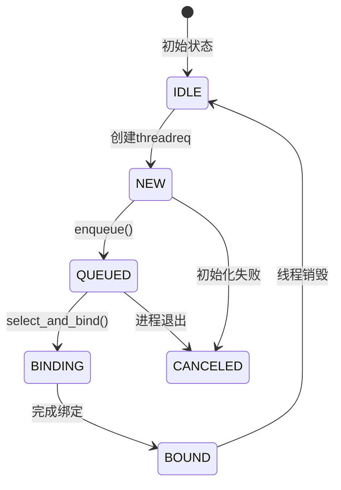

### 1.3 关键函数分析

首先理解**所有调用路径**：

## workq_threadreq_enqueue()的三种调用场景

### 场景1：dispatch_async提交work

**触发时机**: 用户通过GCD的dispatch_queue提交work时

**调用链**:
```c
// 用户空间：dispatch_queue.c
dispatch_async(queue, block);

// 系统调用：pthread_workqueue.c:3735-3741
WQOPS_QUEUE_REQTHREADS → workq_reqthreads()

// 内核层：pthread_workqueue.c:3021-3048
static int workq_reqthreads(proc_t p, int num_threads, pthread_priority_t pri, bool cooperative)
{
    struct workqueue *wq = proc_get_wqptr(p);

    // 创建threadreq对象
    kqr = zalloc(workq_zone_threadreq);
    kqr->tr_qos = workq_pri_to_qos(pri);
    kqr->tr_count = num_threads;
    kqr->tr_flags = cooperative ? WORKQ_TR_FLAG_COOPERATIVE : 0;

    // ... 初始化 ...
    workq_kern_threadreq_initiate(p, kqr, NULL, qos, WORKQ_THREADREQ_CAN_CREATE_THREADS);

    // 👈 在workq_reqthreads末尾调用enqueue
    workq_lock_spin(wq);
    workq_threadreq_enqueue(wq, kqr);
    workq_schedule_creator(p, wq, 0);
    workq_unlock(wq);
}
```

**场景描述**: 这是最常见的场景，用户提交新work，转换为内核请求并enqueue到队列。

---

### 场景2：kevent/workloop初始化请求

**触发时机**: 创建kevent或workloop时，需要永久绑定线程

**调用链**:
```c
// 用户空间：kqueue_create()或workloop_create()
// 系统调用：WQOPS_THREADREQ_INITIATE
case WQOPS_THREADREQ_INITIATE: {
    error = workq_kern_threadreq_initiate(p, (workq_threadreq_t)arg2,
        (struct turnstile *)arg3, arg4, false);
    break;
}
```

**关键函数**: `workq_kern_threadreq_initiate()` - pthread_workqueue.c:3050-3142

```c
bool workq_kern_threadreq_initiate(struct proc *p, workq_threadreq_t req,
    struct turnstile *workloop_ts, thread_qos_t qos,
    workq_kern_threadreq_flags_t flags)
{
    assert(req->tr_flags & (WORKQ_TR_FLAG_WORKLOOP | WORKQ_TR_FLAG_KEVENT));

    workq_lock_spin(wq);

    // 检查是否可以直接绑定当前线程（rebinding情况）
    if (uth && workq_threadreq_admissible(wq, uth, req)) {
        // 👈 场景2a：直接绑定，不enqueue
        assert(uth != wq->wq_creator);
        _wq_thactive_move(wq, uth->uu_workq_pri.qos_bucket, req->tr_qos);
        kqueue_threadreq_bind(p, req, get_machthread(uth), 0);
    } else {
        // 👈 场景2b：需要入队等待
        if (workq_threadreq_enqueue(wq, req)) {
            workq_schedule_creator(p, wq, flags);
        }
    }
    workq_unlock(wq);
}
```

**场景2a：Rebinding路径**
- **触发**: 线程即将unbind时，收到新kevent请求
- **处理**: 直接绑定到当前线程，避免unbind/rebind开销
- **特点**: 不enqueue，直接绑定

**场景2b：首次创建路径**
- **触发**: kevent/workloop首次初始化
- **处理**: enqueue到队列，等待creator分配线程
- **特点**: 正常的enqueue流程

---

### 场景3：modify请求QoS或flags

**触发时机**: 修改已存在的threadreq的QoS或overcommit状态

**调用链**:
```c
// 系统调用：WQOPS_THREADREQ_MODIFY
case WQOPS_THREADREQ_MODIFY: {
    error = workq_kern_threadreq_modify(p, (workq_threadreq_t)arg2,
        arg3, arg4);
    break;
}
```

**关键函数**: `workq_kern_threadreq_modify()` - pthread_workqueue.c:3145-3248

```c
void workq_kern_threadreq_modify(struct proc *p, workq_threadreq_t req,
    thread_qos_t qos, workq_kern_threadreq_flags_t flags)
{
    struct workqueue *wq = proc_get_wqptr_fast(p);

    workq_lock_spin(wq);

    // Stage 1: 先dequeue原请求
    if (priority_queue_remove(pq, &req->tr_entry)) {
        if (workq_threadreq_is_nonovercommit(req)) {
            _wq_thactive_refresh_best_constrained_req_qos(wq);
        }
    }

    // Stage 2: 修改QoS或flags
    if (__improbable(make_overcommit)) {
        req->tr_flags ^= WORKQ_TR_FLAG_OVERCOMMIT;
        pq = workq_priority_queue_for_req(wq, req);
    }
    req->tr_qos = qos;

    // Stage 3: 重新enqueue
    req_max = priority_queue_max(pq, ...);
    if (req_max && req_max->tr_qos >= qos) {
        priority_queue_entry_set_sched_pri(...);
        priority_queue_insert(pq, &req->tr_entry);
    } else {
        // 👈 场景3：修改后重新enqueue
        if (workq_threadreq_enqueue(wq, req) || reevaluate_creator_tg) {
            workq_schedule_creator(p, wq, flags);
        }
    }
    workq_unlock(wq);
}
```

**场景描述**: 修改现有请求的QoS，可能导致其在队列中的优先级改变，因此需要dequeue并重新enqueue。

---

## workq_threadreq_dequeue()的多种调用路径

**我之前分析有遗漏！** dequeue不只在"线程完成工作时"触发，还有其他路径。

### 路径1：线程完成工作后（主路径）

**触发时机**: 所有workqueue线程完成用户代码，返回内核时

**调用链**:
```c
workq_thread_return() → workq_select_threadreq_or_park_and_unlock() → dequeue
```

**关键函数**: `workq_thread_return()` - pthread_workqueue.c:3600-3612

这是所有workqueue线程的核心循环，线程完成工作后必须经过这里选择新请求或park。

---

### 路径2：creator弹出idle线程并唤醒时（重要遗漏！）

**触发时机**: creator从idle列表弹出线程并设置优先级后

**关键代码**: `workq_schedule_creator()` - pthread_workqueue.c:4507-4524

```c
} else if (wq->wq_thidlecount) {
    /*
     * We need to unpark a creator thread
     */
    wq->wq_creator = uth = workq_pop_idle_thread(wq, UT_WORKQ_OVERCOMMIT,
        &needs_wakeup);
    /* Always reset the priorities on the newly chosen creator */
    workq_thread_reset_pri(wq, uth, req, /*unpark*/ true);
    workq_turnstile_update_inheritor(wq, get_machthread(uth),
        TURNSTILE_INHERITOR_THREAD);
    WQ_TRACE_WQ(TRACE_wq_creator_select | DBG_FUNC_NONE,
        wq, 2, uthread_tid(uth), req->tr_qos);
    uth->uu_save.uus_workq_park_data.fulfilled_snapshot = wq->wq_fulfilled;
    uth->uu_save.uus_workq_park_data.yields = 0;
    if (needs_wakeup) {
        workq_thread_wakeup(uth);  // 唤醒creator线程
    }
}
```

**但注意**: 这里弹出的是**creator线程**，不是work线程。creator线程被唤醒后，它会继续调度，创建work线程或从idle列表弹出work线程。

---

### 路径3：弹出work线程并设置优先级时（关键路径！）

**触发时机**: creator需要立即分配请求给现有线程时

**关键代码**: `workq_schedule_creator()` - pthread_workqueue.c:3002-3021

```c
while (unpaced > 0 && wq->wq_thidlecount) {
    struct uthread *uth;
    bool needs_wakeup;
    uint8_t uu_flags = UT_WORKQ_EARLY_BOUND;

    if (workq_tr_is_overcommit(req->tr_flags)) {
        uu_flags |= UT_WORKQ_OVERCOMMIT;
    }

    uth = workq_pop_idle_thread(wq, uu_flags, &needs_wakeup);

    _wq_thactive_inc(wq, qos);
    wq->wq_thscheduled_count[_wq_bucket(qos)]++;
    workq_thread_reset_pri(wq, uth, req, /*unpark*/ true);  // 设置优先级
    wq->wq_fulfilled++;

    uth->uu_save.uus_workq_park_data.upcall_flags = upcall_flags;
    uth->uu_save.uus_workq_park_data.thread_request = req;
    if (needs_wakeup) {
        workq_thread_wakeup(uth);  // 唤醒线程
    }
}
```

**重要**: 这里弹出的是**work线程**，并直接绑定了请求。但请求是否dequeue？

---

### 关键理解：dequeue时机辨析

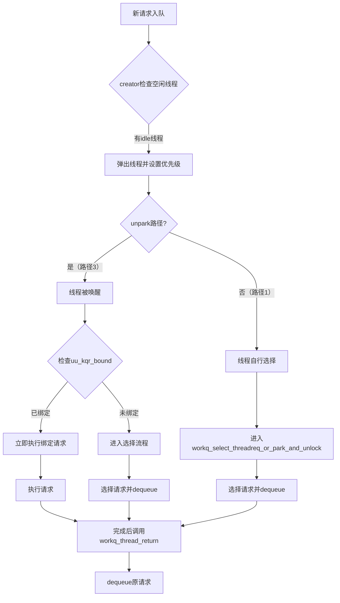

**关键问题**: 在unpark路径（路径3）中，线程被唤醒后立即执行绑定请求，请求是否在执行前dequeue？

**答案**: 是的！在`workq_setup_and_run()`中，会调用`workq_thread_return()`来dequeue请求。

从pthread_workqueue.c:4722-4728行可以看出：
```c
if (tr_flags & (WORKQ_TR_FLAG_KEVENT | WORKQ_TR_FLAG_WORKLOOP)) {
    kqueue_threadreq_bind_prepost(p, req, uth);
    req = NULL;
}
```

在`kqueue_threadreq_bind_prepost()`中，请求会被标记为prepost，然后在线程执行过程中dequeue。

**实际dequeue时机**:
1. **路径1**: 线程完成工作后，通过`workq_thread_return()`调用dequeue
2. **路径2**: modify时先dequeue再重新enqueue
3. **路径3**: 线程执行过程中，通过`workq_thread_return()`调用dequeue

**总结**: 无论哪种路径，请求最终都是通过`workq_thread_return()`或`modify`进行dequeue。creator弹出idle线程并唤醒时，请求还没有dequeue，线程被唤醒后会立即执行，请求在执行过程中dequeue。

---

## 完整数据流对比

### 场景对比表

| 场景 | 触发时机 | 调用路径 | enqueue/dequeue | tr_count | 特点 |
|------|----------|----------|----------------|----------|------|
| **场景1: dispatch_async** | 用户提交work | workq_reqthreads → enqueue | **enqueue** | 多实例 | 最常用，需creator分配线程 |
| **场景2a: kevent rebind** | 线程即将unbind时收到新请求 | workq_kern_threadreq_initiate → 直接绑定 | **无enqueue** | 1 | 避免上下文切换，直接复用线程 |
| **场景2b: kevent创建** | 首次创建kevent/workloop | workq_kern_threadreq_initiate → enqueue | **enqueue** | 1 | 创建持久化请求队列 |
| **场景3: modify QoS** | 修改请求参数 | workq_kern_threadreq_modify → dequeue → enqueue | **dequeue+enqueue** | 1 | 改变优先级，动态重排序 |
| **dequeue路径1: 线程完成工作** | 线程返回内核 | workq_thread_return → dequeue | **dequeue** | N/A | 循环核心，实时绑定请求 |
| **dequeue路径2: unpark唤醒** | creator弹出idle线程 | 直接绑定执行 → dequeue | **dequeue（执行中）** | N/A | 快速路径，减少延迟 |

**注意**: tr_count == 1的请求（场景2和3）是最小单元请求，它们的enqueue/dequeue直接影响系统调度性能。

### 关键时序图

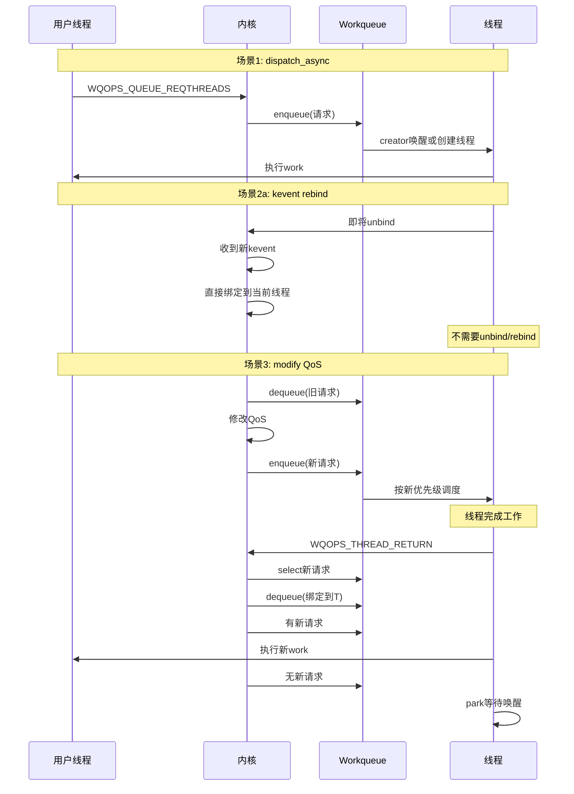

**核心理解**:
1. **enqueue有3种场景**：新work、kevent创建、modify重排序
2. **dequeue有2种用途**：modify时重排、绑定时获取请求
3. **Rebind优化**：避免不必要的unbind/rebind上下文切换
4. **实时绑定**：线程完成工作时立即dequeue并绑定，减少延迟

---

## 二、constrained队列的请求选择

**函数**: `workq_threadreq_select()` - pthread_workqueue.c:4316

constrained队列的选择逻辑与其他队列不同，它在QoS选择阶段被处理。

### 2.1 constrained队列的选择位置

在完整的请求选择流程中，constrained队列处于QoS选择阶段：

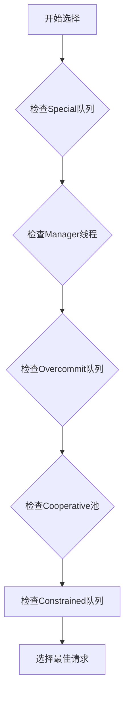

### 2.2 constrained选择逻辑

**核心源码**（仅constrained部分）：
```c
// 步骤5: 检查Constrained队列
req_tmp = priority_queue_max(&wq->wq_constrained_queue,
    struct workq_threadreq_s, tr_entry);

// 如果有constrained请求且QoS更高
if (req_tmp && qos < req_tmp->tr_qos) {
    // 优先级比较：special vs constrained
    if (pri && pri >= thread_workq_pri_for_qos(req_tmp->tr_qos)) {
        return req_pri;  // special优先级更高
    }

    // constrained通过准入检查后返回（关键！）
    if (workq_constrained_allowance(wq, req_tmp->tr_qos, uth, true, true)) {
        return req_tmp;  // 选中constrained请求
    }
}
```

**关键特点**:
1. constrained队列使用priority_queue存储，按优先级排序
2. 必须通过`workq_constrained_allowance()`准入检查
3. 与其他QoS队列（overcommit/cooperative）竞争，优先级相同

---

## 三、线程创建流程

### 3.1 创建时机

线程创建由creator负责，触发条件包括：
- 请求队列非空但没有可用线程（`wq_thidlecount == 0`）
- 当前线程数未达到上限（`wq_nthreads < wq_max_threads`）
- creator被选中执行

### 3.2 完整流程

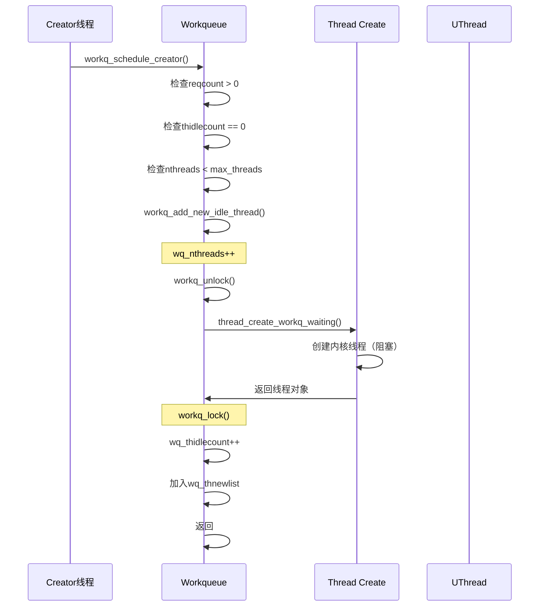

### 3.3 源码分析

**函数**: `workq_add_new_idle_thread()` - pthread_workqueue.c:1067

```c
static kern_return_t workq_add_new_idle_thread(
    proc_t             p,
    struct workqueue  *wq,
    thread_continue_t continuation,
    bool              is_permanently_bound,
    thread_t          *new_thread)
{
    mach_vm_offset_t th_stackaddr;
    kern_return_t kret;
    thread_t th;

    // ⚠️ 关键：先增加计数
    wq->wq_nthreads++;

    workq_unlock(wq);

    vm_map_t vmap = get_task_map(proc_task(p));

    // 创建用户栈
    kret = pthread_functions->workq_create_threadstack(p, vmap, &th_stackaddr);
    if (kret != KERN_SUCCESS) {
        WQ_TRACE_WQ(TRACE_wq_thread_create_failed | DBG_FUNC_NONE, wq,
            kret, 1, 0);
        goto out;
    }

    // 创建内核线程（阻塞状态）
    kret = thread_create_workq_waiting(proc_task(p),
        continuation,
        &th,
        is_permanently_bound);
    if (kret != KERN_SUCCESS) {
        WQ_TRACE_WQ(TRACE_wq_thread_create_failed | DBG_FUNC_NONE, wq,
            kret, 0, 0);
        pthread_functions->workq_destroy_threadstack(p, vmap, th_stackaddr);
        goto out;
    }

    struct uthread *uth = get_bsdthread_info(th);
    uth->uu_workq_stackaddr = (user_addr_t)th_stackaddr;

    wq->wq_creations++;

    // 加入空闲列表
    if (!is_permanently_bound) {
        wq->wq_thidlecount++;
        TAILQ_INSERT_TAIL(&wq->wq_thnewlist, uth, uu_workq_entry);
    }

    if (new_thread) {
        *new_thread = th;
    }

    WQ_TRACE_WQ(TRACE_wq_thread_create | DBG_FUNC_NONE, wq, 0, 0, 0);
    return kret;

out:
    workq_lock_spin(wq);
    // ⚠️ 失败时回滚计数
    wq->wq_nthreads--;
    return kret;
}
```

**关键时序注解**:
| 步骤 | 操作 | 原因 |
|------|------|------|
| 1 | `wq_nthreads++` | 预留槽位，防止并发创建超出限制 |
| 2 | `workq_unlock()` | 释放锁，允许其他线程访问队列 |
| 3 | 创建线程 | 线程创建可能耗时，避免锁持有 |
| 4 | `workq_lock()` | 重新获取锁以安全更新数据结构 |
| 5 | `wq_thidlecount++` | 增加空闲线程计数 |
| 6 | 加入`wq_thnewlist` | 标记为新创建的线程，死亡时特殊处理 |

### 3.4 Creator线程机制深度分析

#### 3.4.1 Creator的定义与定位

**源码位置**: pthread_workqueue.c:4430-4449

```c
/*
 * The creator is an anonymous thread that is counted as scheduled,
 * but otherwise without its scheduler callback set or tracked as active
 * that is used to make other threads.
 *
 * When more requests are added or an existing one is hurried along,
 * a creator is elected and setup, or the existing one overridden accordingly.
 *
 * While this creator is in flight, because no request has been dequeued,
 * already running threads have a chance at stealing thread requests avoiding
 * useless context switches, and the creator once scheduled may not find any
 * work to do and will then just park again.
 *
 * The creator serves the dual purpose of informing the scheduler of work that
 * hasn't be materialized as threads yet, and also as a natural pacing mechanism
 * for thread creation.
 *
 * By being anonymous (and not bound to anything) it means that thread requests
 * can be stolen from this creator by threads already on core yielding more
 * efficient scheduling and reduced context switches.
 */
```

**注释翻译**:
creator是一个匿名线程，被计入调度计数，但没有设置调度器回调或跟踪为活跃线程，用于创建其他线程。

当添加更多请求或现有请求被紧急处理时，会选举并设置一个creator，或相应地覆盖现有的creator。

当这个creator在执行过程中，由于没有请求被dequeue，已经运行的线程有机会偷取thread请求，避免无用的上下文切换，而creator一旦调度可能找不到任何工作，然后就会再次park。

creator有两个作用：告知调度器还有尚未实例化为线程的工作，以及作为线程创建的自然限速机制。

通过保持匿名（不绑定任何东西），意味着thread请求可以被已经在核心上运行的线程从creator那里偷取，从而实现更高效的调度和减少上下文切换。
```

**核心特征**:
1. **匿名线程**: 没有绑定到特定请求的临时线程
2. **占位符作用**: 告知调度器有未完成的工作
3. **自然限速**: 防止过快创建线程的节流机制
4. **可被抢占**: running状态的线程可以偷取creator的请求

#### 3.4.2 Creator的初始化与唤醒

**函数**: `workq_schedule_creator()` - pthread_workqueue.c:4451

```c
static void workq_schedule_creator(proc_t p, struct workqueue *wq,
    workq_kern_threadreq_flags_t flags)
{
    workq_threadreq_t req;
    struct uthread *uth;
    bool needs_wakeup;

    workq_lock_held(wq);
again:
    uth = wq->wq_creator;

    if (!wq->wq_reqcount) {
        // 没有请求时，如果creator存在则等待，否则清除turnstile
        if (uth == NULL) {
            workq_turnstile_update_inheritor(wq, TURNSTILE_INHERITOR_NULL, 0);
        }
        return;
    }

    req = workq_threadreq_select_for_creator(wq);
    if (req == NULL) {
        // 有请求但未通过准入检查，设置turnstile等待
        if (uth == NULL) {
            workq_turnstile_update_inheritor(wq, wq, TURNSTILE_INHERITOR_WORKQ);
        }
        return;
    }

    if (uth) {
        // 已有creator，调整其优先级
        if (workq_thread_needs_priority_change(req, uth)) {
            WQ_TRACE_WQ(TRACE_wq_creator_select | DBG_FUNC_NONE,
                wq, 1, uthread_tid(uth), req->tr_qos);
            workq_thread_reset_pri(wq, uth, req, /*unpark*/ true);
        }
        assert(wq->wq_inheritor == get_machthread(uth));
    } else if (wq->wq_thidlecount) {
        // 👈 路径1：弹出idle线程作为creator
        wq->wq_creator = uth = workq_pop_idle_thread(wq, UT_WORKQ_OVERCOMMIT,
            &needs_wakeup);
        /* Always reset the priorities on the newly chosen creator */
        workq_thread_reset_pri(wq, uth, req, /*unpark*/ true);
        workq_turnstile_update_inheritor(wq, get_machthread(uth),
            TURNSTILE_INHERITOR_THREAD);
        WQ_TRACE_WQ(TRACE_wq_creator_select | DBG_FUNC_NONE,
            wq, 2, uthread_tid(uth), req->tr_qos);
        uth->uu_save.uus_workq_park_data.fulfilled_snapshot = wq->wq_fulfilled;
        uth->uu_save.uus_workq_park_data.yields = 0;
        if (needs_wakeup) {
            workq_thread_wakeup(uth);
        }
    } else {
        // 👈 路径2：创建新线程作为creator
        if (__improbable(wq->wq_nthreads >= wq_max_threads)) {
            flags = WORKQ_THREADREQ_NONE;
        } else if (flags & WORKQ_THREADREQ_SET_AST_ON_FAILURE) {
            act_set_astkevent(current_thread(), AST_KEVENT_REDRIVE_THREADREQ);
        } else if (!(flags & WORKQ_THREADREQ_CAN_CREATE_THREADS)) {
            workq_schedule_immediate_thread_creation(wq);
        } else if ((workq_add_new_idle_thread(p, wq,
            workq_unpark_continue, false, NULL) == KERN_SUCCESS)) {
            goto again;
        } else {
            workq_schedule_delayed_thread_creation(wq, 0);
        }
    }
}
```

**两种初始化路径**:

| 路径 | 条件 | 线程来源 | 特点 |
|------|------|----------|------|
| **弹出idle线程** | `wq_thidlecount > 0` | 现有idle线程复用 | 快速，无创建开销 |
| **创建新线程** | `wq_thidlecount == 0`且未达上限 | 新创建 | 有创建开销，但增加总容量 |

**Turnstile继承者机制**:

Creator通过turnstile继承者机制被唤醒：
1. **初始状态**: `workq_turnstile_update_inheritor(wq, wq, TURNSTILE_INHERITOR_WORKQ)`
   - 将workqueue本身设为继承者
   - 当有新请求时，调度器会唤醒workqueue

2. **具体唤醒**: 当creator被选中后，继承者变为creator线程
   - `workq_turnstile_update_inheritor(wq, get_machthread(uth), TURNSTILE_INHERITOR_THREAD)`
   - 后续唤醒直接针对creator线程

3. **重置状态**: 请求处理完毕或无请求时，继承者设为NULL
   - `workq_turnstile_update_inheritor(wq, TURNSTILE_INHERITOR_NULL, 0)`

#### 3.4.3 Creator→Worker转化机制

**核心逻辑**: pthread_workqueue.c:4620-4625

```c
if (is_creator) {
    WQ_TRACE_WQ(TRACE_wq_creator_select, wq, 4, 0,
        uth->uu_save.uus_workq_park_data.yields);
    wq->wq_creator = NULL;                    // 👈 关键：清除creator标记
    _wq_thactive_inc(wq, req->tr_qos);       // 增加活跃计数
    wq->wq_thscheduled_count[_wq_bucket(req->tr_qos)]++;
}
workq_thread_reset_pri(wq, uth, req, /*unpark*/ true);
```

**转化时序**:

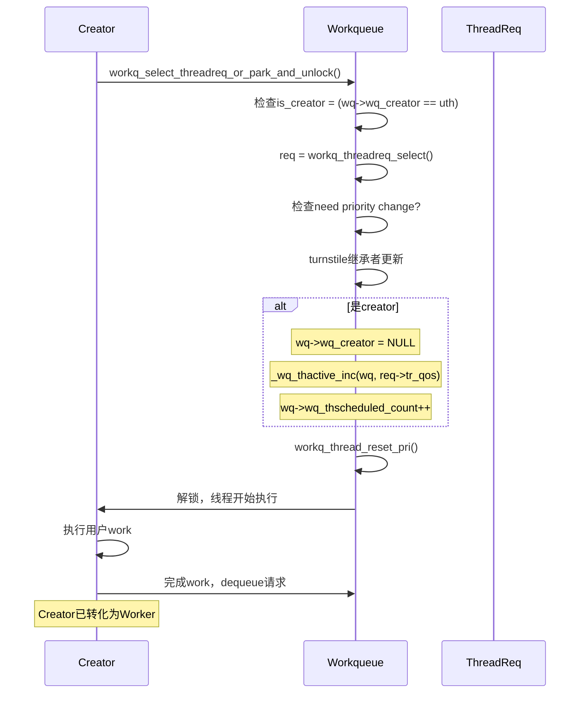

**关键状态变化**:

| 阶段 | wq_creator | 线程类型 | 计数变化 |
|------|-----------|----------|----------|
| **Creator运行中** | 指向该线程 | Overcommit, 未绑定 | 不计入thactive |
| **选择请求后** | `NULL` | 绑定到请求 | 计入thactive和thscheduled |
| **Worker完成后** | `NULL` | 可继续选择新请求或park | 根据选择决定 |

#### 3.4.4 Creator的Yield优化机制

**函数**: `workq_creator_should_yield()` - pthread_workqueue.c:4808

```c
static bool workq_creator_should_yield(struct workqueue *wq, struct uthread *uth)
{
    thread_qos_t qos = workq_pri_override(uth->uu_workq_pri);

    // UI级别不yield，优先响应用户交互
    if (qos >= THREAD_QOS_USER_INTERACTIVE) {
        return false;
    }

    uint32_t snapshot = uth->uu_save.uus_workq_park_data.fulfilled_snapshot;

    // 请求完成数增加，说明系统能处理负载
    if (wq->wq_fulfilled == snapshot) {
        return false;
    }

    uint32_t cnt = 0, conc = wq_max_parallelism[_wq_bucket(qos)];

    // 已完成请求数超过并行度限制
    if (wq->wq_fulfilled - snapshot > conc) {
        WQ_TRACE_WQ(TRACE_wq_creator_yield, wq, 1,
            wq->wq_fulfilled, snapshot);
        return true;
    }

    // 当前调度线程数已达到并行度
    for (uint8_t i = _wq_bucket(qos); i < WORKQ_NUM_QOS_BUCKETS; i++) {
        cnt += wq->wq_thscheduled_count[i];
    }
    if (conc <= cnt) {
        WQ_TRACE_WQ(TRACE_wq_creator_yield, wq, 2,
            wq->wq_fulfilled, snapshot);
        return true;
    }

    return false;
}
```

**Yield判断逻辑**:

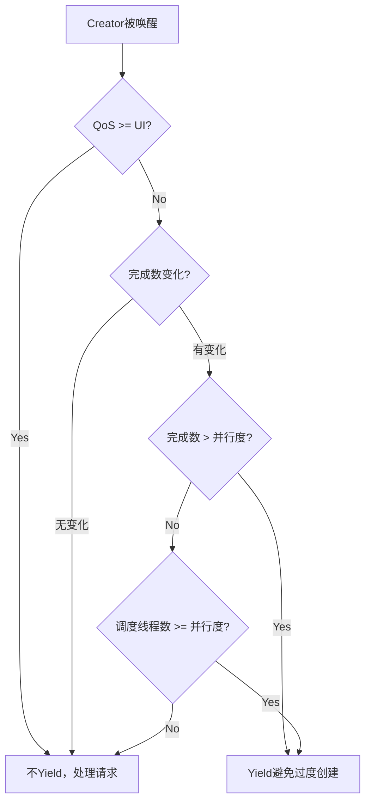

**Yield机制的优势**:
1. **避免过度创建**: 当现有线程能处理负载时，不创建新线程
2. **减少上下文切换**: 防止creator频繁创建立即被抢占的短命线程
3. **动态平衡**: 根据实时负载动态调整线程创建策略

**执行流程** (pthread_workqueue.c:4856-4867):

```c
if (wq->wq_creator == uth && workq_creator_should_yield(wq, uth)) {
    /*
     * If the number of threads we have out are able to keep up with the
     * demand, then we should avoid sending this creator thread to
     * userspace.
     */
    uth->uu_save.uus_workq_park_data.fulfilled_snapshot = wq->wq_fulfilled;
    uth->uu_save.uus_workq_park_data.yields++;
    workq_unlock(wq);
    thread_yield_with_continuation(workq_unpark_continue, NULL);
    __builtin_unreachable();
}
```

#### 3.4.5 前几个GCD线程的完整生命周期

以`dispatch_async`提交的第一个work为例：

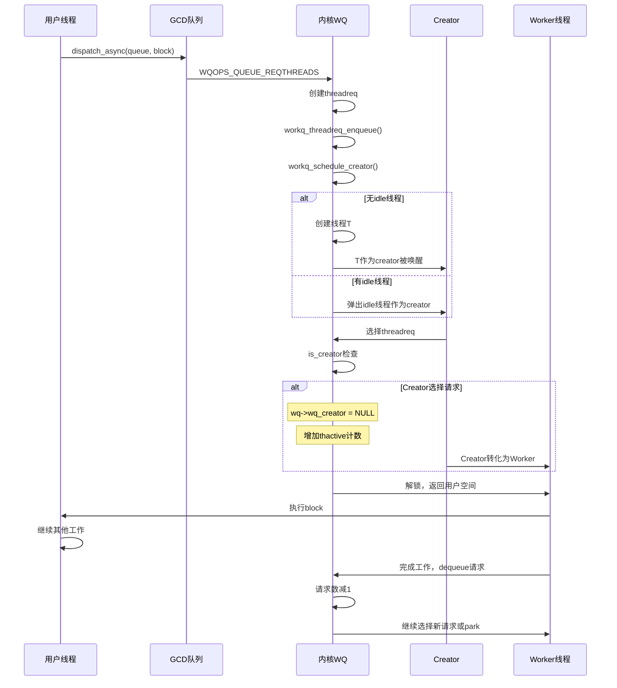

**关键观察**:
1. **第1个请求**: Creator创建/唤醒 → 选择请求 → 转化为Worker
2. **第2个请求**: 可能有idle线程可用，或继续使用Creator
3. **持续负载**: 现有Worker可偷取请求，减少creator压力

#### 3.4.6 Creator与constrained队列的关系

**核心问题**: Creator是否可以从constrained队列中选择请求？

**答案**: **完全可以！** 这是creator的核心功能之一。

**源码证据** (pthread_workqueue.c:4188-4210):

```c
/*
 * Compare the best QoS so far - either from overcommit or from cooperative
 * pool - and compare it with the constrained pool
 */
req_tmp = priority_queue_max(&wq->wq_constrained_queue,
    struct workq_threadreq_s, tr_entry);

if (req_tmp && qos < req_tmp->tr_qos) {
    /*
     * Constrained pool is best in QoS between overcommit, cooperative
     * and constrained. Now check how it fairs against the priority case
     */
    if (pri && pri >= thread_workq_pri_for_qos(req_tmp->tr_qos)) {
        return req_pri;
    }

    if (workq_constrained_allowance(wq, req_tmp->tr_qos, NULL, true, true)) {
        /*
         * If the constrained thread request is the best one and passes
         * the admission check, pick it.
         */
        return req_tmp;
    }
}
```

**选择逻辑**:

| 条件 | 行为 |
|------|------|
| constrained队列为空 | 不选择 |
| 有请求但QoS不是最高 | 不选择 |
| 最高QoS + 通过准入检查 | ✅ 选择该请求 |
| 最高QoS + 未通过准入检查 | 不选择（保持等待） |

**准入检查详情**:

`workq_constrained_allowance(wq, req_tmp->tr_qos, NULL, true, true)`

- 参数`NULL`: creator作为overcommit线程，没有特定线程上下文
- 参数`true`: 允许启动timer（延迟创建）
- 参数`true`: 记录失败的准入检查

**类型转换过程**:

当creator选择constrained请求时，线程类型发生转换 (pthread_workqueue.c:4276-4285):

```c
if (workq_thread_is_overcommit(uth)) {
    if (workq_tr_is_nonovercommit(tr_flags)) {
        // Case 1: thread is overcommit, req is non-overcommit
        wq->wq_constrained_threads_scheduled++;
    } else if (workq_tr_is_cooperative(tr_flags)) {
        // Case 2: thread is overcommit, req is cooperative
        _wq_cooperative_queue_scheduled_count_inc(wq, new_thread_qos);
    }
}
```

**状态转换表**:

| 阶段 | 线程类型 | 队列类型 | 计数变化 |
|------|----------|----------|----------|
| **Creator初始状态** | Overcommit | 无队列 | 不计入constrained计数 |
| **选择constrained请求后** | → Non-overcommit | constrained队列 | `wq_constrained_threads_scheduled++` |
| **请求完成后** | 可保持或转换 | 根据后续选择 | 计数相应调整 |

**为什么需要这个机制？**

1. **效率优化**: creator作为占位符，当有高优先级constrained请求时，直接处理而不是等待新线程创建
2. **避免过度创建**: 通过准入检查确保不超过最大并行度
3. **动态负载均衡**: 根据实时QoS优先级选择最合适的队列

**实际场景示例**:

```
场景: AMP系统，UI QoS请求到达时
1. Creator线程存在（overcommit类型）
2. UI QoS constrained请求进入队列
3. Creator选择该请求（UI QoS最高）
4. 通过准入检查（假设当前活跃数 < 6）
5. Creator转化为Worker，处理UI请求
6. 线程类型转为non-overcommit，计数增加
```

因此，**Creator只能从constrained队列"选择"请求，但不能"取走"（dequeue）请求！**

**关键区分**：

| 动作 | 执行者 | 函数 | 结果 |
|------|--------|------|------|
| **选择（Select）** | Creator | `workq_threadreq_select_for_creator()` | 仅确定最佳请求，不改变队列状态 |
| **取走（Dequeue）** | Worker线程 | `workq_threadreq_dequeue()` | 请求从队列中移除，状态变为IDLE |

**源码证据**：

**Creator选择请求**（pthread_workqueue.c:4479）:
```c
req = workq_threadreq_select_for_creator(wq);  // 只是选择，不dequeue
```

**Worker取走请求**（pthread_workqueue.c:4684）:
```c
/*
 * We passed all checks, dequeue the request, bind to it, and set it up
 * to return to user.
 */
schedule_creator = workq_threadreq_dequeue(wq, req,
    cooperative_sched_count_changed);  // 真正的dequeue
```

**完整流程**：

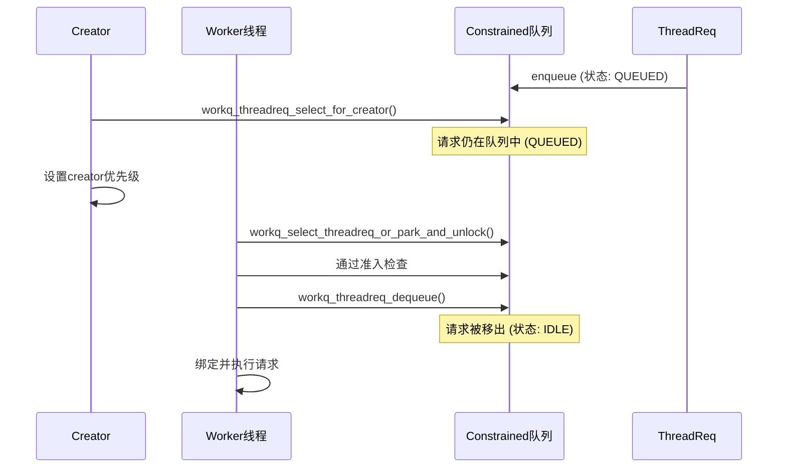

**为什么这样设计？**

1. **责任分离**: Creator负责调度，Worker负责执行
2. **避免Race Condition**: 防止creator和worker同时操作同一请求
3. **准入检查**: 只有Worker能通过准入检查后才能真正dequeue，确保最大并行度限制

**因此，Creator是"选择者"而非"取走者"，真正的dequeue动作由Worker在线程选择过程中执行！**

### 3.4.7 并发安全问题：如何防止重复处理？

**你的担心是对的**：如果creator只选择请求但不dequeue，请求仍在队列中，后续线程查看时会不会重复创建worker？

**答案**：**不会！** 关键机制在于creator被唤醒后**立即执行**，在执行过程中**真正dequeue**请求。

**详细流程分析**：

```mermaid
sequenceDiagram
    participant U as 用户线程
    participant C as Creator
    participant W1 as Worker1
    participant W2 as Worker2
    participant Q as Constrained队列
    participant R as ThreadReq

    U->>Q: dispatch_async提交UI请求
    Q->>Q: enqueue (状态: QUEUED)

    Note over C: 场景1: Creator选择但不dequeue
    C->>Q: workq_threadreq_select_for_creator()
    Note over Q: R仍在队列中 (QUEUED)
    C->>C: 设置优先级，准备唤醒

    C->>C: workq_unpark_continue()
    Note over C: Creator被唤醒执行

    Note over C,W1,W2: 并发点：多个线程可能同时查看队列
    C->>Q: workq_select_threadreq_or_park_and_unlock()
    C->>Q: 通过准入检查
    C->>Q: workq_threadreq_dequeue()  👈 真正的dequeue！
    Note over Q: R被移出队列 (状态: IDLE)
    C->>C: Creator→Worker，执行UI请求

    W1->>Q: workq_select_threadreq_or_park_and_unlock()
    Note over Q: 队列为空或R已被dequeue
    W1->>Q: 没找到可用请求，park
```

**关键机制**：

1. **Creator被唤醒后立即执行**：Creator唤醒后不会"返回队列查看"，而是立即进入 `workq_select_threadreq_or_park_and_unlock()`
2. **Creator作为当前线程选择请求**：在 `workq_select_threadreq_or_park_and_unlock()` 中，`is_creator = (wq->wq_creator == uth)` 为true
3. **Creator在选择过程中dequeue请求**：通过准入检查后，在line 4684调用 `workq_threadreq_dequeue()`
4. **请求被绑定到Creator**：dequeue后，请求立即绑定到creator线程

**源码证据**（pthread_workqueue.c:4620-4625）:

```c
if (is_creator) {
    WQ_TRACE_WQ(TRACE_wq_creator_select, wq, 4, 0,
        uth->uu_save.uus_workq_park_data.yields);
    wq->wq_creator = NULL;                    // 👈 creator标记清除
    _wq_thactive_inc(wq, req->tr_qos);       // 转为活跃线程
    wq->wq_thscheduled_count[_wq_bucket(req->tr_qos)]++;
}
```

**状态转换**：

| 时间点 | Creator状态 | R状态 | 队列状态 |
|--------|-------------|-------|----------|
| **T0** | 未选择 | QUEUED | 在队列中 |
| **T1** | 选择请求 | QUEUED | 仍在队列中 |
| **T2** | 被唤醒 | QUEUED | 仍在队列中 |
| **T3** | 进入选择流程 | → IDLE | **移出队列** |
| **T4** | 绑定R执行 | IDLE | 不在队列中 |

**结论**：

虽然creator在初始阶段只"选择"不"取走"，但creator**立即被唤醒执行**，并在执行过程中**真正dequeue**请求。因此：

1. ✅ **不会出现重复处理**：Creator执行后请求立即被dequeue
2. ✅ **不会出现重复创建**：后续线程查看时请求已被移除
3. ✅ **符合最大并行度**：dequeue前通过准入检查，确保不超过限制

**这正是creator设计的巧妙之处**：作为"占位符"快速选择和唤醒，但在执行时立即完成正式的dequeue操作，既保证了并发安全，又实现了高效调度！

### 3.4.8 "在执行过程中dequeue"的详细机制

#### 3.4.8.1 什么是"在执行过程中dequeue"？

**关键概念**：`workq_threadreq_dequeue()` **不在线程启动时调用**，也不在"创建线程"时调用，而是在**线程被唤醒后的执行准备阶段**调用。

**完整流程拆解**：

```mermaid
sequenceDiagram
    participant U as 用户空间
    participant K as 内核空间
    participant T as 线程
    participant R as ThreadReq
    participant Q as 队列

    Note over U,K,T,R,Q: 步骤1: 线程创建/唤醒
    T->>K: 进入内核 (workq_unpark_continue)

    Note over U,K,T,R,Q: 步骤2: 选择请求
    K->>K: workq_select_threadreq_or_park_and_unlock()
    K->>Q: 从各队列选择最佳请求 (包含constrained)
    K->>K: workq_threadreq_select()
    K->>K: 通过准入检查
    K->>K: workq_constrained_allowance() 检查并行度

    Note over U,K,T,R,Q: 步骤3: 执行中dequeue (关键!)
    K->>K: workq_threadreq_dequeue()  👈 正在执行阶段dequeue
    Note over Q: R从队列移除

    K->>K: 设置线程状态和优先级
    K->>K: workq_thread_reset_pri()

    Note over U,K,T,R,Q: 步骤4: 返回用户空间执行
    K->>U: 返回用户空间
    U->>U: 执行用户代码 ( dispatch_async block等 )

    Note over U,K,T,R,Q: 步骤5: 完成工作后
    U->>K: 重新进入内核 (workq_thread_return)
    K->>K: 循环回到步骤2，选择新请求或park
```

#### 3.4.8.2 具体代码路径分析

**源码位置**：pthread_workqueue.c:4847-4872 (workq_unpark_continue)

```c
__attribute__((noreturn, noinline))
static void
workq_unpark_continue(void *parameter __unused, wait_result_t wr __unused)
{
    thread_t th = current_thread();
    struct uthread *uth = get_bsdthread_info(th);
    proc_t p = current_proc();
    struct workqueue *wq = proc_get_wqptr_fast(p);

    workq_lock_spin(wq);

    // 👈 检查creator是否需要yield
    if (wq->wq_creator == uth && workq_creator_should_yield(wq, uth)) {
        uth->uu_save.uus_workq_park_data.fulfilled_snapshot = wq->wq_fulfilled;
        uth->uu_save.uus_workq_park_data.yields++;
        workq_unlock(wq);
        thread_yield_with_continuation(workq_unpark_continue, NULL);
        __builtin_unreachable();
    }

    // 👈 关键：进入选择和dequeue流程
    if (__probable(uth->uu_workq_flags & UT_WORKQ_RUNNING)) {
        workq_unpark_select_threadreq_or_park_and_unlock(p, wq, uth, WQ_SETUP_NONE);
        __builtin_unreachable();
    }

    // ... park路径 (死亡或其他情况)
}
```

**核心调用链**：

```
workq_unpark_continue()
    ↓
workq_unpark_select_threadreq_or_park_and_unlock()
    ↓
workq_select_threadreq_or_park_and_unlock() (line 4568)
    ↓
workq_threadreq_select() (line 4395)
    ↓
通过准入检查
    ↓
workq_threadreq_dequeue() (line 1686)  ← 关键：执行中dequeue
    ↓
workq_thread_reset_pri() (line 1207)
    ↓
返回用户空间
```

#### 3.4.8.3 "执行中"的时间界定

**时间点定义**：

| 阶段 | 代码位置 | 动作 | 说明 |
|------|----------|------|------|
| **唤醒前** | workq_schedule_creator() | 唤醒线程 | 线程在idle状态 |
| **唤醒时** | workq_unpark_continue() | 进入执行准备 | 线程进入内核 |
| **选择中** | workq_select_threadreq_or_park_and_unlock() | 选择最佳请求 | 仍持锁，但即将释放 |
| **✨执行中** | workq_threadreq_dequeue() | **正在dequeue** | 这是"执行中"的关键时刻！ |
| **设置中** | workq_thread_reset_pri() | 设置优先级 | 线程已绑定请求 |
| **返回前** | 设置返回状态 | 准备返回用户空间 | 即将执行用户代码 |
| **✨执行中** | 用户代码执行 | **正在执行用户代码** | block/kevent/workloop |

**为什么叫"执行中dequeue"？**

1. **线程已经被唤醒**：不再是idle状态
2. **已通过准入检查**：线程即将真正处理请求
3. **但尚未返回用户空间**：还在内核执行准备阶段
4. **请求即将被绑定**：dequeue后立即绑定到当前线程

#### 3.4.8.4 与"直接dequeue"的对比

**场景A：非creator线程执行流程**：

```
线程被唤醒 → 选择请求 → 检查准入 → dequeue → 返回用户空间 → 执行
                    ↓
                如果检查失败：不dequeue，直接park
```

**场景B：creator线程执行流程**：

```
Creator被唤醒 → 选择请求 → 检查准入 → dequeue → Creator→Worker → 返回 → 执行
        ↓              ↓                ↓           ↓
    初始"选择"    无"直接dequeue"   **执行中dequeue**   绑定执行
```

**关键区别**：

| 维度 | 非creator线程 | creator线程 |
|------|--------------|-------------|
| **选择时机** | 每次唤醒 | 初次选择用于设置优先级 |
| **选择深度** | 选择后立即dequeue | 选择后等待执行时dequeue |
| **dequeue时机** | 线程选择时 | 线程执行准备阶段 |
| **队列状态** | 持锁时队列状态稳定 | 持锁时可能仍在队列中 |

#### 3.4.8.5 并发安全保障

**Race Condition风险**：

```
时间轴：
T0: Creator选择请求R (R仍在Q中)
T1: Worker线程查看队列 → 看到R
T2: Creator执行，dequeue R
T3: Worker尝试dequeue R → R已不在队列中
```

**安全保障机制**：

1. **准入检查通过后立即dequeue**（pthread_workqueue.c:4677-4684）：
```c
/*
 * We passed all checks, dequeue the request, bind to it, and set it up
 * to return to user.
 */
WQ_TRACE_WQ(TRACE_wq_thread_logical_run | DBG_FUNC_START, wq,
    workq_trace_req_id(req), tr_flags, 0);
wq->wq_fulfilled++;
schedule_creator = workq_threadreq_dequeue(wq, req,
    cooperative_sched_count_changed);
```

2. **dequeue操作原子性**：`workq_threadreq_dequeue()` 是原子操作，将请求从队列移除并更新状态

3. **持锁期间完成关键操作**：在`workq_lock_spin()`保护下完成选择、准入检查、dequeue

**最终状态**：

| 线程 | 请求状态 | 队列状态 | 说明 |
|------|----------|----------|------|
| **Creator** | 绑定R执行 | R被移除 | 正常执行用户代码 |
| **Worker** | 没找到请求 | Q为空或R被移除 | Park或选择其他请求 |

#### 3.4.8.6 设计意图总结

**为什么不在"创建线程"时dequeue，而在"执行前"dequeue？**

1. **懒加载原则**：
   - 创建线程时：只唤醒，不保证立即有请求
   - 执行前：确认有请求且通过检查，才正式分配

2. **避免过度创建**：
   - creator选择请求仅用于设置优先级
   - 只有确认线程能处理请求时才dequeue
   - 如果后续情况变化（如请求被取消），避免浪费dequeue

3. **动态决策**：
   - 执行前可以重新评估优先级
   - 可以根据当前系统负载调整并发度
   - 更精确的准入控制

**因此，"在执行过程中dequeue"是xnu workqueue的核心设计精髓：延迟决策、动态调整、并发安全！**

---

## 四、线程选择与绑定

**函数**: `workq_select_threadreq_or_park_and_unlock()` - pthread_workqueue.c:4568

### 4.1 完整流程图

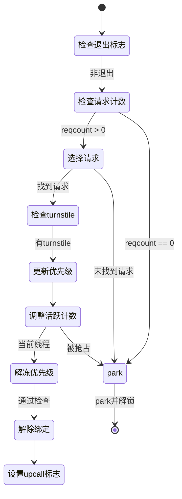

### 4.2 核心源码片段

```c
__attribute__((noreturn, noinline))
static void workq_select_threadreq_or_park_and_unlock(proc_t p, struct workqueue *wq,
    struct uthread *uth, uint32_t setup_flags)
{
    workq_threadreq_t req = NULL;
    bool is_creator = (wq->wq_creator == uth);
    bool schedule_creator = false;

    // 检查是否需要park
    if (__improbable(_wq_exiting(wq))) {
        goto park;
    }

    if (wq->wq_reqcount == 0) {
        goto park;
    }

    // 选择最佳请求
    req = workq_threadreq_select(wq, uth);
    if (__improbable(req == NULL)) {
        goto park;
    }

    struct uu_workq_policy old_pri = uth->uu_workq_pri;
    uint8_t tr_flags = req->tr_flags;
    struct turnstile *req_ts = kqueue_threadreq_get_turnstile(req);

    // 更新turnstile继承者（如果需要）
    if (req_ts) {
        workq_perform_turnstile_operation_locked(wq, ^{
            turnstile_update_inheritor(req_ts, get_machthread(uth),
            TURNSTILE_IMMEDIATE_UPDATE | TURNSTILE_INHERITOR_THREAD);
            turnstile_update_inheritor_complete(req_ts,
            TURNSTILE_INTERLOCK_HELD);
        });
    }

    // ⚠️ 关键：调整活跃计数
    if (is_creator) {
        WQ_TRACE_WQ(TRACE_wq_creator_select, wq, 4, 0,
            uth->uu_save.uus_workq_park_data.yields);
        wq->wq_creator = NULL;
        _wq_thactive_inc(wq, req->tr_qos);              // 原子增加活跃计数
        wq->wq_thscheduled_count[_wq_bucket(req->tr_qos)]++;
    } else if (old_pri.qos_bucket != req->tr_qos) {
        _wq_thactive_move(wq, old_pri.qos_bucket, req->tr_qos);
    }
    workq_thread_reset_pri(wq, uth, req, /*unpark*/ true);

    bool cooperative_sched_count_changed =
        workq_adjust_cooperative_constrained_schedule_counts(wq, uth,
        old_pri.qos_req, tr_flags);

    // 设置线程类型（overcommit/cooperative/constrained）
    if (workq_tr_is_overcommit(tr_flags)) {
        workq_thread_set_type(uth, UT_WORKQ_OVERCOMMIT);
    } else if (workq_tr_is_cooperative(tr_flags)) {
        workq_thread_set_type(uth, UT_WORKQ_COOPERATIVE);
    } else {
        workq_thread_set_type(uth, 0);  // constrained
    }

    // 检查是否需要被抢占
    if (__improbable(thread_unfreeze_base_pri(get_machthread(uth)) && !is_creator)) {
        // 需要被抢占，返还turnstile并park
        if (req_ts) {
            workq_perform_turnstile_operation_locked(wq, ^{
                turnstile_update_inheritor(req_ts, wq->wq_turnstile,
                TURNSTILE_IMMEDIATE_UPDATE | TURNSTILE_INHERITOR_TURNSTILE);
                turnstile_update_inheritor_complete(req_ts,
                TURNSTILE_INTERLOCK_HELD);
            });
        }
        WQ_TRACE_WQ(TRACE_wq_select_threadreq | DBG_FUNC_NONE, wq, 3, 0, 0);

        if (cooperative_sched_count_changed) {
            if (req->tr_qos == WORKQ_THREAD_QOS_MANAGER) {
                _wq_cooperative_queue_refresh_best_req_qos(wq);
            }
        }
        goto park_thawed;
    }

    // ✅ 通过所有检查，可以运行
    WQ_TRACE_WQ(TRACE_wq_thread_logical_run | DBG_FUNC_START, wq,
        workq_trace_req_id(req), tr_flags, 0);
    wq->wq_fulfilled++;

    // 出队并解除绑定
    schedule_creator = workq_threadreq_dequeue(wq, req,
        cooperative_sched_count_changed);

    workq_thread_reset_cpupercent(req, uth);

    if (tr_flags & (WORKQ_TR_FLAG_KEVENT | WORKQ_TR_FLAG_WORKLOOP)) {
        kqueue_threadreq_bind_prepost(p, req, uth);
        req = NULL;
    } else if (req->tr_count > 0) {
        req = NULL;
    }

    if (uth->uu_workq_flags & UT_WORKQ_NEW) {
        uth->uu_workq_flags ^= UT_WORKQ_NEW;
        setup_flags |= WQ_SETUP_FIRST_USE;
    }

    // 可能需要重新调度creator
    if (is_creator || schedule_creator) {
        workq_schedule_creator(p, wq, WORKQ_THREADREQ_CAN_CREATE_THREADS);
    }

    workq_unlock(wq);

    if (req) {
        zfree(workq_zone_threadreq, req);
    }

    // 设置upcall标志
    uint32_t upcall_flags = WQ_FLAG_THREAD_NEWSPI;
    if (uth->uu_workq_pri.qos_bucket == WORKQ_THREAD_QOS_MANAGER) {
        upcall_flags |= WQ_FLAG_THREAD_EVENT_MANAGER;
    } else if (workq_tr_is_overcommit(tr_flags)) {
        upcall_flags |= WQ_FLAG_THREAD_OVERCOMMIT;
    } else if (workq_tr_is_cooperative(tr_flags)) {
        upcall_flags |= WQ_FLAG_THREAD_COOPERATIVE;
    }
    if (tr_flags & WORKQ_TR_FLAG_KEVENT) {
        upcall_flags |= WQ_FLAG_THREAD_KEVENT;
        assert((upcall_flags & WQ_FLAG_THREAD_COOPERATIVE) == 0);
    }

    if (tr_flags & WORKQ_TR_FLAG_WORKLOOP) {
        upcall_flags |= WQ_FLAG_THREAD_WORKLOOP | WQ_FLAG_THREAD_KEVENT;
    }
    uth->uu_save.uus_workq_park_data.upcall_flags = upcall_flags;

    // 提交绑定
    if (tr_flags & (WORKQ_TR_FLAG_KEVENT | WORKQ_TR_FLAG_WORKLOOP)) {
        kqueue_threadreq_bind_commit(p, get_machthread(uth));
    } else {
#if CONFIG_PREADOPT_TG
        thread_set_preadopt_thread_group(get_machthread(uth), NULL);
#endif
    }

    // 运行线程
    workq_setup_and_run(p, uth, setup_flags);
    __builtin_unreachable();

park:
    thread_unfreeze_base_pri(get_machthread(uth));
park_thawed:
    workq_park_and_unlock(p, wq, uth, setup_flags);
}
```

**关键逻辑注解**:

| 步骤 | 操作 | 作用 |
|------|------|------|
| 1 | `workq_threadreq_select()` | 选择最佳请求（可能返回NULL） |
| 2 | turnstile更新 | 如果请求有关联的turnstile，更新继承者 |
| 3 | `_wq_thactive_inc()` | **原子增加**活跃线程计数（每QoS独立） |
| 4 | `wq_thscheduled_count++` | 增加该QoS的调度计数 |
| 5 | `workq_thread_reset_pri()` | 设置线程调度优先级 |
| 6 | `thread_unfreeze_base_pri()` | 解冻基础优先级，检查是否需要被抢占 |
| 7 | `workq_threadreq_dequeue()` | 从队列中移除请求 |
| 8 | `kqueue_threadreq_bind_prepost()` | 预绑定kevent/workloop请求 |
| 9 | `workq_setup_and_run()` | 准备并运行用户代码 |

**抢占检查**:
如果调度器检测到当前线程应该被高优先级任务抢占，`thread_unfreeze_base_pri()`会返回true，此时需要：
1. 将turnstile继承者返还给workqueue
2. park而不是运行用户代码

---

## 五、计数系统与位图编码

### 5.1 计数变量体系

**文件**: `workqueue_internal.h:237-288`

```c
struct workqueue {
    // 基础计数
    uint32_t wq_reqcount;              // 队列中请求总数（含多实例）
    uint32_t wq_fulfilled;             // 已完成的请求数（用于creator yield检查）
    uint16_t wq_threads_scheduled;     // 已调度线程总数
    uint16_t wq_constrained_threads_scheduled;  // constrained池已调度数

    // 生命周期计数
    uint16_t wq_nthreads;              // 当前总线程数（创建中+活跃+空闲+阻塞）
    uint16_t wq_thidlecount;           // 空闲线程数
    uint16_t wq_thdying_count;         // 正在死亡的线程数

    // 按QoS分桶的调度计数
    uint16_t wq_thscheduled_count[WORKQ_NUM_BUCKETS];  // 7个桶：BG/MT, UT, DF, IN, UI, AUI, MGR

    // 原子计数：活跃线程位图
    _Atomic wq_thactive_t wq_thactive;

    // 线程列表
    struct workq_uthread_head wq_thrunlist;   // 运行中
    struct workq_uthread_head wq_thnewlist;   // 新创建（未使用过）
    struct workq_uthread_head wq_thidlelist;  // 空闲

    // 队列
    struct priority_queue_sched_max wq_constrained_queue;
    struct priority_queue_sched_max wq_overcommit_queue;
    struct priority_queue_sched_max wq_special_queue;
};
```

### 5.2 计数变量变化时序表

| 变量名 | 类型 | 含义 | 修改点位 | 与线程状态的关系 |
|--------|------|------|----------|------------------|
| `wq_nthreads` | uint16 | 当前总线程数 | 创建时+1（workq_add_new_idle_thread:1078）<br>销毁时-1（pthread_workqueue.c:972） | **先**于创建<br>**后**于销毁 |
| `wq_thidlecount` | uint16 | 空闲线程数 | 创建后+1（pthread_workqueue.c:1110）<br>弹出时-1（workq_pop_idle_thread）<br>park时+1（workq_push_idle_thread:1287） | **后**于创建<br>**先**于弹出<br>**后**于park |
| `wq_thscheduled_count[i]` | uint16 | 第i个QoS桶的活跃线程数 | 绑定时+1（workq_select_threadreq_or_park:480）<br>park时-1（workq_push_idle_thread:1301） | **后**于绑定<br>**先**于park |
| `wq_thactive` | atomic | 位图编码的活跃线程数 | 绑定时原子+1（workq_select_threadreq_or_park:479）<br>park时原子-1（workq_push_idle_thread:1300）<br>QoS迁移时move | **后**于绑定<br>**先**于park |
| `wq_reqcount` | uint32 | 队列中请求总数 | enqueue时+1（workq_threadreq_enqueue:1635）<br>dequeue时-1（workq_threadreq_dequeue:1689） | 与请求生命周期同步 |
| `wq_threads_scheduled` | uint16 | 已调度线程总数 | 绑定时+1（workq_select_threadreq_or_park）<br>park时-1（workq_push_idle_thread） | 与线程绑定同步 |
| `wq_constrained_threads_scheduled` | uint16 | constrained池已调度数 | constrained线程绑定时+1<br>constrained线程park时-1 | 仅constrained线程修改 |
| `wq_fulfilled` | uint32 | 已完成请求数 | 每次dequeue时+1（workq_select_threadreq_or_park:523） | 累计计数器 |

### 5.3 关键时序分析

#### 线程创建时刻序（workq_add_new_idle_thread）

```c
// 顺序1: 先预留槽位
wq->wq_nthreads++;

// 顺序2: 释放锁（允许其他线程并发访问）
workq_unlock();

// 顺序3: 创建内核线程（可能耗时）
thread_create_workq_waiting(...);

// 顺序4: 重新获取锁
workq_lock();

// 顺序5: 加入空闲列表
wq->wq_thidlecount++;           // 从0变为1
TAILQ_INSERT_TAIL(&wq->wq_thnewlist, uth, uu_workq_entry);
```

**关键点**: `wq_nthreads++`在释放锁**之前**，防止并发创建超出上限。

#### 线程绑定时刻序（workq_select_threadreq_or_park_and_unlock）

```c
// 1. 从空闲列表弹出
uth = workq_pop_idle_thread(wq, ...);  // wq_thidlecount--

// 2. 原子增加活跃计数
_wq_thactive_inc(wq, req->tr_qos);     // wq_thactive原子+1
wq->wq_thscheduled_count[...]++;       // 调度计数+1

// 3. 设置优先级
workq_thread_reset_pri(...);

// 4. dequeue请求
workq_threadreq_dequeue(wq, req, ...);  // wq_reqcount--
wq->wq_fulfilled++;                     // 完成计数+1

// 5. 运行用户代码
workq_setup_and_run(p, uth, setup_flags);
```

**关键点**: 先修改计数，再dequeue请求，确保计数与队列状态一致。

#### 线程park时刻序（workq_push_idle_thread）

```c
// 1. 原子减少活跃计数
_wq_thactive_dec(wq, uth->uu_workq_pri.qos_bucket);  // wq_thactive原子-1
wq->wq_thscheduled_count[...]--;                      // 调度计数-1

// 2. 增加空闲计数
wq->wq_thidlecount++;                                // 从0变为1
TAILQ_INSERT_TAIL(&wq->wq_thidlelist, uth, ...);
```

**关键点**: 活跃计数减少后立即增加空闲计数，确保线程不会同时处于两种状态。

### 5.3 wq_thactive位图编码

**文件**: `pthread_workqueue.c:319-328`

```c
// 编码格式：每个QoS桶占用10位，总共70位
// 位布局：[reserved][AUI][UI][IN][DF][UT][BG/MT]
//         1bit   10bit 10bit 10bit 10bit 10bit 10bit

#define WQ_THACTIVE_BUCKET_WIDTH 10        // 每桶位数
#define WQ_THACTIVE_BUCKET_HALF  (1U << (WQ_THACTIVE_BUCKET_WIDTH - 1))  // 512

static_assert(sizeof(wq_thactive_t) * CHAR_BIT - WQ_THACTIVE_QOS_SHIFT >= 3,
    "Make sure we have space to encode a QoS");

// 获取指定QoS在位图中的偏移量
static inline wq_thactive_t _wq_thactive_offset_for_qos(thread_qos_t qos)
{
    uint8_t bucket = _wq_bucket(qos);
    __builtin_assume(bucket < WORKQ_NUM_BUCKETS);
    return (wq_thactive_t)1 << (bucket * WQ_THACTIVE_BUCKET_WIDTH);
}

// 增加指定QoS的活跃线程数（原子操作）
static inline wq_thactive_t _wq_thactive_inc(struct workqueue *wq, thread_qos_t qos)
{
    wq_thactive_t v = _wq_thactive_offset_for_qos(qos);
    return os_atomic_add_orig(&wq->wq_thactive, v, relaxed);
}

// 减少指定QoS的活跃线程数
static inline wq_thactive_t _wq_thactive_dec(struct workqueue *wq, thread_qos_t qos)
{
    wq_thactive_t v = _wq_thactive_offset_for_qos(qos);
    return os_atomic_sub_orig(&wq->wq_thactive, v, relaxed);
}

// QoS间迁移（如线程改变QoS）
static inline void _wq_thactive_move(struct workqueue *wq,
    thread_qos_t old_qos, thread_qos_t new_qos)
{
    wq_thactive_t v = _wq_thactive_offset_for_qos(new_qos) -
        _wq_thactive_offset_for_qos(old_qos);
    os_atomic_add(&wq->wq_thactive, v, relaxed);
}
```

**位图编码示例**:

假设当前状态：
- 3个BG/MT线程活跃
- 5个UT线程活跃
- 2个UI线程活跃

位图表示（简化64位）：
```
[0][0000000010][0000000101][0000000011][0000000000][0000000000][0000000000]
   UI(2)      UT(5)        BG/MT(3)
```

**为什么限制512（2^9）而非1023（2^10-1）**：

| 原因 | 说明 |
|------|------|
| 避免进位 | 限制在2^9，每次操作最多增加/减少2^9，保证10位桶内不会进位到相邻桶 |
| 防止溢出 | 10位最大1023，但2^9=512更安全，避免边界条件 |
| 系统限制 | 64位系统中70位有效，需要保留4位安全余量 |
| 实际够用 | 512个活跃线程远超单进程workqueue的正常使用场景 |

### 5.4 活跃计数聚合

**函数**: `_wq_thactive_aggregate_downto_qos()` - pthread_workqueue.c:343-383

```c
static inline uint32_t _wq_thactive_aggregate_downto_qos(struct workqueue *wq,
    wq_thactive_t thactive, thread_qos_t qos, uint32_t *busycount, uint32_t *downto_qos)
{
    uint32_t count = 0;
    uint32_t busy = 0;

    uint8_t bucket_idx = _wq_bucket(qos);
    wq_thactive_t mask = _wq_thactive_offset_for_qos(qos);
    wq_thactive_t bucket_mask = mask - 1;

    for (uint8_t i = 0; i < WORKQ_NUM_BUCKETS; i++) {
        wq_thactive_t bucket_bits = thactive & ((1 << WQ_THACTIVE_BUCKET_WIDTH) - 1);
        if (bucket_bits) {
            if (i < bucket_idx) {
                // 更高优先级QoS的活跃线程
                count += (uint32_t)bucket_bits;
            } else if (i == bucket_idx) {
                // 当前QoS的活跃线程
                count += (uint32_t)bucket_bits;
                busy += _wq_thactive_bucket_busycount(wq, i, bucket_bits);
            } else {
                // 更低优先级QoS的"忙"线程（可能很快恢复）
                busy += _wq_thactive_bucket_busycount(wq, i, bucket_bits);
            }
        }
        thactive >>= WQ_THACTIVE_BUCKET_WIDTH;
    }

    if (downto_qos) {
        *downto_qos = qos;
    }
    if (busycount) {
        *busycount = busy;
    }
    return count;
}
```

**busycount含义**:
- 记录最近阻塞但可能很快恢复的线程数
- 用于预留槽位，避免新线程刚创建就被阻塞的线程抢占

### 5.5 全局限制变量

**文件**: `pthread_workqueue.c:146-150`

```c
static uint32_t wq_max_threads = WORKQUEUE_MAXTHREADS;              // 默认512
static uint32_t wq_max_constrained_threads = WORKQUEUE_MAXTHREADS/8; // = 64
static uint32_t wq_init_constrained_limit = 1;
static uint16_t wq_death_max_load;
static uint32_t wq_max_parallelism[WORKQ_NUM_QOS_BUCKETS];          // 每QoS最大并行度
```

**文件**: `pthread_workqueue.c:2093-2123`（初始化）

```c
if (wq_init_constrained_limit) {
    uint32_t limit, num_cpus = ml_wait_max_cpus();

    // 计算全局constrained限制 = CPU数 × 5
    limit = num_cpus * WORKQUEUE_CONSTRAINED_FACTOR;

    if (limit > wq_max_constrained_threads) {
        wq_max_constrained_threads = limit;
    }

    // 硬上限：不超过512（WQ_THACTIVE_BUCKET_HALF）
    if (wq_max_threads > WQ_THACTIVE_BUCKET_HALF) {
        wq_max_threads = WQ_THACTIVE_BUCKET_HALF;
    }
    if (wq_max_threads > CONFIG_THREAD_MAX - 20) {
        wq_max_threads = CONFIG_THREAD_MAX - 20;
    }

    // 计算死亡线程负载阈值
    wq_death_max_load = (uint16_t)fls(num_cpus) + 1;

    // 设置每QoS最大并行度
    for (thread_qos_t qos = WORKQ_THREAD_QOS_MIN; qos <= WORKQ_THREAD_QOS_MAX; qos++) {
        wq_max_parallelism[_wq_bucket(qos)] =
            qos_max_parallelism(qos, QOS_PARALLELISM_COUNT_LOGICAL);
    }

    wq_max_cooperative_threads = num_cpus;

    wq_init_constrained_limit = 0;
}
```

**限制变量总结**:

| 变量名 | 默认值 | 计算方式 | 作用 |
|--------|--------|----------|------|
| `wq_max_threads` | 512 | min(WQ_THACTIVE_BUCKET_HALF, CONFIG_THREAD_MAX-20) | 全局硬上限 |
| `wq_max_constrained_threads` | CPU×5 | max(WORKQUEUE_MAXTHREADS/8, CPU×5) | constrained池全局限制 |
| `wq_max_parallelism[QoS]` | 见下文 | qos_max_parallelism() | 每QoS的CPU核数限制 |
| `wq_death_max_load` | fls(CPU)+1 | 用于延迟线程销毁 | 控制死亡线程清理策略 |

---

## 六、最大并行度限制机制（constrained的核心保证）

### 6.1 最大并行度计算路径

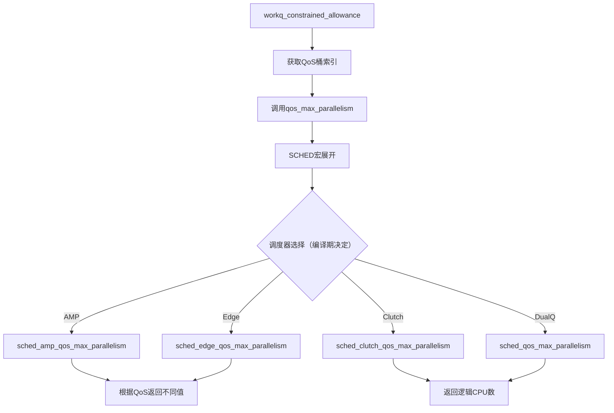

### 6.2 调度器使能机制

**文件**: `osfmk/kern/sched_prim.h:858-882`

**重要说明**: 调度器策略在**编译期**确定，通过条件编译选择不同的调度器表，以避免运行时函数指针调用的性能开销。

```c
/*
 * The scheduling policy is fixed at compile-time, in order to save the performance
 * cost of function pointer indirection that we would otherwise pay each time when
 * making a policy-specific callout.
 */

#if __AMP__                                    // 是否为AMP系统（大小核）
    #if CONFIG_SCHED_EDGE                      // 是否启用EDGE调度器
        extern const struct sched_dispatch_table sched_edge_dispatch;
        #define SCHED(f) (sched_edge_dispatch.f)
    #else                                      // 默认AMP调度器
        extern const struct sched_dispatch_table sched_amp_dispatch;
        #define SCHED(f) (sched_amp_dispatch.f)
    #endif
#else                                          // 非AMP系统
    #if CONFIG_SCHED_CLUTCH                    // 是否启用Clutch调度器
        extern const struct sched_dispatch_table sched_clutch_dispatch;
        #define SCHED(f) (sched_clutch_dispatch.f)
    #else                                      // 默认双队列调度器
        extern const struct sched_dispatch_table sched_dualq_dispatch;
        #define SCHED(f) (sched_dualq_dispatch.f)
    #endif
#endif
```

**调度器选择树**:

| 架构类型 | 宏定义 | 调度器表 | 主要特点 |
|----------|--------|----------|----------|
| **AMP + EDGE** | `__AMP__ && CONFIG_SCHED_EDGE` | `sched_edge_dispatch` | AMP架构，启用EDGE调度器 |
| **AMP** | `__AMP__` | `sched_amp_dispatch` | AMP架构，默认调度器 |
| **Clutch** | `CONFIG_SCHED_CLUTCH` | `sched_clutch_dispatch` | 非AMP，启用Clutch调度器 |
| **DualQ** | 默认 | `sched_dualq_dispatch` | 非AMP，默认双队列调度器 |

**宏定义说明**:
- `__AMP__`: 在编译时自动根据目标架构设置，Apple ARM芯片（M系列/A系列）启用
- `CONFIG_SCHED_EDGE`: 内核配置选项，可选启用
- `CONFIG_SCHED_CLUTCH`: 内核配置选项，可选启用

### 6.3 AMP系统实现（大小核架构）

**文件**: `osfmk/kern/sched_amp_common.c:445-488`

```c
uint32_t sched_amp_qos_max_parallelism(int qos, uint64_t options)
{
    uint32_t ecount = ecore_set ? ecore_set->cpu_set_count : 0;
    uint32_t pcount = pcore_set ? pcore_set->cpu_set_count : 0;

    uint32_t ecluster_count = ecount ? 1 : 0;
    uint32_t pcluster_count = pcount ? 1 : 0;

    if (options & QOS_PARALLELISM_REALTIME) {
        // RT线程只允许在P核运行
        return (options & QOS_PARALLELISM_CLUSTER_SHARED_RESOURCE) ? pcluster_count : pcount;
    }

    // 根据QoS决定允许使用的核
    switch (qos) {
    case THREAD_QOS_UTILITY:
        if (os_atomic_load(&sched_perfctl_policy_util, relaxed) == SCHED_PERFCTL_POLICY_DEFAULT) {
            // 默认策略：UT只允许在E核运行
            return (options & QOS_PARALLELISM_CLUSTER_SHARED_RESOURCE) ? ecluster_count : ecount;
        } else {
            // 性能控制策略调整：UT可以使用所有核
            return (options & QOS_PARALLELISM_CLUSTER_SHARED_RESOURCE) ? (ecluster_count + pcluster_count) : (ecount + pcount);
        }
    case THREAD_QOS_BACKGROUND:
    case THREAD_QOS_MAINTENANCE:
        if (os_atomic_load(&sched_perfctl_policy_bg, relaxed) == SCHED_PERFCTL_POLICY_DEFAULT) {
            // 默认策略：BG/MT只允许在E核运行
            return (options & QOS_PARALLELISM_CLUSTER_SHARED_RESOURCE) ? ecluster_count : ecount;
        } else {
            // 性能控制策略调整：BG/MT可以使用所有核
            return (options & QOS_PARALLELISM_CLUSTER_SHARED_RESOURCE) ? (ecluster_count + pcluster_count) : (ecount + pcount);
        }
    default:  // IN, UI, AUI等高QoS
        // 高QoS：可以使用所有核（E核 + P核）
        return (options & QOS_PARALLELISM_CLUSTER_SHARED_RESOURCE) ? (ecluster_count + pcluster_count) : (ecount + pcount);
    }
}
```

**AMP系统QoS与最大并行度映射表**:

现代Apple设备（iPhone/Mac）均为AMP系统（大小核架构），假设系统：4个E核 + 2个P核（共6个逻辑CPU）

| QoS级别 | 允许使用的核 | 最大并行度 |
|---------|-------------|-----------|
| THREAD_QOS_MAINTENANCE (MT) | 仅E核 | 4 |
| THREAD_QOS_BACKGROUND (BG) | 仅E核 | 4 |
| THREAD_QOS_UTILITY (UT) | 仅E核（默认）<br>所有核（性能模式） | 4 或 6 |
| THREAD_QOS_DEFAULT (DF) | 所有核 | 6 |
| THREAD_QOS_USER_INITIATED (IN) | 所有核 | 6 |
| THREAD_QOS_USER_INTERACTIVE (UI) | 所有核 | 6 |
| THREAD_QOS_USER_INITIATED (AUI) | 所有核 | 6 |

**性能控制策略**:
- `sched_perfctl_policy_util`: 控制UT线程是否可以抢占P核
- `sched_perfctl_policy_bg`: 控制BG/MT线程是否可以抢占P核

### 6.3 非AMP系统实现（传统多核）

**文件**: `osfmk/kern/sched_prim.c:9803-9825`

```c
uint32_t sched_qos_max_parallelism(__unused int qos, uint64_t options)
{
    host_basic_info_data_t hinfo;
    mach_msg_type_number_t count = HOST_BASIC_INFO_COUNT;

    assert((options & QOS_PARALLELISM_CLUSTER_SHARED_RESOURCE) == 0);

    __assert_only kern_return_t kret = host_info(host_self(), HOST_BASIC_INFO,
        (host_info_t)&hinfo, &count);
    assert(kret == KERN_SUCCESS);

    if (options & QOS_PARALLELISM_COUNT_LOGICAL) {
        return hinfo.logical_cpu;
    } else {
        return hinfo.physical_cpu;
    }
}
```

**非AMP系统QoS与最大并行度映射表**:

假设系统：4核8线程（启用超线程）

| QoS级别 | 最大并行度 |
|---------|-----------|
| 所有QoS（MT, BG, UT, DF, IN, UI, AUI） | 8（逻辑CPU数） |

**特点**:
- 所有QoS使用相同的最大并行度
- 使用逻辑CPU数（包含超线程）
- 无QoS特定的核分配策略

### 6.4 最大并行度应用示例

**场景1**: AMP系统（4E + 2P核）

```
QoS=UI请求：
  wq_max_parallelism[UI] = 6（所有核）
  当前活跃UI线程 = 3
  → 允许创建最多3个新UI线程

QoS=UT请求：
  wq_max_parallelism[UT] = 4（仅E核）
  当前活跃UT线程 = 4
  → 不允许创建新UT线程（已达E核上限）
```

**场景2**: 非AMP系统（4核8线程）

```
任意QoS请求：
  wq_max_parallelism[QOS] = 8（逻辑CPU数）
  当前活跃线程 = 7
  → 允许创建1个新线程
```

---

## 七、constrained准入检查逻辑

**函数**: `workq_constrained_allowance()` - pthread_workqueue.c:3979-4058

### 7.1 准入检查流程图

```mermaid
flowchart TD
    A[入口: workq_constrained_allowance] --> B[获取当前scheduled数]
    B --> C{当前线程是否是constrained?}
    C -->|是| D[scheduled数-1]
    C -->|否| E[无调整]
    D --> F{scheduled >= max_constrained?}
    E --> F
    F -->|是| G[拒绝: 超出全局限制]
    F -->|否| H[max_count -= max_constrained]
    H --> I[聚合活跃线程数]
    I --> J[计算busycount]
    J --> K[获取该QoS的CPU核数]
    K --> L{活跃+忙 >= CPU核数?}
    L -->|是| M[拒绝: 达到CPU核数限制]
    L -->|否| N[允许: 剩余槽位 = CPU核数 - (活跃+忙)]
    G --> O[设置exceeded标志]
    M --> O
    N --> O
    O --> P[返回allowance_passed]
```

### 7.3 核心逻辑解析

#### 第一步：获取最大并行度

**获取该QoS允许的最大并行度**：
```c
count = wq_max_parallelism[_wq_bucket(at_qos)];
```

**重要说明**：`count`不是CPU核数，而是"该QoS允许的最大并行度"：

**AMP系统**（大小核架构）：
- **低QoS (MT/BG/UT)**: 只允许在E核运行 → count = E核数（如4）
- **高QoS (IN/UI/AUI)**: 可使用所有核 → count = E核 + P核（如6）

**非AMP系统**：
- **所有QoS**: count = 逻辑CPU数（如8）

`wq_max_parallelism`数组在系统初始化时设置：

**文件**: `pthread_workqueue.c:816-819`

```c
for (thread_qos_t qos = WORKQ_THREAD_QOS_MIN; qos <= WORKQ_THREAD_QOS_MAX; qos++) {
    wq_max_parallelism[_wq_bucket(qos)] =
        qos_max_parallelism(qos, QOS_PARALLELISM_COUNT_LOGICAL);
}
```

`qos_max_parallelism()`根据调度器和QoS返回不同的值。

#### 槽位使用计算

```c
// 第二步: 聚合活跃线程数（≥指定QoS的所有活跃线程）
thactive_count = _wq_thactive_aggregate_downto_qos(wq, _wq_thactive(wq),
    at_qos, &busycount, NULL);

// 第三步: 检查是否超出最大并行度
if (count > thactive_count + busycount) {
    allowance_passed = MIN(count - (thactive_count + busycount), max_count);
} else {
    allowance_passed = 0;  // 达到最大并行度限制，拒绝
}
```

**关键公式**:
- `count` = 该QoS允许的最大并行度（不是CPU核数！）
- `thactive_count` = 活跃线程数（≥当前QoS）
- `busycount` = 忙线程数（最近阻塞但可能很快恢复）
- `used = thactive_count + busycount` = 已使用的槽位
- `allowed = count - used` = 允许创建的新线程数

**当 `used ≥ count` 时，拒绝创建新线程**，保证活跃线程数不超过该QoS允许的最大并行度。

### 7.4 源码分析

```c
static uint32_t workq_constrained_allowance(struct workqueue *wq, thread_qos_t at_qos,
    struct uthread *uth, bool may_start_timer, bool record_failed_allowance)
{
    assert(at_qos != WORKQ_THREAD_QOS_MANAGER);
    uint32_t allowance_passed = 0;
    uint32_t count = 0;

    // 第一层检查：全局constrained限制（CPU × 5）
    uint32_t max_count = wq->wq_constrained_threads_scheduled;
    if (uth && workq_thread_is_nonovercommit(uth)) {
        // 如果当前线程是constrained，不计算自己
        assert(max_count > 0);
        max_count--;
    }
    if (max_count >= wq_max_constrained_threads) {
        WQ_TRACE_WQ(TRACE_wq_constrained_admission | DBG_FUNC_NONE, wq, 1,
            wq->wq_constrained_threads_scheduled,
            wq_max_constrained_threads);
        allowance_passed = 0;
        goto out;
    }
    // 剩余可用槽位（全局限制内）
    max_count -= wq_max_constrained_threads;

    // 第二层检查：CPU核数限制
    uint32_t busycount, thactive_count;

    // 从位图聚合活跃线程数（≥ 指定QoS的所有线程）
    thactive_count = _wq_thactive_aggregate_downto_qos(wq, _wq_thactive(wq),
        at_qos, &busycount, NULL);

    // 如果当前线程的QoS ≥ 请求QoS，不计算自己
    if (uth && uth->uu_workq_pri.qos_bucket != WORKQ_THREAD_QOS_MANAGER &&
        at_qos <= uth->uu_workq_pri.qos_bucket) {
        assert(thactive_count > 0);
        thactive_count--;
    }

    // 获取该QoS允许的最大并行度（CPU核数）
    count = wq_max_parallelism[_wq_bucket(at_qos)];

    // 检查是否超出CPU核数
    if (count > thactive_count + busycount) {
        // 有剩余槽位
        count -= thactive_count + busycount;
        WQ_TRACE_WQ(TRACE_wq_constrained_admission | DBG_FUNC_NONE, wq, 2,
            thactive_count, busycount);
        allowance_passed = MIN(count, max_count);  // 取两层限制的最小值
        goto out;
    } else {
        WQ_TRACE_WQ(TRACE_wq_constrained_admission | DBG_FUNC_NONE, wq, 3,
            thactive_count, busycount);
        allowance_passed = 0;
    }

    if (may_start_timer) {
        // 如果被拒绝，启动延迟计时器，等待线程释放
        workq_schedule_delayed_thread_creation(wq, 0);
    }

out:
    if (record_failed_allowance) {
        wq->wq_exceeded_active_constrained_thread_limit = !allowance_passed;
    }
    return allowance_passed;
}
```

### 7.3 双层限制机制详解

#### 第一层：全局限制（CPU × 5）

| 概念 | 计算方式 | 目的 |
|------|----------|------|
| `wq_max_constrained_threads` | `max(CPU×5, 64)` | 防止constrained线程总数过多 |
| `wq_constrained_threads_scheduled` | 实际已调度数 | 实时统计 |

**为什么是5**:
- 早期设计：每个CPU核允许最多5个constrained线程
- 这5个线程对应不同QoS桶：MT, BG, UT, DF, IN（或UI）
- 实践中，UI/AUI线程通常不会阻塞很长时间

#### 第二层：CPU最大并行度限制（每QoS独立）

| 概念 | 计算方式 | 目的 |
|------|----------|------|
| `wq_max_parallelism[QoS]` | `qos_max_parallelism(QoS)` | 限制活跃线程数不超过该QoS允许的最大并行度 |
| `thactive_count + busycount` | 当前活跃+忙线程数 | 实际占用槽位数 |

**准入条件**:
```
允许创建新线程数 = min(
    wq_max_constrained_threads - wq_constrained_threads_scheduled,  // 全局剩余
    wq_max_parallelism[QoS] - (thactive + busycount)                 // 该QoS最大并行度剩余
)
```

### 7.4 活跃计数聚合细节

**函数**: `_wq_thactive_aggregate_downto_qos()` - pthread_workqueue.c:343-383

**功能**:
- 统计所有QoS ≥ 指定QoS的活跃线程总数
- 计算这些线程中处于"忙"状态的数量

**忙状态定义**:
```c
// 最近阻塞的线程，被认为可能很快恢复
// 用于预留槽位，避免新线程刚创建就被抢占
static inline uint32_t _wq_thactive_bucket_busycount(struct workqueue *wq,
    uint8_t bucket_idx, wq_thactive_t bucket_bits)
{
    uint64_t now = mach_absolute_time();
    uint64_t last_blocked = wq->wq_lastblocked_ts[bucket_idx];

    // 最近200μs内阻塞的线程视为"忙"
    return (now - last_blocked < WQ_STALLED_WINDOW_USECS * 1000ULL) ? 1 : 0;
}
```

**聚合示例**:

假设当前状态：
- wq_thactive = 0000010010 (2个UT线程活跃)
- 指定QoS = UI
- 需要聚合：UI, IN, DF, UT, BG/MT的活跃线程

```c
// 假设位图： [AUI][UI][IN][DF][UT][BG/MT] = [0001][0010][0011][0100][0101][0110]
// 索引：    [  5][ 4 ][ 3][ 2][ 1 ][  0  ]

// QoS = UI (索引4)
// 需要聚合的桶：UI(4), IN(3), DF(2), UT(1), BG/MT(0)
//
// 活跃线程数 = 2(UI) + 3(IN) + 4(DF) + 5(UT) + 6(BG/MT) = 20
// busy线程数  = 检查每个桶最近是否有人阻塞
```

### 7.5 拒绝场景分析

| 场景 | 全局限制 | 最大并行度限制 | 结果 |
|------|----------|---------------|------|
| constrained总数已达CPU×5 | ❌ 拒绝 | - | 超出全局阈值 |
| 活跃线程数已等于最大并行度 | ✅ 通过 | ❌ 拒绝 | 达到并行度上限 |
| 活跃+忙线程数 = 最大并行度 | ✅ 通过 | ❌ 拒绝 | 无可用槽位 |
| 活跃+忙线程数 < 最大并行度 | ✅ 通过 | ✅ 通过 | 允许创建 |

**例子**: AMP系统，4E+2P核，QoS=UI（最大并行度=6）

```
场景：当前4个UI活跃线程 + 2个忙UI线程
新请求：创建UI线程

检查：
  max_parallelism[UI] = 6
  thactive_count = 4  (活跃UI线程)
  busycount = 2       (忙UI线程)
  used = 4 + 2 = 6
  remaining = 6 - 6 = 0

结果：❌ 拒绝（已达到UI QoS的最大并行度）
```

**注意**: 这是AMP系统上UT QoS可能允许4个线程（仅E核），但UI QoS允许6个线程（所有核）。

---

## 八、总结与关键设计原理

### 8.1 constrained队列的准入检查机制

**文件定位**: `pthread_workqueue.c:3979` - `workq_constrained_allowance()`

constrained队列通过**准入检查机制**确保活跃线程数不超过该QoS允许的最大并行度。其核心逻辑是：

```c
// 获取该QoS允许的最大并行度（不是CPU核数！）
count = wq_max_parallelism[_wq_bucket(at_qos)];

// 准入检查：只有最大并行度 > (活跃 + 忙)，才允许创建新线程
if (count > thactive_count + busycount) {
    count -= thactive_count + busycount;
    allowance_passed = MIN(count, max_count);
} else {
    allowance_passed = 0;  // 拒绝创建
}
```

**关键效果**:
- 当 `活跃线程数 + 忙线程数 ≥ 该QoS的最大并行度` 时，系统拒绝创建新的constrained线程
- 这意味着活跃constrained线程数**永远不会超过该QoS允许的最大并行度**（注意：忙线程可能很快恢复，但系统会预留槽位）
- 通过准入控制，强制将活跃线程数限制在该QoS允许的最大并行度附近，避免过度调度

**双层检查**:
1. **全局层面**: 检查总数不超过`CPU数 × 5`
2. **QoS层面**: 检查每QoS的活跃线程数不超过该QoS允许的最大并行度

### 8.2 位图编码的设计智慧

**文件定位**: `pthread_workqueue.c:319` - `WQ_THACTIVE_BUCKET_WIDTH`

使用10位/桶的位图编码实现：
- **原子操作**: 无锁增减计数
- **独立计数**: 每QoS独立统计，避免互斥锁
- **聚合查询**: O(1)时间聚合所有QoS的活跃线程数
- **512限制**: 防止进位，保持每桶独立

### 8.3 QoS感知的调度

**文件定位**: `osfmk/kern/sched_amp_common.c:471`

AMP系统中不同QoS的CPU核数分配：
- **低QoS (MT/BG/UT)**: 限制在小核（E核），节省功耗
- **高QoS (IN/UI/AUI)**: 可使用所有核，保证性能

### 8.4 关键函数交互关系

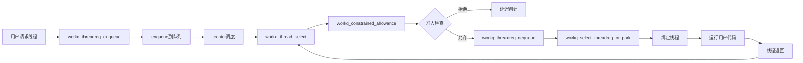

### 8.5 计数变量的生命周期

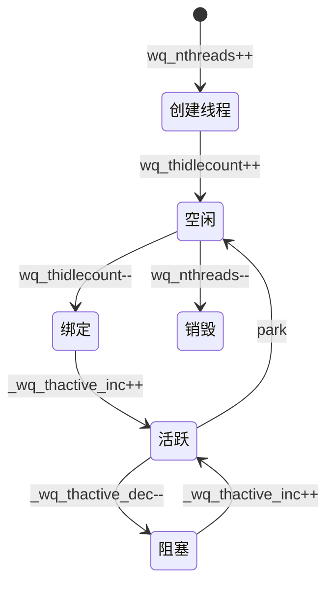

