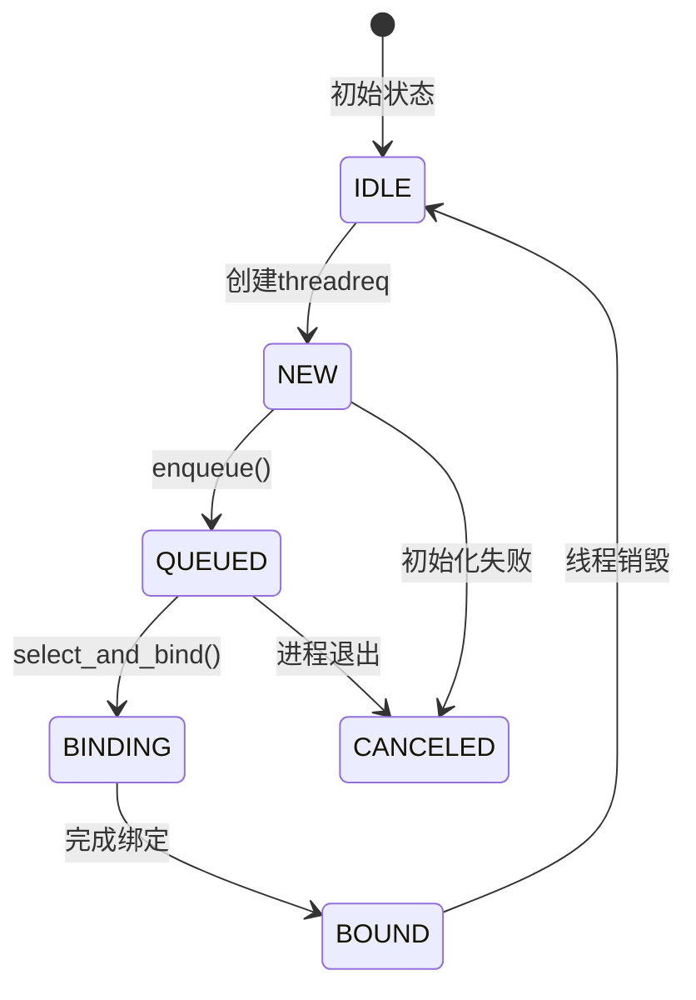
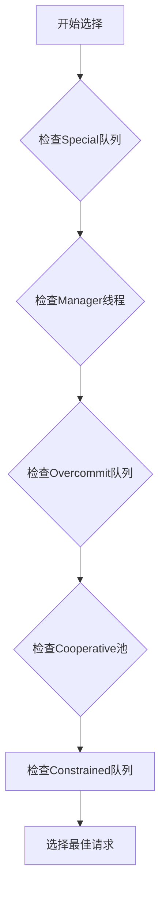
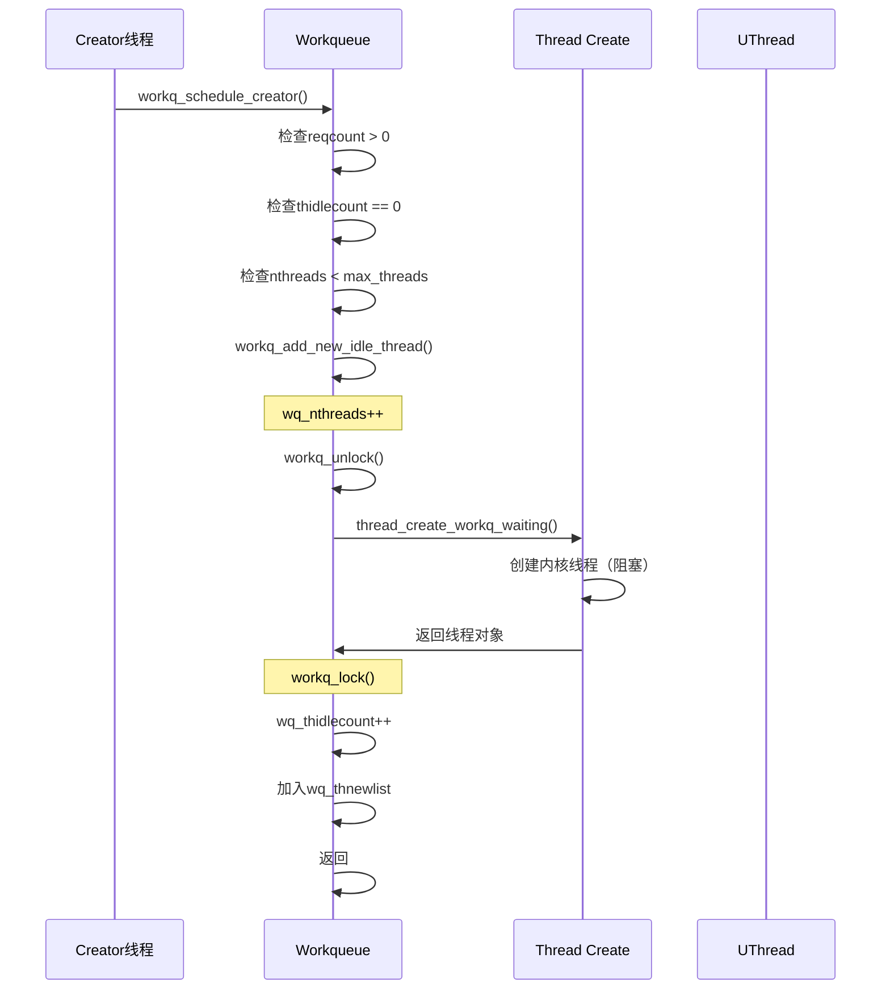
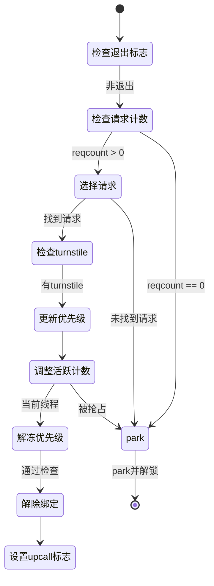
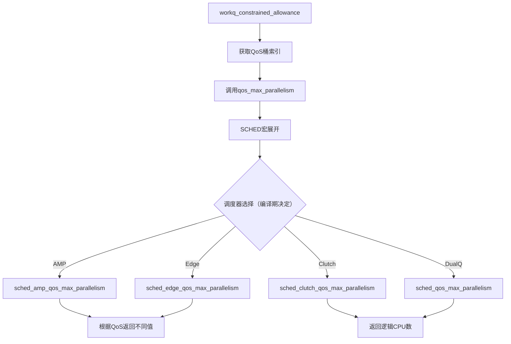
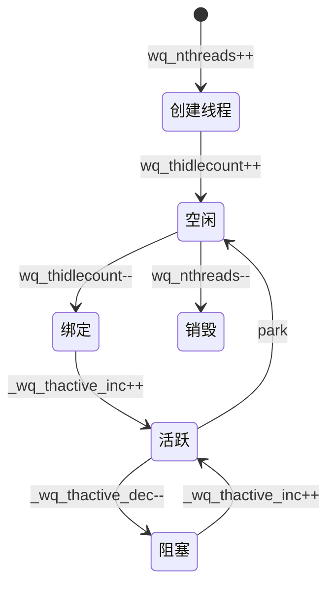

## 引言

constrained队列是xnu workqueue机制中的三大线程池之一，与overcommit和cooperative池并列。其准入检查机制的核心效果是：**确保活跃线程数不会超过CPU核数**。

具体来说，系统通过检查 `CPU核数 > (活跃线程数 + 忙线程数)` 来决定是否允许创建新线程。当活跃+忙线程数达到或超过CPU核数时，创建请求被拒绝，从而保证活跃线程数始终控制在CPU核数范围内，避免过度调度造成的性能退化。

## 一、线程请求状态机

### 1.1 状态定义

**文件**: `workqueue_internal.h:170-177`

```c
__enum_decl(workq_tr_state_t, uint8_t, {
    WORKQ_TR_STATE_IDLE               = 0,  // 请求未使用
    WORKQ_TR_STATE_NEW                = 1,  // 正在初始化
    WORKQ_TR_STATE_QUEUED             = 2,  // 已enqueue等待
    WORKQ_TR_STATE_CANCELED           = 3,  // 被取消
    WORKQ_TR_STATE_BINDING            = 4,  // 正在绑定线程
    WORKQ_TR_STATE_BOUND              = 5,  // 已绑定
});
```

### 1.2 状态流转图



### 1.3 关键函数分析

**函数**: `workq_threadreq_enqueue()` - pthread_workqueue.c:1630

**功能**: 将新创建的线程请求enqueue到对应队列

**核心逻辑**:
1. 验证状态为NEW
2. 修改状态为QUEUED
3. 增加队列请求计数（`wq_reqcount`）
4. 根据请求类型选择队列：
   - Manager线程 → `wq_event_manager_threadreq`
   - Cooperative请求 → `wq_cooperative_queue[QoS]` (STAILQ队列)
   - Constrained/Overcommit请求 → `wq_*_queue` (优先级队列)
5. 设置优先级并插入优先级队列
6. 返回true表示队列头发生变化

**源码**:
```c
static bool workq_threadreq_enqueue(struct workqueue *wq, workq_threadreq_t req)
{
    assert(req->tr_state == WORKQ_TR_STATE_NEW);

    req->tr_state = WORKQ_TR_STATE_QUEUED;
    wq->wq_reqcount += req->tr_count;

    if (req->tr_qos == WORKQ_THREAD_QOS_MANAGER) {
        assert(wq->wq_event_manager_threadreq == NULL);
        assert(req->tr_flags & WORKQ_TR_FLAG_KEVENT);
        assert(req->tr_count == 1);
        wq->wq_event_manager_threadreq = req;
        return true;
    }

    if (workq_threadreq_is_cooperative(req)) {
        // cooperative池使用简单链表，插入尾部
        struct workq_threadreq_tailq *bucket = &wq->wq_cooperative_queue[_wq_bucket(req->tr_qos)];
        STAILQ_INSERT_TAIL(bucket, req, tr_link);
        return _wq_cooperative_queue_refresh_best_req_qos(wq);
    }

    // constrained/overcommit池使用优先级队列
    struct priority_queue_sched_max *q = workq_priority_queue_for_req(wq, req);
    priority_queue_entry_set_sched_pri(q, &req->tr_entry,
        workq_priority_for_req(req), false);

    if (priority_queue_insert(q, &req->tr_entry)) {
        if (workq_threadreq_is_nonovercommit(req)) {
            _wq_thactive_refresh_best_constrained_req_qos(wq);
        }
        return true;
    }
    return false;
}
```

**注解**:
- `wq_reqcount`记录队列中所有请求的总数，包括未完成的多实例请求
- cooperative池使用STAILQ是因为需要FIFO顺序支持最佳请求QoS刷新
- constrained/overcommit池使用priority_queue是为了支持优先级调度

---

**函数**: `workq_threadreq_dequeue()` - pthread_workqueue.c:1686

**功能**: 从constrained队列中移除已绑定的线程请求

**核心逻辑**:
1. 减少队列请求计数（`wq_reqcount`）
2. 减少请求实例计数（`tr_count`）
3. 如果实例计数归零，从constraind队列的优先级队列中完全dequeue
4. 返回true表示最高优先级请求发生变化

**源码**:
```c
static bool workq_threadreq_dequeue(struct workqueue *wq, workq_threadreq_t req,
    bool cooperative_sched_count_changed)
{
    wq->wq_reqcount--;

    bool next_highest_request_changed = false;

    if (--req->tr_count == 0) {
        // constrained池：从优先级队列移除
        struct priority_queue_sched_max *q = workq_priority_queue_for_req(wq, req);
        priority_queue_remove(q, &req->tr_entry);

        if (workq_threadreq_is_nonovercommit(req)) {
            next_highest_request_changed = true;
        }
    }

    return next_highest_request_changed;
}
```

**注解**:
- constrained池使用priority_queue实现按优先级出队
- 返回true时会触发creator的重新调度

---

## 二、constrained队列的请求选择

**函数**: `workq_threadreq_select()` - pthread_workqueue.c:4316

constrained队列的选择逻辑与其他队列不同，它在QoS选择阶段被处理。

### 2.1 constrained队列的选择位置

在完整的请求选择流程中，constrained队列处于QoS选择阶段：



### 2.2 constrained选择逻辑

**核心源码**（仅constrained部分）：
```c
// 步骤5: 检查Constrained队列
req_tmp = priority_queue_max(&wq->wq_constrained_queue,
    struct workq_threadreq_s, tr_entry);

// 如果有constrained请求且QoS更高
if (req_tmp && qos < req_tmp->tr_qos) {
    // 优先级比较：special vs constrained
    if (pri && pri >= thread_workq_pri_for_qos(req_tmp->tr_qos)) {
        return req_pri;  // special优先级更高
    }

    // constrained通过准入检查后返回（关键！）
    if (workq_constrained_allowance(wq, req_tmp->tr_qos, uth, true, true)) {
        return req_tmp;  // 选中constrained请求
    }
}
```

**关键特点**:
1. constrained队列使用priority_queue存储，按优先级排序
2. 必须通过`workq_constrained_allowance()`准入检查
3. 与其他QoS队列（overcommit/cooperative）竞争，优先级相同

---

## 三、线程创建流程

### 3.1 创建时机

线程创建由creator负责，触发条件包括：
- 请求队列非空但没有可用线程（`wq_thidlecount == 0`）
- 当前线程数未达到上限（`wq_nthreads < wq_max_threads`）
- creator被选中执行

### 3.2 完整流程



### 3.3 源码分析

**函数**: `workq_add_new_idle_thread()` - pthread_workqueue.c:1067

```c
static kern_return_t workq_add_new_idle_thread(
    proc_t             p,
    struct workqueue  *wq,
    thread_continue_t continuation,
    bool              is_permanently_bound,
    thread_t          *new_thread)
{
    mach_vm_offset_t th_stackaddr;
    kern_return_t kret;
    thread_t th;

    // ⚠️ 关键：先增加计数
    wq->wq_nthreads++;

    workq_unlock(wq);

    vm_map_t vmap = get_task_map(proc_task(p));

    // 创建用户栈
    kret = pthread_functions->workq_create_threadstack(p, vmap, &th_stackaddr);
    if (kret != KERN_SUCCESS) {
        WQ_TRACE_WQ(TRACE_wq_thread_create_failed | DBG_FUNC_NONE, wq,
            kret, 1, 0);
        goto out;
    }

    // 创建内核线程（阻塞状态）
    kret = thread_create_workq_waiting(proc_task(p),
        continuation,
        &th,
        is_permanently_bound);
    if (kret != KERN_SUCCESS) {
        WQ_TRACE_WQ(TRACE_wq_thread_create_failed | DBG_FUNC_NONE, wq,
            kret, 0, 0);
        pthread_functions->workq_destroy_threadstack(p, vmap, th_stackaddr);
        goto out;
    }

    struct uthread *uth = get_bsdthread_info(th);
    uth->uu_workq_stackaddr = (user_addr_t)th_stackaddr;

    wq->wq_creations++;

    // 加入空闲列表
    if (!is_permanently_bound) {
        wq->wq_thidlecount++;
        TAILQ_INSERT_TAIL(&wq->wq_thnewlist, uth, uu_workq_entry);
    }

    if (new_thread) {
        *new_thread = th;
    }

    WQ_TRACE_WQ(TRACE_wq_thread_create | DBG_FUNC_NONE, wq, 0, 0, 0);
    return kret;

out:
    workq_lock_spin(wq);
    // ⚠️ 失败时回滚计数
    wq->wq_nthreads--;
    return kret;
}
```

**关键时序注解**:
| 步骤 | 操作 | 原因 |
|------|------|------|
| 1 | `wq_nthreads++` | 预留槽位，防止并发创建超出限制 |
| 2 | `workq_unlock()` | 释放锁，允许其他线程访问队列 |
| 3 | 创建线程 | 线程创建可能耗时，避免锁持有 |
| 4 | `workq_lock()` | 重新获取锁以安全更新数据结构 |
| 5 | `wq_thidlecount++` | 增加空闲线程计数 |
| 6 | 加入`wq_thnewlist` | 标记为新创建的线程，死亡时特殊处理 |

---

## 四、线程选择与绑定

**函数**: `workq_select_threadreq_or_park_and_unlock()` - pthread_workqueue.c:4568

### 4.1 完整流程图



### 4.2 核心源码片段

```c
__attribute__((noreturn, noinline))
static void workq_select_threadreq_or_park_and_unlock(proc_t p, struct workqueue *wq,
    struct uthread *uth, uint32_t setup_flags)
{
    workq_threadreq_t req = NULL;
    bool is_creator = (wq->wq_creator == uth);
    bool schedule_creator = false;

    // 检查是否需要park
    if (__improbable(_wq_exiting(wq))) {
        goto park;
    }

    if (wq->wq_reqcount == 0) {
        goto park;
    }

    // 选择最佳请求
    req = workq_threadreq_select(wq, uth);
    if (__improbable(req == NULL)) {
        goto park;
    }

    struct uu_workq_policy old_pri = uth->uu_workq_pri;
    uint8_t tr_flags = req->tr_flags;
    struct turnstile *req_ts = kqueue_threadreq_get_turnstile(req);

    // 更新turnstile继承者（如果需要）
    if (req_ts) {
        workq_perform_turnstile_operation_locked(wq, ^{
            turnstile_update_inheritor(req_ts, get_machthread(uth),
            TURNSTILE_IMMEDIATE_UPDATE | TURNSTILE_INHERITOR_THREAD);
            turnstile_update_inheritor_complete(req_ts,
            TURNSTILE_INTERLOCK_HELD);
        });
    }

    // ⚠️ 关键：调整活跃计数
    if (is_creator) {
        WQ_TRACE_WQ(TRACE_wq_creator_select, wq, 4, 0,
            uth->uu_save.uus_workq_park_data.yields);
        wq->wq_creator = NULL;
        _wq_thactive_inc(wq, req->tr_qos);              // 原子增加活跃计数
        wq->wq_thscheduled_count[_wq_bucket(req->tr_qos)]++;
    } else if (old_pri.qos_bucket != req->tr_qos) {
        _wq_thactive_move(wq, old_pri.qos_bucket, req->tr_qos);
    }
    workq_thread_reset_pri(wq, uth, req, /*unpark*/ true);

    bool cooperative_sched_count_changed =
        workq_adjust_cooperative_constrained_schedule_counts(wq, uth,
        old_pri.qos_req, tr_flags);

    // 设置线程类型（overcommit/cooperative/constrained）
    if (workq_tr_is_overcommit(tr_flags)) {
        workq_thread_set_type(uth, UT_WORKQ_OVERCOMMIT);
    } else if (workq_tr_is_cooperative(tr_flags)) {
        workq_thread_set_type(uth, UT_WORKQ_COOPERATIVE);
    } else {
        workq_thread_set_type(uth, 0);  // constrained
    }

    // 检查是否需要被抢占
    if (__improbable(thread_unfreeze_base_pri(get_machthread(uth)) && !is_creator)) {
        // 需要被抢占，返还turnstile并park
        if (req_ts) {
            workq_perform_turnstile_operation_locked(wq, ^{
                turnstile_update_inheritor(req_ts, wq->wq_turnstile,
                TURNSTILE_IMMEDIATE_UPDATE | TURNSTILE_INHERITOR_TURNSTILE);
                turnstile_update_inheritor_complete(req_ts,
                TURNSTILE_INTERLOCK_HELD);
            });
        }
        WQ_TRACE_WQ(TRACE_wq_select_threadreq | DBG_FUNC_NONE, wq, 3, 0, 0);

        if (cooperative_sched_count_changed) {
            if (req->tr_qos == WORKQ_THREAD_QOS_MANAGER) {
                _wq_cooperative_queue_refresh_best_req_qos(wq);
            }
        }
        goto park_thawed;
    }

    // ✅ 通过所有检查，可以运行
    WQ_TRACE_WQ(TRACE_wq_thread_logical_run | DBG_FUNC_START, wq,
        workq_trace_req_id(req), tr_flags, 0);
    wq->wq_fulfilled++;

    // 出队并解除绑定
    schedule_creator = workq_threadreq_dequeue(wq, req,
        cooperative_sched_count_changed);

    workq_thread_reset_cpupercent(req, uth);

    if (tr_flags & (WORKQ_TR_FLAG_KEVENT | WORKQ_TR_FLAG_WORKLOOP)) {
        kqueue_threadreq_bind_prepost(p, req, uth);
        req = NULL;
    } else if (req->tr_count > 0) {
        req = NULL;
    }

    if (uth->uu_workq_flags & UT_WORKQ_NEW) {
        uth->uu_workq_flags ^= UT_WORKQ_NEW;
        setup_flags |= WQ_SETUP_FIRST_USE;
    }

    // 可能需要重新调度creator
    if (is_creator || schedule_creator) {
        workq_schedule_creator(p, wq, WORKQ_THREADREQ_CAN_CREATE_THREADS);
    }

    workq_unlock(wq);

    if (req) {
        zfree(workq_zone_threadreq, req);
    }

    // 设置upcall标志
    uint32_t upcall_flags = WQ_FLAG_THREAD_NEWSPI;
    if (uth->uu_workq_pri.qos_bucket == WORKQ_THREAD_QOS_MANAGER) {
        upcall_flags |= WQ_FLAG_THREAD_EVENT_MANAGER;
    } else if (workq_tr_is_overcommit(tr_flags)) {
        upcall_flags |= WQ_FLAG_THREAD_OVERCOMMIT;
    } else if (workq_tr_is_cooperative(tr_flags)) {
        upcall_flags |= WQ_FLAG_THREAD_COOPERATIVE;
    }
    if (tr_flags & WORKQ_TR_FLAG_KEVENT) {
        upcall_flags |= WQ_FLAG_THREAD_KEVENT;
        assert((upcall_flags & WQ_FLAG_THREAD_COOPERATIVE) == 0);
    }

    if (tr_flags & WORKQ_TR_FLAG_WORKLOOP) {
        upcall_flags |= WQ_FLAG_THREAD_WORKLOOP | WQ_FLAG_THREAD_KEVENT;
    }
    uth->uu_save.uus_workq_park_data.upcall_flags = upcall_flags;

    // 提交绑定
    if (tr_flags & (WORKQ_TR_FLAG_KEVENT | WORKQ_TR_FLAG_WORKLOOP)) {
        kqueue_threadreq_bind_commit(p, get_machthread(uth));
    } else {
#if CONFIG_PREADOPT_TG
        thread_set_preadopt_thread_group(get_machthread(uth), NULL);
#endif
    }

    // 运行线程
    workq_setup_and_run(p, uth, setup_flags);
    __builtin_unreachable();

park:
    thread_unfreeze_base_pri(get_machthread(uth));
park_thawed:
    workq_park_and_unlock(p, wq, uth, setup_flags);
}
```

**关键逻辑注解**:

| 步骤 | 操作 | 作用 |
|------|------|------|
| 1 | `workq_threadreq_select()` | 选择最佳请求（可能返回NULL） |
| 2 | turnstile更新 | 如果请求有关联的turnstile，更新继承者 |
| 3 | `_wq_thactive_inc()` | **原子增加**活跃线程计数（每QoS独立） |
| 4 | `wq_thscheduled_count++` | 增加该QoS的调度计数 |
| 5 | `workq_thread_reset_pri()` | 设置线程调度优先级 |
| 6 | `thread_unfreeze_base_pri()` | 解冻基础优先级，检查是否需要被抢占 |
| 7 | `workq_threadreq_dequeue()` | 从队列中移除请求 |
| 8 | `kqueue_threadreq_bind_prepost()` | 预绑定kevent/workloop请求 |
| 9 | `workq_setup_and_run()` | 准备并运行用户代码 |

**抢占检查**:
如果调度器检测到当前线程应该被高优先级任务抢占，`thread_unfreeze_base_pri()`会返回true，此时需要：
1. 将turnstile继承者返还给workqueue
2. park而不是运行用户代码

---

## 五、计数系统与位图编码

### 5.1 计数变量体系

**文件**: `workqueue_internal.h:237-288`

```c
struct workqueue {
    // 基础计数
    uint32_t wq_reqcount;              // 队列中请求总数（含多实例）
    uint32_t wq_fulfilled;             // 已完成的请求数（用于creator yield检查）
    uint16_t wq_threads_scheduled;     // 已调度线程总数
    uint16_t wq_constrained_threads_scheduled;  // constrained池已调度数

    // 生命周期计数
    uint16_t wq_nthreads;              // 当前总线程数（创建中+活跃+空闲+阻塞）
    uint16_t wq_thidlecount;           // 空闲线程数
    uint16_t wq_thdying_count;         // 正在死亡的线程数

    // 按QoS分桶的调度计数
    uint16_t wq_thscheduled_count[WORKQ_NUM_BUCKETS];  // 7个桶：BG/MT, UT, DF, IN, UI, AUI, MGR

    // 原子计数：活跃线程位图
    _Atomic wq_thactive_t wq_thactive;

    // 线程列表
    struct workq_uthread_head wq_thrunlist;   // 运行中
    struct workq_uthread_head wq_thnewlist;   // 新创建（未使用过）
    struct workq_uthread_head wq_thidlelist;  // 空闲

    // 队列
    struct priority_queue_sched_max wq_constrained_queue;
    struct priority_queue_sched_max wq_overcommit_queue;
    struct priority_queue_sched_max wq_special_queue;
};
```

### 5.2 计数变量变化时序表

| 变量名 | 类型 | 含义 | 修改点位 | 与线程状态的关系 |
|--------|------|------|----------|------------------|
| `wq_nthreads` | uint16 | 当前总线程数 | 创建时+1（workq_add_new_idle_thread:1078）<br>销毁时-1（pthread_workqueue.c:972） | **先**于创建<br>**后**于销毁 |
| `wq_thidlecount` | uint16 | 空闲线程数 | 创建后+1（pthread_workqueue.c:1110）<br>弹出时-1（workq_pop_idle_thread）<br>park时+1（workq_push_idle_thread:1287） | **后**于创建<br>**先**于弹出<br>**后**于park |
| `wq_thscheduled_count[i]` | uint16 | 第i个QoS桶的活跃线程数 | 绑定时+1（workq_select_threadreq_or_park:480）<br>park时-1（workq_push_idle_thread:1301） | **后**于绑定<br>**先**于park |
| `wq_thactive` | atomic | 位图编码的活跃线程数 | 绑定时原子+1（workq_select_threadreq_or_park:479）<br>park时原子-1（workq_push_idle_thread:1300）<br>QoS迁移时move | **后**于绑定<br>**先**于park |
| `wq_reqcount` | uint32 | 队列中请求总数 | enqueue时+1（workq_threadreq_enqueue:1635）<br>dequeue时-1（workq_threadreq_dequeue:1689） | 与请求生命周期同步 |
| `wq_threads_scheduled` | uint16 | 已调度线程总数 | 绑定时+1（workq_select_threadreq_or_park）<br>park时-1（workq_push_idle_thread） | 与线程绑定同步 |
| `wq_constrained_threads_scheduled` | uint16 | constrained池已调度数 | constrained线程绑定时+1<br>constrained线程park时-1 | 仅constrained线程修改 |
| `wq_fulfilled` | uint32 | 已完成请求数 | 每次dequeue时+1（workq_select_threadreq_or_park:523） | 累计计数器 |

### 5.3 关键时序分析

#### 线程创建时刻序（workq_add_new_idle_thread）

```c
// 顺序1: 先预留槽位
wq->wq_nthreads++;

// 顺序2: 释放锁（允许其他线程并发访问）
workq_unlock();

// 顺序3: 创建内核线程（可能耗时）
thread_create_workq_waiting(...);

// 顺序4: 重新获取锁
workq_lock();

// 顺序5: 加入空闲列表
wq->wq_thidlecount++;           // 从0变为1
TAILQ_INSERT_TAIL(&wq->wq_thnewlist, uth, uu_workq_entry);
```

**关键点**: `wq_nthreads++`在释放锁**之前**，防止并发创建超出上限。

#### 线程绑定时刻序（workq_select_threadreq_or_park_and_unlock）

```c
// 1. 从空闲列表弹出
uth = workq_pop_idle_thread(wq, ...);  // wq_thidlecount--

// 2. 原子增加活跃计数
_wq_thactive_inc(wq, req->tr_qos);     // wq_thactive原子+1
wq->wq_thscheduled_count[...]++;       // 调度计数+1

// 3. 设置优先级
workq_thread_reset_pri(...);

// 4. dequeue请求
workq_threadreq_dequeue(wq, req, ...);  // wq_reqcount--
wq->wq_fulfilled++;                     // 完成计数+1

// 5. 运行用户代码
workq_setup_and_run(p, uth, setup_flags);
```

**关键点**: 先修改计数，再dequeue请求，确保计数与队列状态一致。

#### 线程park时刻序（workq_push_idle_thread）

```c
// 1. 原子减少活跃计数
_wq_thactive_dec(wq, uth->uu_workq_pri.qos_bucket);  // wq_thactive原子-1
wq->wq_thscheduled_count[...]--;                      // 调度计数-1

// 2. 增加空闲计数
wq->wq_thidlecount++;                                // 从0变为1
TAILQ_INSERT_TAIL(&wq->wq_thidlelist, uth, ...);
```

**关键点**: 活跃计数减少后立即增加空闲计数，确保线程不会同时处于两种状态。

### 5.3 wq_thactive位图编码

**文件**: `pthread_workqueue.c:319-328`

```c
// 编码格式：每个QoS桶占用10位，总共70位
// 位布局：[reserved][AUI][UI][IN][DF][UT][BG/MT]
//         1bit   10bit 10bit 10bit 10bit 10bit 10bit

#define WQ_THACTIVE_BUCKET_WIDTH 10        // 每桶位数
#define WQ_THACTIVE_BUCKET_HALF  (1U << (WQ_THACTIVE_BUCKET_WIDTH - 1))  // 512

static_assert(sizeof(wq_thactive_t) * CHAR_BIT - WQ_THACTIVE_QOS_SHIFT >= 3,
    "Make sure we have space to encode a QoS");

// 获取指定QoS在位图中的偏移量
static inline wq_thactive_t _wq_thactive_offset_for_qos(thread_qos_t qos)
{
    uint8_t bucket = _wq_bucket(qos);
    __builtin_assume(bucket < WORKQ_NUM_BUCKETS);
    return (wq_thactive_t)1 << (bucket * WQ_THACTIVE_BUCKET_WIDTH);
}

// 增加指定QoS的活跃线程数（原子操作）
static inline wq_thactive_t _wq_thactive_inc(struct workqueue *wq, thread_qos_t qos)
{
    wq_thactive_t v = _wq_thactive_offset_for_qos(qos);
    return os_atomic_add_orig(&wq->wq_thactive, v, relaxed);
}

// 减少指定QoS的活跃线程数
static inline wq_thactive_t _wq_thactive_dec(struct workqueue *wq, thread_qos_t qos)
{
    wq_thactive_t v = _wq_thactive_offset_for_qos(qos);
    return os_atomic_sub_orig(&wq->wq_thactive, v, relaxed);
}

// QoS间迁移（如线程改变QoS）
static inline void _wq_thactive_move(struct workqueue *wq,
    thread_qos_t old_qos, thread_qos_t new_qos)
{
    wq_thactive_t v = _wq_thactive_offset_for_qos(new_qos) -
        _wq_thactive_offset_for_qos(old_qos);
    os_atomic_add(&wq->wq_thactive, v, relaxed);
}
```

**位图编码示例**:

假设当前状态：
- 3个BG/MT线程活跃
- 5个UT线程活跃
- 2个UI线程活跃

位图表示（简化64位）：
```
[0][0000000010][0000000101][0000000011][0000000000][0000000000][0000000000]
   UI(2)      UT(5)        BG/MT(3)
```

**为什么限制512（2^9）而非1023（2^10-1）**：

| 原因 | 说明 |
|------|------|
| 避免进位 | 限制在2^9，每次操作最多增加/减少2^9，保证10位桶内不会进位到相邻桶 |
| 防止溢出 | 10位最大1023，但2^9=512更安全，避免边界条件 |
| 系统限制 | 64位系统中70位有效，需要保留4位安全余量 |
| 实际够用 | 512个活跃线程远超单进程workqueue的正常使用场景 |

### 5.4 活跃计数聚合

**函数**: `_wq_thactive_aggregate_downto_qos()` - pthread_workqueue.c:343-383

```c
static inline uint32_t _wq_thactive_aggregate_downto_qos(struct workqueue *wq,
    wq_thactive_t thactive, thread_qos_t qos, uint32_t *busycount, uint32_t *downto_qos)
{
    uint32_t count = 0;
    uint32_t busy = 0;

    uint8_t bucket_idx = _wq_bucket(qos);
    wq_thactive_t mask = _wq_thactive_offset_for_qos(qos);
    wq_thactive_t bucket_mask = mask - 1;

    for (uint8_t i = 0; i < WORKQ_NUM_BUCKETS; i++) {
        wq_thactive_t bucket_bits = thactive & ((1 << WQ_THACTIVE_BUCKET_WIDTH) - 1);
        if (bucket_bits) {
            if (i < bucket_idx) {
                // 更高优先级QoS的活跃线程
                count += (uint32_t)bucket_bits;
            } else if (i == bucket_idx) {
                // 当前QoS的活跃线程
                count += (uint32_t)bucket_bits;
                busy += _wq_thactive_bucket_busycount(wq, i, bucket_bits);
            } else {
                // 更低优先级QoS的"忙"线程（可能很快恢复）
                busy += _wq_thactive_bucket_busycount(wq, i, bucket_bits);
            }
        }
        thactive >>= WQ_THACTIVE_BUCKET_WIDTH;
    }

    if (downto_qos) {
        *downto_qos = qos;
    }
    if (busycount) {
        *busycount = busy;
    }
    return count;
}
```

**busycount含义**:
- 记录最近阻塞但可能很快恢复的线程数
- 用于预留槽位，避免新线程刚创建就被阻塞的线程抢占

### 5.5 全局限制变量

**文件**: `pthread_workqueue.c:146-150`

```c
static uint32_t wq_max_threads = WORKQUEUE_MAXTHREADS;              // 默认512
static uint32_t wq_max_constrained_threads = WORKQUEUE_MAXTHREADS/8; // = 64
static uint32_t wq_init_constrained_limit = 1;
static uint16_t wq_death_max_load;
static uint32_t wq_max_parallelism[WORKQ_NUM_QOS_BUCKETS];          // 每QoS最大并行度
```

**文件**: `pthread_workqueue.c:2093-2123`（初始化）

```c
if (wq_init_constrained_limit) {
    uint32_t limit, num_cpus = ml_wait_max_cpus();

    // 计算全局constrained限制 = CPU数 × 5
    limit = num_cpus * WORKQUEUE_CONSTRAINED_FACTOR;

    if (limit > wq_max_constrained_threads) {
        wq_max_constrained_threads = limit;
    }

    // 硬上限：不超过512（WQ_THACTIVE_BUCKET_HALF）
    if (wq_max_threads > WQ_THACTIVE_BUCKET_HALF) {
        wq_max_threads = WQ_THACTIVE_BUCKET_HALF;
    }
    if (wq_max_threads > CONFIG_THREAD_MAX - 20) {
        wq_max_threads = CONFIG_THREAD_MAX - 20;
    }

    // 计算死亡线程负载阈值
    wq_death_max_load = (uint16_t)fls(num_cpus) + 1;

    // 设置每QoS最大并行度
    for (thread_qos_t qos = WORKQ_THREAD_QOS_MIN; qos <= WORKQ_THREAD_QOS_MAX; qos++) {
        wq_max_parallelism[_wq_bucket(qos)] =
            qos_max_parallelism(qos, QOS_PARALLELISM_COUNT_LOGICAL);
    }

    wq_max_cooperative_threads = num_cpus;

    wq_init_constrained_limit = 0;
}
```

**限制变量总结**:

| 变量名 | 默认值 | 计算方式 | 作用 |
|--------|--------|----------|------|
| `wq_max_threads` | 512 | min(WQ_THACTIVE_BUCKET_HALF, CONFIG_THREAD_MAX-20) | 全局硬上限 |
| `wq_max_constrained_threads` | CPU×5 | max(WORKQUEUE_MAXTHREADS/8, CPU×5) | constrained池全局限制 |
| `wq_max_parallelism[QoS]` | 见下文 | qos_max_parallelism() | 每QoS的CPU核数限制 |
| `wq_death_max_load` | fls(CPU)+1 | 用于延迟线程销毁 | 控制死亡线程清理策略 |

---

## 六、最大并行度限制机制（constrained的核心保证）

### 6.1 最大并行度计算路径



### 6.2 调度器使能机制

**文件**: `osfmk/kern/sched_prim.h:858-882`

**重要说明**: 调度器策略在**编译期**确定，通过条件编译选择不同的调度器表，以避免运行时函数指针调用的性能开销。

```c
/*
 * The scheduling policy is fixed at compile-time, in order to save the performance
 * cost of function pointer indirection that we would otherwise pay each time when
 * making a policy-specific callout.
 */

#if __AMP__                                    // 是否为AMP系统（大小核）
    #if CONFIG_SCHED_EDGE                      // 是否启用EDGE调度器
        extern const struct sched_dispatch_table sched_edge_dispatch;
        #define SCHED(f) (sched_edge_dispatch.f)
    #else                                      // 默认AMP调度器
        extern const struct sched_dispatch_table sched_amp_dispatch;
        #define SCHED(f) (sched_amp_dispatch.f)
    #endif
#else                                          // 非AMP系统
    #if CONFIG_SCHED_CLUTCH                    // 是否启用Clutch调度器
        extern const struct sched_dispatch_table sched_clutch_dispatch;
        #define SCHED(f) (sched_clutch_dispatch.f)
    #else                                      // 默认双队列调度器
        extern const struct sched_dispatch_table sched_dualq_dispatch;
        #define SCHED(f) (sched_dualq_dispatch.f)
    #endif
#endif
```

**调度器选择树**:

| 架构类型 | 宏定义 | 调度器表 | 主要特点 |
|----------|--------|----------|----------|
| **AMP + EDGE** | `__AMP__ && CONFIG_SCHED_EDGE` | `sched_edge_dispatch` | AMP架构，启用EDGE调度器 |
| **AMP** | `__AMP__` | `sched_amp_dispatch` | AMP架构，默认调度器 |
| **Clutch** | `CONFIG_SCHED_CLUTCH` | `sched_clutch_dispatch` | 非AMP，启用Clutch调度器 |
| **DualQ** | 默认 | `sched_dualq_dispatch` | 非AMP，默认双队列调度器 |

**宏定义说明**:
- `__AMP__`: 在编译时自动根据目标架构设置，Apple ARM芯片（M系列/A系列）启用
- `CONFIG_SCHED_EDGE`: 内核配置选项，可选启用
- `CONFIG_SCHED_CLUTCH`: 内核配置选项，可选启用

### 6.3 AMP系统实现（大小核架构）

**文件**: `osfmk/kern/sched_amp_common.c:445-488`

```c
uint32_t sched_amp_qos_max_parallelism(int qos, uint64_t options)
{
    uint32_t ecount = ecore_set ? ecore_set->cpu_set_count : 0;
    uint32_t pcount = pcore_set ? pcore_set->cpu_set_count : 0;

    uint32_t ecluster_count = ecount ? 1 : 0;
    uint32_t pcluster_count = pcount ? 1 : 0;

    if (options & QOS_PARALLELISM_REALTIME) {
        // RT线程只允许在P核运行
        return (options & QOS_PARALLELISM_CLUSTER_SHARED_RESOURCE) ? pcluster_count : pcount;
    }

    // 根据QoS决定允许使用的核
    switch (qos) {
    case THREAD_QOS_UTILITY:
        if (os_atomic_load(&sched_perfctl_policy_util, relaxed) == SCHED_PERFCTL_POLICY_DEFAULT) {
            // 默认策略：UT只允许在E核运行
            return (options & QOS_PARALLELISM_CLUSTER_SHARED_RESOURCE) ? ecluster_count : ecount;
        } else {
            // 性能控制策略调整：UT可以使用所有核
            return (options & QOS_PARALLELISM_CLUSTER_SHARED_RESOURCE) ? (ecluster_count + pcluster_count) : (ecount + pcount);
        }
    case THREAD_QOS_BACKGROUND:
    case THREAD_QOS_MAINTENANCE:
        if (os_atomic_load(&sched_perfctl_policy_bg, relaxed) == SCHED_PERFCTL_POLICY_DEFAULT) {
            // 默认策略：BG/MT只允许在E核运行
            return (options & QOS_PARALLELISM_CLUSTER_SHARED_RESOURCE) ? ecluster_count : ecount;
        } else {
            // 性能控制策略调整：BG/MT可以使用所有核
            return (options & QOS_PARALLELISM_CLUSTER_SHARED_RESOURCE) ? (ecluster_count + pcluster_count) : (ecount + pcount);
        }
    default:  // IN, UI, AUI等高QoS
        // 高QoS：可以使用所有核（E核 + P核）
        return (options & QOS_PARALLELISM_CLUSTER_SHARED_RESOURCE) ? (ecluster_count + pcluster_count) : (ecount + pcount);
    }
}
```

**AMP系统QoS与最大并行度映射表**:

现代Apple设备（iPhone/Mac）均为AMP系统（大小核架构），假设系统：4个E核 + 2个P核（共6个逻辑CPU）

| QoS级别 | 允许使用的核 | 最大并行度 |
|---------|-------------|-----------|
| THREAD_QOS_MAINTENANCE (MT) | 仅E核 | 4 |
| THREAD_QOS_BACKGROUND (BG) | 仅E核 | 4 |
| THREAD_QOS_UTILITY (UT) | 仅E核（默认）<br>所有核（性能模式） | 4 或 6 |
| THREAD_QOS_DEFAULT (DF) | 所有核 | 6 |
| THREAD_QOS_USER_INITIATED (IN) | 所有核 | 6 |
| THREAD_QOS_USER_INTERACTIVE (UI) | 所有核 | 6 |
| THREAD_QOS_USER_INITIATED (AUI) | 所有核 | 6 |

**性能控制策略**:
- `sched_perfctl_policy_util`: 控制UT线程是否可以抢占P核
- `sched_perfctl_policy_bg`: 控制BG/MT线程是否可以抢占P核

### 6.3 非AMP系统实现（传统多核）

**文件**: `osfmk/kern/sched_prim.c:9803-9825`

```c
uint32_t sched_qos_max_parallelism(__unused int qos, uint64_t options)
{
    host_basic_info_data_t hinfo;
    mach_msg_type_number_t count = HOST_BASIC_INFO_COUNT;

    assert((options & QOS_PARALLELISM_CLUSTER_SHARED_RESOURCE) == 0);

    __assert_only kern_return_t kret = host_info(host_self(), HOST_BASIC_INFO,
        (host_info_t)&hinfo, &count);
    assert(kret == KERN_SUCCESS);

    if (options & QOS_PARALLELISM_COUNT_LOGICAL) {
        return hinfo.logical_cpu;
    } else {
        return hinfo.physical_cpu;
    }
}
```

**非AMP系统QoS与最大并行度映射表**:

假设系统：4核8线程（启用超线程）

| QoS级别 | 最大并行度 |
|---------|-----------|
| 所有QoS（MT, BG, UT, DF, IN, UI, AUI） | 8（逻辑CPU数） |

**特点**:
- 所有QoS使用相同的最大并行度
- 使用逻辑CPU数（包含超线程）
- 无QoS特定的核分配策略

### 6.4 最大并行度应用示例

**场景1**: AMP系统（4E + 2P核）

```
QoS=UI请求：
  wq_max_parallelism[UI] = 6（所有核）
  当前活跃UI线程 = 3
  → 允许创建最多3个新UI线程

QoS=UT请求：
  wq_max_parallelism[UT] = 4（仅E核）
  当前活跃UT线程 = 4
  → 不允许创建新UT线程（已达E核上限）
```

**场景2**: 非AMP系统（4核8线程）

```
任意QoS请求：
  wq_max_parallelism[QOS] = 8（逻辑CPU数）
  当前活跃线程 = 7
  → 允许创建1个新线程
```

---

## 七、constrained准入检查逻辑

**函数**: `workq_constrained_allowance()` - pthread_workqueue.c:3979-4058

### 7.1 准入检查流程图

```mermaid
flowchart TD
    A[入口: workq_constrained_allowance] --> B[获取当前scheduled数]
    B --> C{当前线程是否是constrained?}
    C -->|是| D[scheduled数-1]
    C -->|否| E[无调整]
    D --> F{scheduled >= max_constrained?}
    E --> F
    F -->|是| G[拒绝: 超出全局限制]
    F -->|否| H[max_count -= max_constrained]
    H --> I[聚合活跃线程数]
    I --> J[计算busycount]
    J --> K[获取该QoS的CPU核数]
    K --> L{活跃+忙 >= CPU核数?}
    L -->|是| M[拒绝: 达到CPU核数限制]
    L -->|否| N[允许: 剩余槽位 = CPU核数 - (活跃+忙)]
    G --> O[设置exceeded标志]
    M --> O
    N --> O
    O --> P[返回allowance_passed]
```

### 7.3 核心逻辑解析

#### 第一步：获取最大并行度

**获取该QoS允许的最大并行度**：
```c
count = wq_max_parallelism[_wq_bucket(at_qos)];
```

**重要说明**：`count`不是CPU核数，而是"该QoS允许的最大并行度"：

**AMP系统**（大小核架构）：
- **低QoS (MT/BG/UT)**: 只允许在E核运行 → count = E核数（如4）
- **高QoS (IN/UI/AUI)**: 可使用所有核 → count = E核 + P核（如6）

**非AMP系统**：
- **所有QoS**: count = 逻辑CPU数（如8）

`wq_max_parallelism`数组在系统初始化时设置：

**文件**: `pthread_workqueue.c:816-819`

```c
for (thread_qos_t qos = WORKQ_THREAD_QOS_MIN; qos <= WORKQ_THREAD_QOS_MAX; qos++) {
    wq_max_parallelism[_wq_bucket(qos)] =
        qos_max_parallelism(qos, QOS_PARALLELISM_COUNT_LOGICAL);
}
```

`qos_max_parallelism()`根据调度器和QoS返回不同的值。

#### 槽位使用计算

```c
// 第二步: 聚合活跃线程数（≥指定QoS的所有活跃线程）
thactive_count = _wq_thactive_aggregate_downto_qos(wq, _wq_thactive(wq),
    at_qos, &busycount, NULL);

// 第三步: 检查是否超出最大并行度
if (count > thactive_count + busycount) {
    allowance_passed = MIN(count - (thactive_count + busycount), max_count);
} else {
    allowance_passed = 0;  // 达到最大并行度限制，拒绝
}
```

**关键公式**:
- `count` = 该QoS允许的最大并行度（不是CPU核数！）
- `thactive_count` = 活跃线程数（≥当前QoS）
- `busycount` = 忙线程数（最近阻塞但可能很快恢复）
- `used = thactive_count + busycount` = 已使用的槽位
- `allowed = count - used` = 允许创建的新线程数

**当 `used ≥ count` 时，拒绝创建新线程**，保证活跃线程数不超过该QoS允许的最大并行度。

### 7.4 源码分析

```c
static uint32_t workq_constrained_allowance(struct workqueue *wq, thread_qos_t at_qos,
    struct uthread *uth, bool may_start_timer, bool record_failed_allowance)
{
    assert(at_qos != WORKQ_THREAD_QOS_MANAGER);
    uint32_t allowance_passed = 0;
    uint32_t count = 0;

    // 第一层检查：全局constrained限制（CPU × 5）
    uint32_t max_count = wq->wq_constrained_threads_scheduled;
    if (uth && workq_thread_is_nonovercommit(uth)) {
        // 如果当前线程是constrained，不计算自己
        assert(max_count > 0);
        max_count--;
    }
    if (max_count >= wq_max_constrained_threads) {
        WQ_TRACE_WQ(TRACE_wq_constrained_admission | DBG_FUNC_NONE, wq, 1,
            wq->wq_constrained_threads_scheduled,
            wq_max_constrained_threads);
        allowance_passed = 0;
        goto out;
    }
    // 剩余可用槽位（全局限制内）
    max_count -= wq_max_constrained_threads;

    // 第二层检查：CPU核数限制
    uint32_t busycount, thactive_count;

    // 从位图聚合活跃线程数（≥ 指定QoS的所有线程）
    thactive_count = _wq_thactive_aggregate_downto_qos(wq, _wq_thactive(wq),
        at_qos, &busycount, NULL);

    // 如果当前线程的QoS ≥ 请求QoS，不计算自己
    if (uth && uth->uu_workq_pri.qos_bucket != WORKQ_THREAD_QOS_MANAGER &&
        at_qos <= uth->uu_workq_pri.qos_bucket) {
        assert(thactive_count > 0);
        thactive_count--;
    }

    // 获取该QoS允许的最大并行度（CPU核数）
    count = wq_max_parallelism[_wq_bucket(at_qos)];

    // 检查是否超出CPU核数
    if (count > thactive_count + busycount) {
        // 有剩余槽位
        count -= thactive_count + busycount;
        WQ_TRACE_WQ(TRACE_wq_constrained_admission | DBG_FUNC_NONE, wq, 2,
            thactive_count, busycount);
        allowance_passed = MIN(count, max_count);  // 取两层限制的最小值
        goto out;
    } else {
        WQ_TRACE_WQ(TRACE_wq_constrained_admission | DBG_FUNC_NONE, wq, 3,
            thactive_count, busycount);
        allowance_passed = 0;
    }

    if (may_start_timer) {
        // 如果被拒绝，启动延迟计时器，等待线程释放
        workq_schedule_delayed_thread_creation(wq, 0);
    }

out:
    if (record_failed_allowance) {
        wq->wq_exceeded_active_constrained_thread_limit = !allowance_passed;
    }
    return allowance_passed;
}
```

### 7.3 双层限制机制详解

#### 第一层：全局限制（CPU × 5）

| 概念 | 计算方式 | 目的 |
|------|----------|------|
| `wq_max_constrained_threads` | `max(CPU×5, 64)` | 防止constrained线程总数过多 |
| `wq_constrained_threads_scheduled` | 实际已调度数 | 实时统计 |

**为什么是5**:
- 早期设计：每个CPU核允许最多5个constrained线程
- 这5个线程对应不同QoS桶：MT, BG, UT, DF, IN（或UI）
- 实践中，UI/AUI线程通常不会阻塞很长时间

#### 第二层：CPU最大并行度限制（每QoS独立）

| 概念 | 计算方式 | 目的 |
|------|----------|------|
| `wq_max_parallelism[QoS]` | `qos_max_parallelism(QoS)` | 限制活跃线程数不超过该QoS允许的最大并行度 |
| `thactive_count + busycount` | 当前活跃+忙线程数 | 实际占用槽位数 |

**准入条件**:
```
允许创建新线程数 = min(
    wq_max_constrained_threads - wq_constrained_threads_scheduled,  // 全局剩余
    wq_max_parallelism[QoS] - (thactive + busycount)                 // 该QoS最大并行度剩余
)
```

### 7.4 活跃计数聚合细节

**函数**: `_wq_thactive_aggregate_downto_qos()` - pthread_workqueue.c:343-383

**功能**:
- 统计所有QoS ≥ 指定QoS的活跃线程总数
- 计算这些线程中处于"忙"状态的数量

**忙状态定义**:
```c
// 最近阻塞的线程，被认为可能很快恢复
// 用于预留槽位，避免新线程刚创建就被抢占
static inline uint32_t _wq_thactive_bucket_busycount(struct workqueue *wq,
    uint8_t bucket_idx, wq_thactive_t bucket_bits)
{
    uint64_t now = mach_absolute_time();
    uint64_t last_blocked = wq->wq_lastblocked_ts[bucket_idx];

    // 最近200μs内阻塞的线程视为"忙"
    return (now - last_blocked < WQ_STALLED_WINDOW_USECS * 1000ULL) ? 1 : 0;
}
```

**聚合示例**:

假设当前状态：
- wq_thactive = 0000010010 (2个UT线程活跃)
- 指定QoS = UI
- 需要聚合：UI, IN, DF, UT, BG/MT的活跃线程

```c
// 假设位图： [AUI][UI][IN][DF][UT][BG/MT] = [0001][0010][0011][0100][0101][0110]
// 索引：    [  5][ 4 ][ 3][ 2][ 1 ][  0  ]

// QoS = UI (索引4)
// 需要聚合的桶：UI(4), IN(3), DF(2), UT(1), BG/MT(0)
//
// 活跃线程数 = 2(UI) + 3(IN) + 4(DF) + 5(UT) + 6(BG/MT) = 20
// busy线程数  = 检查每个桶最近是否有人阻塞
```

### 7.5 拒绝场景分析

| 场景 | 全局限制 | 最大并行度限制 | 结果 |
|------|----------|---------------|------|
| constrained总数已达CPU×5 | ❌ 拒绝 | - | 超出全局阈值 |
| 活跃线程数已等于最大并行度 | ✅ 通过 | ❌ 拒绝 | 达到并行度上限 |
| 活跃+忙线程数 = 最大并行度 | ✅ 通过 | ❌ 拒绝 | 无可用槽位 |
| 活跃+忙线程数 < 最大并行度 | ✅ 通过 | ✅ 通过 | 允许创建 |

**例子**: AMP系统，4E+2P核，QoS=UI（最大并行度=6）

```
场景：当前4个UI活跃线程 + 2个忙UI线程
新请求：创建UI线程

检查：
  max_parallelism[UI] = 6
  thactive_count = 4  (活跃UI线程)
  busycount = 2       (忙UI线程)
  used = 4 + 2 = 6
  remaining = 6 - 6 = 0

结果：❌ 拒绝（已达到UI QoS的最大并行度）
```

**注意**: 这是AMP系统上UT QoS可能允许4个线程（仅E核），但UI QoS允许6个线程（所有核）。

---

## 八、总结与关键设计原理

### 8.1 constrained队列的准入检查机制

**文件定位**: `pthread_workqueue.c:3979` - `workq_constrained_allowance()`

constrained队列通过**准入检查机制**确保活跃线程数不超过该QoS允许的最大并行度。其核心逻辑是：

```c
// 获取该QoS允许的最大并行度（不是CPU核数！）
count = wq_max_parallelism[_wq_bucket(at_qos)];

// 准入检查：只有最大并行度 > (活跃 + 忙)，才允许创建新线程
if (count > thactive_count + busycount) {
    count -= thactive_count + busycount;
    allowance_passed = MIN(count, max_count);
} else {
    allowance_passed = 0;  // 拒绝创建
}
```

**关键效果**:
- 当 `活跃线程数 + 忙线程数 ≥ 该QoS的最大并行度` 时，系统拒绝创建新的constrained线程
- 这意味着活跃constrained线程数**永远不会超过该QoS允许的最大并行度**（注意：忙线程可能很快恢复，但系统会预留槽位）
- 通过准入控制，强制将活跃线程数限制在该QoS允许的最大并行度附近，避免过度调度

**双层检查**:
1. **全局层面**: 检查总数不超过`CPU数 × 5`
2. **QoS层面**: 检查每QoS的活跃线程数不超过该QoS允许的最大并行度

### 8.2 位图编码的设计智慧

**文件定位**: `pthread_workqueue.c:319` - `WQ_THACTIVE_BUCKET_WIDTH`

使用10位/桶的位图编码实现：
- **原子操作**: 无锁增减计数
- **独立计数**: 每QoS独立统计，避免互斥锁
- **聚合查询**: O(1)时间聚合所有QoS的活跃线程数
- **512限制**: 防止进位，保持每桶独立

### 8.3 QoS感知的调度

**文件定位**: `osfmk/kern/sched_amp_common.c:471`

AMP系统中不同QoS的CPU核数分配：
- **低QoS (MT/BG/UT)**: 限制在小核（E核），节省功耗
- **高QoS (IN/UI/AUI)**: 可使用所有核，保证性能

### 8.4 关键函数交互关系


### 8.5 计数变量的生命周期



