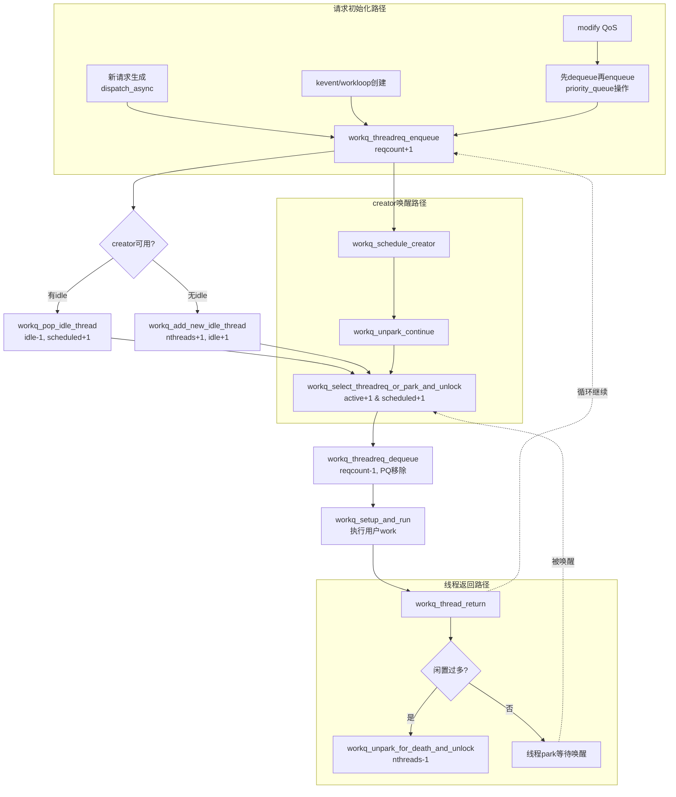

## 1. 出队的所有场景（从队列移除或计数扣减）
- **线程返回内核**：`workq_thread_return → workq_select_threadreq_or_park_and_unlock`，准入检查后调用`workq_threadreq_dequeue()`：`reqcount--`并从PQ/STAILQ移除。
- **creator唤醒后择优**：`workq_schedule_creator → workq_unpark_continue → workq_select_threadreq_or_park_and_unlock`，同样在选择时做`workq_threadreq_dequeue()`。
- **modify/cancel**：`workq_kern_threadreq_modify`或`workq_threadreq_destroy`直接`priority_queue_remove`/`STAILQ_REMOVE_HEAD`做重排或销毁，不经过`workq_threadreq_dequeue()`。
- **unpaced早绑定**：`workq_reqthreads`循环直接把请求塞给idle线程（`UT_WORKQ_EARLY_BOUND`），`reqcount`已扣减，唤醒后直接执行，不再从队列dequeue。

## 2. 计数更新的关键位置
- **活跃/调度计数增加**
  - creator转worker：`workq_select_threadreq_or_park_and_unlock`的`is_creator`分支中`_wq_thactive_inc()`与`wq_thscheduled_count++`。
  - 运行线程换QoS：同函数中`_wq_thactive_move()`。
  - unpaced早绑定：`workq_reqthreads`循环里`_wq_thactive_inc()`与`wq_thscheduled_count++`。
- **活跃/调度计数减少**
  - worker回idle：`workq_push_idle_thread`里`_wq_thactive_dec()`（非creator）与`wq_thscheduled_count--`。
- **idle计数**
  - 减少：`workq_pop_idle_thread`弹出idle线程或`workq_unpark_for_death_and_unlock`拉去终止。
  - 增加：`workq_add_new_idle_thread`创建成功入`thnewlist`；`workq_push_idle_thread`将运行线程放回idle列表。
- **总线程数**：`workq_add_new_idle_thread`先`wq_nthreads++`后释放锁创建，成功则`wq_thidlecount++`；失败回滚`wq_nthreads--`。

## 3. 休眠/唤醒/新增的先后逻辑
1. **请求生成**：`workq_threadreq_enqueue`或unpaced早绑定。
2. **若有空闲线程**：creator可被唤醒；无creator时直接弹idle线程并提权。
3. **若无空闲线程**：在不超上限时`workq_add_new_idle_thread`先占位再创建。
4. **选择并绑定**：`workq_select_threadreq_or_park_and_unlock`完成准入、计数变更与`workq_threadreq_dequeue`。
5. **执行完成返回内核**：`workq_thread_return`驱动下一轮选择或park。
6. **park路径**：`workq_push_idle_thread`维护idle/active/scheduled计数并可能触发死亡策略。

## 4. 全局时序（Mermaid）

## 5. 快速对照表

| 场景 | 入队/出队 | 活跃/调度计数 | idle计数 | 说明 |
|------|-----------|---------------|----------|------|
| 线程正常循环 | 选择时`workq_threadreq_dequeue`；完成后`workq_push_idle_thread` | 选取时增，回idle时减 | 回idle时增 | 主路径 |
| creator唤醒 | 选取时`workq_threadreq_dequeue` | creator→worker时增 | 取idle线程时减 | 快速复用 |
| unpaced早绑定 | 不再dequeue | 选中idle线程时增 | 取idle线程时减 | dispatch并行请求 |
| modify/cancel | 直接PQ/STAILQ移除 | 不变 | 不变 | 重排/销毁 |
| 新增线程 | - | - | 成功创建idle++ | 先`wq_nthreads++`占位 |
